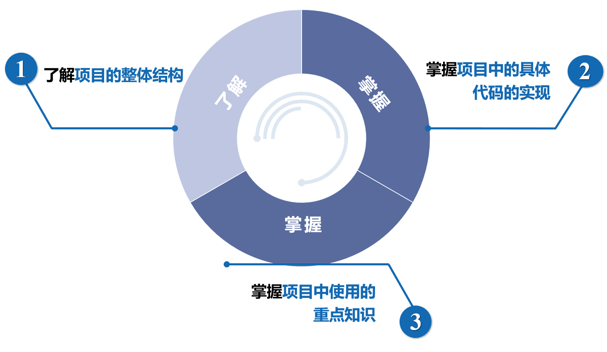
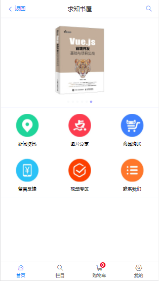
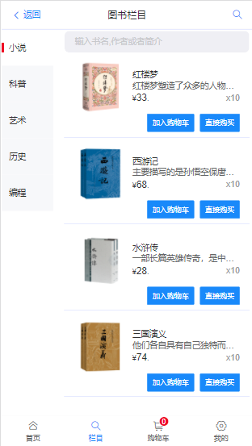
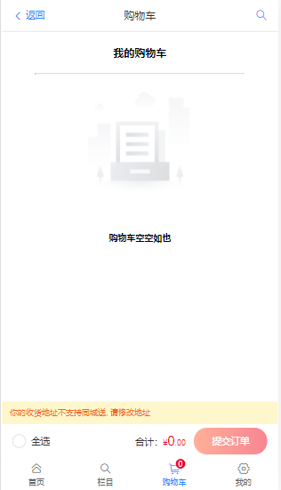
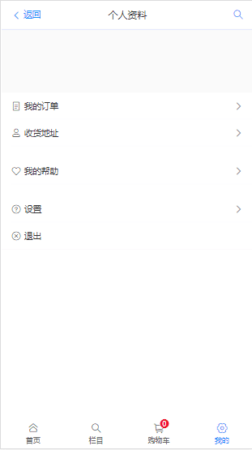
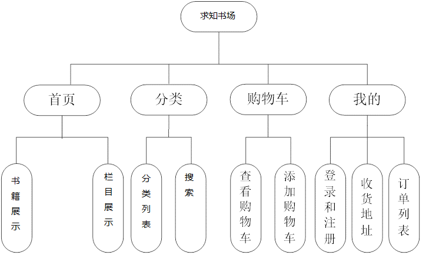
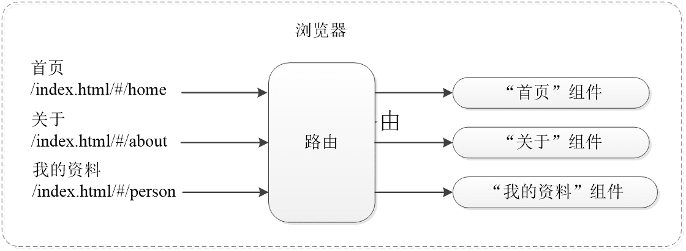

**Vue 前端框架基础课练习**

<!--truncate-->

## 一、 学习目标



## 二、 项目展示

 

 

## 三、 项目结构



## 四、 技术方案

1. 使用 Vue 作为前端开发框架

2. 使用 Vue CLI 脚手架搭建项目

3. 使用 Vant 作为移动端组件库

4. 使用 Axios 作为 HTTP 库和后端 API 交互

5. Mockjs 模拟后端 API 提供数据

6. 使用 Vue-Router 实现前端路由的定义及跳转、参数的传递等

7. 使用 Vuex 进行数据状态管理，实现购物车的状态存储

## 五、 项目搭建

1）安装 Node.js。

2）安装 Vue CLI 脚手架。 `npm install vue-cli -g`

3）创建并运行项目。

目录结构：

1. public：存放公共文件
2. src：源代码目录，保存开发人员编写的项目源码
3. src\assets：资源文件目录，如图片、css 等
4. src\components：组件文件目录
5. src\lib：存放 css、js、fonts 资源
6. src\plugins：插件目录，存放 axios.js 文件

- 注：

  - index.html：入口 html 文件
  - src\App.vue：项目的 Vue 根组件,所有页面在其中切换
  - src\main.js：项目的入口文件
  - src\router.js：路由文件
  - 将 components/HelloWorld.vue 删除
  - App.vue 中多余代码删除
  - router/index.js 中多余代码删除

## 六、 Single Page Application（SPA）

单页面应用：页面由组件构成。项目的网址不变，只有网页内容（组件）切换。

**优点：**

1. 良好的交互体验

　　不需要重新加载整个页面，没有页面之间的切换，不会出现 “闪烁”现象，页面显示流畅。

2. 前后端工作分离模式

　　后端不再负责模板渲染、输出页面工作，后端API通用化，

3. 减轻服务器压力


SPA：在前后端分离基础上加一层前端路由，整个网站只有一个 html 页面

图中，index.html 后面的 “#/home” 是 hash 方式的路由，由前端路由来处理，将 hash 值与页面中的组件对应，当 hash 值为 “#/home” 时，就显示 “首页” 组件。

前端路由在访问一个新页面的时候仅仅是变换了一下 hash 值而已，没有和服务端交互，所以不存在网络延迟，提升了用户体验。



## 七、 前端路由

**路由：**根据不同的URL展示不同的页面，即输入网址，切换网页。一般由服务器端完成。

**前端路由：**不经过服务器端，直接在前端切换内容（组件）。router 插件实现。

main.js 中引入路由

```javascript
import router from './router'

new Vue({

 el: '#app',

 router,

})
```

创建路由组件：新建 Home.vue、User.vue、Category.vue、Shopcart.vue 文件

**命名规范：属于** **组件或类的**，统一使用大写字母开头

index.js 中路由，实现页面切换：

```javascript

首页Home.vue ：

import Home from '@/components/Home'
{ path: '/', name: 'Home', component: Home, },

用户页User.vue ：

import User from '@/components/User'
{ path: '/User', name: 'User', component: User, },

```

## 八、 组件切换

App.vue：引入 Home.vue 组件

**&#60;router-view&#47;&#62; ：代表路由中的组件，根据路由切换**

**路由切换时，切换的是 &#60;router-view&#47;&#62; 挂载的组件，其他内容不改变**

#### 动画切换

App.vue：引入 Home.vue 组件

```vue
<transition name="fade" mode="out-in">
   <router-view/>
</transition>
```


## 九、 首页页面结构

顶部： 标题栏  AppHeader.vue

中部： 轮播      HomeSwipe.vue

中部： 九宫格   HomeGridNine.vue

底部： 导航栏   AppTabBar.vue

## 十、 vant前端组件库

网址： https://youzan.github.io/vant/#/zh-CN/home

安装：`npm i vant -S`

在 main.js 引入 vant 框架：

```javascript
import Vant from 'vant';

import 'vant/lib/index.css';

Vue.use(Vant);
```

## 十一、 底部导航栏

组件网址： https://youzan.github.io/vant/#/zh-CN/tabbar

思路：

- 使用组件库中组件封装成自己的组件，文件：AppTabBar.vue
- 在 App.vue 中使用组件 AppTabBar.vue

实现：AppTabBar.vue

- template
  - 结构：van-tabbar-item
  - 图标：icon，https://youzan.github.io/vant/#/zh-CN/icon
- data
  - active：当前激活页面
- watch：监控路由，设置激活页面

引入：App.vue

```javascript
import apptabbar from './components/part/AppTabBar.vue'
```

## 十二、 顶部标题栏

组件网址：https://youzan.github.io/vant/#/zh-CN/nav-bar

思路：

- 使用组件库中组件封装成自己的组件 AppHeader.vue
- 在 App.vue 中使用组件 AppHeader.vue

AppHeader.vue

- template
  - title
  - `{ path: '/', name: 'Home', component: Home, meta:{title:'求知书屋',}, },`
- style
  - .van-nav-bar：注意命名规则与组件对应

返回箭头：后退

```javascript
onClickLeft() {
   this.$router.go(-1)
},
```

搜索：切换组件

```javascript
onClickRight() {
  this.$router.push("/Category");
},
```

App.vue 引入：

```javascript
import appheader from './components/part/AppHeader.vue'
```

## 十三、 轮播图

组件网址： https://youzan.github.io/vant/#/zh-CN/swipe

思路：

- 使用组件库中组件封装成自己的组件，文件： HomeSwipe.vue
- 在 Home.vue 中使用组件 HomeSwipe.vue

图片数据：["s1.jpg","s2.jpg","s3.jpg","s4.jpg","s5.jpg","s6.jpg"]

图片数据哪里来？服务端。Vue.js并未提供与服务器通信的接口，

- axios：向服务器端发出请求，是一个基于 promise的HTTP客户端。
- mockjs：模拟服务器端数据响应(后台和前台一般同时开发，真实对象在调试期间的代替品，生成假数据)

#### mockjs

- 安装命令：`npm install - -save mockjs`
- 新建文件夹、文件：mock/mock.js
- main.js中引入文件：`import Mock from './mock/mock.js'`

```javascript
Mock.mock('/swipe', /post|get/i, {
    'swipeList':["s1.jpg","s2.jpg","s3.jpg","s4.jpg","s5.jpg","s6.jpg"],
}) 
// /post|get/i 匹配post和get模式 也可以用'post'或'get'
```

#### axios

- `npm install - -save axios vue-axios`

- 引用：main.js

- ```javascript
  import axios from 'axios';
  import VueAxios from 'vue-axios';
  Vue.use(VueAxios, axios);
  ```


axios 请求轮播图片数据： mounted 中实现

```javascript
this.axios.post("/swipe").then( (res) => {
	this.list=res.data.swipeList;
}).catch( (error) => { console.log(error); });
```

mock响应数据：

```javascript
Mock.mock('/swipe', /post|get/i, {
  'swipeList':["s1.jpg","s2.jpg","s3.jpg","s4.jpg","s5.jpg","s6.jpg"],
})
```


HomeSwipe.vue 编写：

- template

- - 图片地址写法：

  - ```vue
    
    ```

- data

- style

Home.vue中引入：

```javascript
import homeswipe from './part/HomeSwipe.vue'
```

## 十四、 九宫格

组件网址： https://youzan.github.io/vant/#/zh-CN/grid

思路：

- 使用组件库中组件封装成自己的组件，文件： HomeGridNine.vue
- 在 Home.vue 中使用组件 HomeGridNine.vue

axios 请求九宫格中内容数据： mounted 中实现

```javascript
this.axios.post("/**grid9**").then( (res) => {

	this.list=res.data.gridList;

}).catch( (error) => { console.log(error); } );
```

mock 响应数据：

```javascript
Mock.mock('/**grid9**', /post|get/i, {

  'gridList':[

   {id:"/Category", pic:"menu1.png", title:"新闻资讯"},

   {id:"/Category", pic:"menu2.png", title:"图片分享"},

   {id:"/Category", pic:"menu3.png", title:"商品购买"},

  ],

})
```

HomeGridNine.vue

- template
- style

Home.vue

- ```javascript
  import homegridnine from './part/HomeGridNine.vue'
  ```