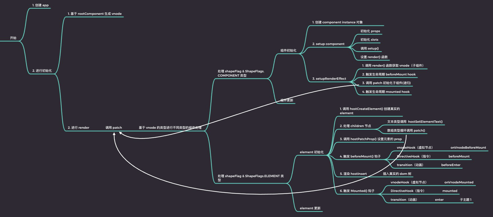
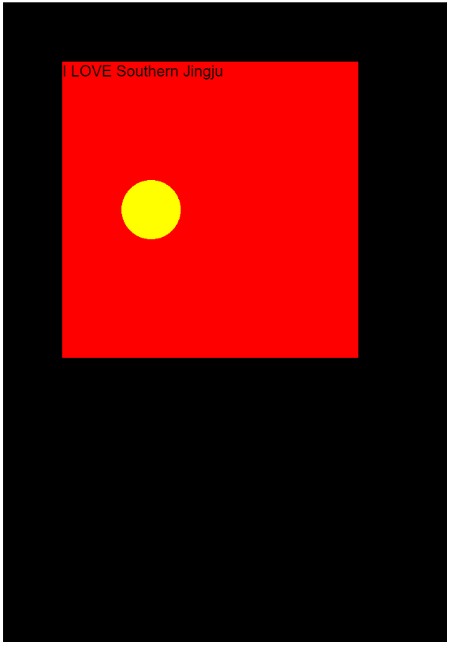

<!--truncate-->

## 仿照 vue cli 编写一个示例：

<hr />

- play-plane
  - node_modules
  - src
    - component
      - Circle.js
    - runtime-canvas
      - index.js
    - App.js
    - Game.js
  - main.js
  - package.json
  - webpack.config.js

<hr />

## 初始化流程图



webpack.config.js

```javascript
const path = require('path')

module.exports = {
    entry: path.resolve(__dirname,"./main.js"),
    output: {
        filename:"build.js",
        path: path.resolve(__dirname,"./dist"),
    },
    devtool: "source-map",
    devServer: {
        contentBase: path.resolve(__dirname,"./dist"),
    }
}
```

main.js

```javascript
// console.log("main.js111222");
import { createApp } from './src/runtime-canvas'
import App from './src/App'
import { getRootContainer } from './src/Game'

// 需要根组件
// 根容器
// canvas → pixi.js

createApp(App).mount(getRootContainer())
```

.dist/index.html

```html
<!DOCTYPE html>
<html lang="en">
<head>
    <meta charset="UTF-8">
    <meta name="viewport" content="width=device-width, initial-scale=1.0">
    <title>Document</title>
</head>
<body>
    <script src="build.js"></script>
</body>
</html>
```

package.json

```json
{
  "name": "play-plane",
  "version": "1.0.0",
  "description": "",
  "main": "main.js",
  "scripts": {
    "build": "webpack",
    "serve": "webpack-dev-server --open",
    "test": "echo \"Error: no test specified\" && exit 1"
  },
  "keywords": [],
  "author": "",
  "license": "ISC",
  "devDependencies": {
    "webpack": "^5.11.0",
    "webpack-cli": "^3.3.12"
  },
  "dependencies": {
    "@vue/runtime-core": "^3.0.4",
    "install": "^0.13.0",
    "pixi.js": "^5.3.6",
    "webpack-dev-server": "^3.11.0"
  }
}
```


## 示例展示




在线演示 : [点此访问](https://yancyqi2002.github.io/kaikebawebdemo/Vue%203.0%20Actual%20combat%20and%20source%20code%20training%20camp/Day%2001/play-plane/dist/index.html)

项目仓库地址：[点此访问](https://github.com/YancyQi2002/kaikebawebdemo/tree/main/Vue%203.0%20Actual%20combat%20and%20source%20code%20training%20camp/Day%2001/play-plane)