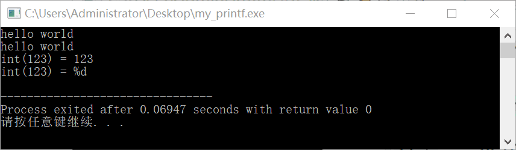
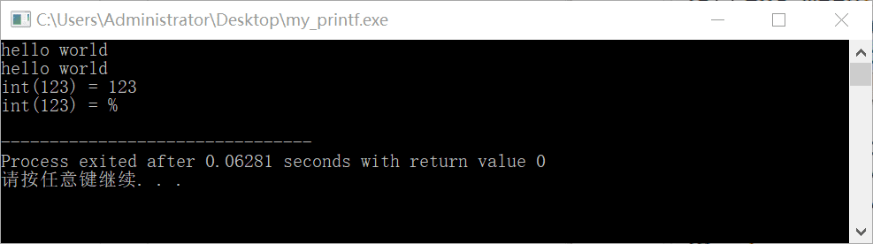
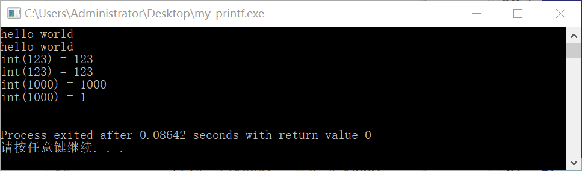
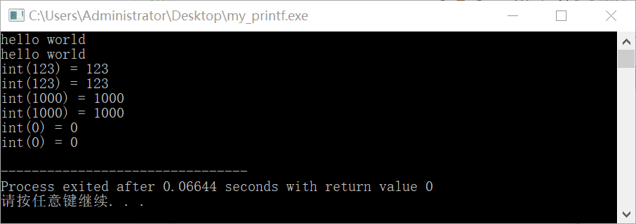
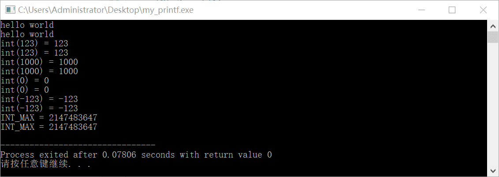

<!--truncate-->

## 01 实现打印字符串

```cpp
#include <stdio.h>

int my_printf(const char *frm, ...) {
	int cnt = 0;
	#define PUTC(a) putchar(a), ++cnt
	for (int i = 0; frm[i]; i ++) {
	//	putchar(frm[i]),++cnt;
		PUTC(frm[i]);
	}
	return cnt;
}

int main() {
	printf("hello world\n");
	my_printf("hello world\n");
	return 0;
}
```


## 02 实现打印变量

```cpp
int main() {
	int a = 123;
	
	printf("int(123) = %d\n",a);
	my_printf("int(123) = %d\n",a);
	return 0;
}
```



```cpp
#include <stdio.h>
#include <stdarg.h>

int my_printf(const char *frm, ...) {
	int cnt = 0;
	va_list arg;
	va_start(arg, frm);
	#define PUTC(a) putchar(a), ++cnt
	for (int i = 0; frm[i]; i ++) {
	//	putchar(frm[i]),++cnt;
		switch (frm[i]) {
			case '%' : {
				switch (frm[++i]) {
					case '%' : PUTC(frm[i]); break;
					case 'd' : {
						int x = va_arg(arg, int);
						while (x) {
							PUTC(x % 10 + '0');
							x /= 10;
						}
					} break;
					case 'f' : {
						
					} break;
				}
			} break;
			default: PUTC(frm[i]); break;
		}
	}
	return cnt;
}

int main() {
	int a = 123;
	printf("hello world\n");
	my_printf("hello world\n");
	
	printf("int(123) = %d\n",a);
	my_printf("int(123) = %%\n",a);
	return 0;
}
```



```cpp
#include <stdio.h>
#include <stdarg.h>

int my_printf(const char *frm, ...) {
	int cnt = 0;
	va_list arg;
	va_start(arg, frm);
	#define PUTC(a) putchar(a), ++cnt
	for (int i = 0; frm[i]; i ++) {
	//	putchar(frm[i]),++cnt;
		switch (frm[i]) {
			case '%' : {
				switch (frm[++i]) {
					case '%' : PUTC(frm[i]); break;
					case 'd' : {
						int x = va_arg(arg, int);
						while (x) {
							PUTC(x % 10 + '0');
							x /= 10;
						}
					} break;
					case 'f' : {
						
					} break;
				}
			} break;
			default: PUTC(frm[i]); break;
		}
	}
	return cnt;
}

int main() {
	int a = 123;
	printf("hello world\n");
	my_printf("hello world\n");
	
	printf("int(123) = %d\n",a);
	my_printf("int(123) = %d\n",a);
	return 0;
}
```


```cpp
#include <stdio.h>
#include <stdarg.h>

int my_printf(const char *frm, ...) {
	int cnt = 0;
	va_list arg;
	va_start(arg, frm);
	#define PUTC(a) putchar(a), ++cnt
	for (int i = 0; frm[i]; i ++) {
	//	putchar(frm[i]),++cnt;
		switch (frm[i]) {
			case '%' : {
				switch (frm[++i]) {
					case '%' : PUTC(frm[i]); break;
					case 'd' : {
						int temp = va_arg(arg, int);
						int x = 0;
						while (temp) {
							x = x * 10 + temp % 10;
							temp /= 10;
						}
						while (x) {
							PUTC(x % 10 + '0');
							x /= 10;
						}
					} break;
					case 'f' : {
						
					} break;
				}
			} break;
			default: PUTC(frm[i]); break;
		}
	}
	return cnt;
}

int main() {
	int a = 123;
	printf("hello world\n");
	my_printf("hello world\n");
	
	printf("int(123) = %d\n",a);
	my_printf("int(123) = %d\n",a);
	return 0;
}
```


```cpp
int main() {
	int a = 123;
	printf("hello world\n");
	my_printf("hello world\n");
	
	printf("int(123) = %d\n",a);
	my_printf("int(123) = %d\n",a);
	
	printf("int(1000) = %d\n",1000);
	my_printf("int(1000) = %d\n",1000);
	return 0;
}
```



```cpp
#include <stdio.h>
#include <stdarg.h>

int my_printf(const char *frm, ...) {
	int cnt = 0;
	va_list arg;
	va_start(arg, frm);
	#define PUTC(a) putchar(a), ++cnt
	for (int i = 0; frm[i]; i ++) {
	//	putchar(frm[i]),++cnt;
		switch (frm[i]) {
			case '%' : {
				switch (frm[++i]) {
					case '%' : PUTC(frm[i]); break;
					case 'd' : {
						int temp = va_arg(arg, int);
						int x = 0, digit = 0;
						while (temp) {
							x = x * 10 + temp % 10;
							temp /= 10;
							digit++;
						}
						while (digit--) {
							PUTC(x % 10 + '0');
							x /= 10;
						}
					} break;
					case 'f' : {
						
					} break;
				}
			} break;
			default: PUTC(frm[i]); break;
		}
	}
	return cnt;
}

int main() {
	int a = 123;
	printf("hello world\n");
	my_printf("hello world\n");
	
	printf("int(123) = %d\n",a);
	my_printf("int(123) = %d\n",a);
	
	printf("int(1000) = %d\n",1000);
	my_printf("int(1000) = %d\n",1000);
	return 0;
}
```


```cpp
int main() {
	int a = 123;
	printf("hello world\n");
	my_printf("hello world\n");
	
	printf("int(123) = %d\n",a);
	my_printf("int(123) = %d\n",a);
	
	printf("int(1000) = %d\n",1000);
	my_printf("int(1000) = %d\n",1000);
	
	printf("int(0) = %d\n",0);
	my_printf("int(0) = %d\n",0);
	return 0;
}
```


```cpp
int my_printf(const char *frm, ...) {
	int cnt = 0;
	va_list arg;
	va_start(arg, frm);
	#define PUTC(a) putchar(a), ++cnt
	for (int i = 0; frm[i]; i ++) {
	//	putchar(frm[i]),++cnt;
		switch (frm[i]) {
			case '%' : {
				switch (frm[++i]) {
					case '%' : PUTC(frm[i]); break;
					case 'd' : {
						int temp = va_arg(arg, int);
						int x = 0, digit = 0;
						do {
							x = x * 10 + temp % 10;
							temp /= 10;
							digit++;
						} while (temp);
						while (digit--) {
							PUTC(x % 10 + '0');
							x /= 10;
						}
					} break;
					case 'f' : {
						
					} break;
				}
			} break;
			default: PUTC(frm[i]); break;
		}
	}
	return cnt;
}
```



```cpp
int main() {
	int a = 123;
	printf("hello world\n");
	my_printf("hello world\n");
	
	printf("int(123) = %d\n",a);
	my_printf("int(123) = %d\n",a);
	
	printf("int(1000) = %d\n",1000);
	my_printf("int(1000) = %d\n",1000);
	
	printf("int(0) = %d\n",0);
	my_printf("int(0) = %d\n",0);
	
	printf("int(-123) = %d\n",-123);
	my_printf("int(-123) = %d\n",-123);
	return 0;
}
```


```cpp
int my_printf(const char *frm, ...) {
	int cnt = 0;
	va_list arg;
	va_start(arg, frm);
	#define PUTC(a) putchar(a), ++cnt
	for (int i = 0; frm[i]; i ++) {
	//	putchar(frm[i]),++cnt;
		switch (frm[i]) {
			case '%' : {
				switch (frm[++i]) {
					case '%' : PUTC(frm[i]); break;
					case 'd' : {
						int temp = va_arg(arg, int);
						if (temp < 0) {
							PUTC('-'),
							temp = -temp;
						}
						int x = 0, digit = 0;
						do {
							x = x * 10 + temp % 10;
							temp /= 10;
							digit++;
						} while (temp);
						while (digit--) {
							PUTC(x % 10 + '0');
							x /= 10;
						}
					} break;
					case 'f' : {
						
					} break;
				}
			} break;
			default: PUTC(frm[i]); break;
		}
	}
	return cnt;
}
```


```cpp
#include <stdio.h>
#include <stdarg.h>
#include <inttypes.h>
#include <stdint.h>
#include <climits>

int main() {
	int a = 123;
	printf("hello world\n");
	my_printf("hello world\n");
	
	printf("int(123) = %d\n",a);
	my_printf("int(123) = %d\n",a);
	
	printf("int(1000) = %d\n",1000);
	my_printf("int(1000) = %d\n",1000);
	
	printf("int(0) = %d\n",0);
	my_printf("int(0) = %d\n",0);
	
	printf("int(-123) = %d\n",-123);
	my_printf("int(-123) = %d\n",-123);
	
	printf("INT_MAX = %d\n", INT_MAX);
	my_printf("INT_MAX = %d\n", INT_MAX);
	return 0;
}
```


```cpp
#include <stdio.h>
#include <stdarg.h>
#include <inttypes.h>
#include <stdint.h>
#include <climits>

int output_num(int num, int digit) {
	int cnt = 0;
	while (digit--) {
		putchar(num % 10 + '0'), ++cnt;
		num /= 10;
	}
	return cnt;
}

int reverse_num(int num, int *temp) {
	*temp = 0;
	int digit = 0;
	do {
		*temp = *temp * 10 + num % 10;
		num /= 10;
		digit++; 
	} while (num);
	return digit;
}

int my_printf(const char *frm, ...) {
	int cnt = 0;
	va_list arg;
	va_start(arg, frm);
	#define PUTC(a) putchar(a), ++cnt
	for (int i = 0; frm[i]; i ++) {
	//	putchar(frm[i]),++cnt;
		switch (frm[i]) {
			case '%' : {
				switch (frm[++i]) {
					case '%' : PUTC(frm[i]); break;
					case 'd' : {
						int temp = va_arg(arg, int);
						if (temp < 0) {
							PUTC('-'),
							temp = -temp;
						}
						int x1 = temp / 100000, x2 = temp % 100000;
						int temp1, temp2;
						int digit1 = reverse_num(x1, &temp1);
						int digit2 = reverse_num(x2, &temp2);
						if (x1) {
							digit2 = 5;
						} else {
							digit1 = 0;
						}
						cnt += output_num(temp1, digit1);
						cnt += output_num(temp2, digit2);
					} break;
					case 'f' : {
						
					} break;
				}
			} break;
			default: PUTC(frm[i]); break;
		}
	}
	return cnt;
}

int main() {
	int a = 123;
	printf("hello world\n");
	my_printf("hello world\n");
	
	printf("int(123) = %d\n",a);
	my_printf("int(123) = %d\n",a);
	
	printf("int(1000) = %d\n",1000);
	my_printf("int(1000) = %d\n",1000);
	
	printf("int(0) = %d\n",0);
	my_printf("int(0) = %d\n",0);
	
	printf("int(-123) = %d\n",-123);
	my_printf("int(-123) = %d\n",-123);
	
	printf("INT_MAX = %d\n", INT_MAX);
	my_printf("INT_MAX = %d\n", INT_MAX);
	return 0;
}
```



```cpp
int main() {
	int a = 123;
	printf("hello world\n");
	my_printf("hello world\n");
	
	printf("int(123) = %d\n",a);
	my_printf("int(123) = %d\n",a);
	
	printf("int(1000) = %d\n",1000);
	my_printf("int(1000) = %d\n",1000);
	
	printf("int(0) = %d\n",0);
	my_printf("int(0) = %d\n",0);
	
	printf("int(-123) = %d\n",-123);
	my_printf("int(-123) = %d\n",-123);
	
	printf("INT_MAX = %d\n", INT_MAX);
	my_printf("INT_MAX = %d\n", INT_MAX);
	
	printf("INT_MIN = %d\n", INT_MIN);
	my_printf("INT_MIN = %d\n", INT_MIN);
	return 0;
}
```


```cpp
#include <stdio.h>
#include <stdarg.h>
#include <inttypes.h>
#include <stdint.h>
#include <climits>

int output_num(int num, int digit) {
	int cnt = 0;
	while (digit--) {
		putchar(num % 10 + '0'), ++cnt;
		num /= 10;
	}
	return cnt;
}

int reverse_num(int num, int *temp) {
	*temp = 0;
	int digit = 0;
	do {
		*temp = *temp * 10 + num % 10;
		num /= 10;
		digit++; 
	} while (num);
	return digit;
}

int my_printf(const char *frm, ...) {
	int cnt = 0;
	va_list arg;
	va_start(arg, frm);
	#define PUTC(a) putchar(a), ++cnt
	for (int i = 0; frm[i]; i ++) {
	//	putchar(frm[i]),++cnt;
		switch (frm[i]) {
			case '%' : {
				switch (frm[++i]) {
					case '%' : PUTC(frm[i]); break;
					case 'd' : {
						int temp = va_arg(arg, int);
						uint32_t xx = 0;
						if (temp < 0) {
							PUTC('-'),
							xx = -temp;
						} else {
							xx = temp;
						}
						int x1 = xx / 100000, x2 = xx % 100000;
						int temp1, temp2;
						int digit1 = reverse_num(x1, &temp1);
						int digit2 = reverse_num(x2, &temp2);
						if (x1) {
							digit2 = 5;
						} else {
							digit1 = 0;
						}
						cnt += output_num(temp1, digit1);
						cnt += output_num(temp2, digit2);
					} break;
					case 'f' : {
						
					} break;
				}
			} break;
			default: PUTC(frm[i]); break;
		}
	}
	return cnt;
}
```


```cpp
int main() {
	int a = 123;
	printf("hello world\n");
	my_printf("hello world\n");
	
	printf("int(123) = %d\n",a);
	my_printf("int(123) = %d\n",a);
	
	printf("int(1000) = %d\n",1000);
	my_printf("int(1000) = %d\n",1000);
	
	printf("int(0) = %d\n",0);
	my_printf("int(0) = %d\n",0);
	
	printf("int(-123) = %d\n",-123);
	my_printf("int(-123) = %d\n",-123);
	
	printf("INT_MAX = %d\n", INT_MAX);
	my_printf("INT_MAX = %d\n", INT_MAX);
	
	printf("INT_MIN = %d\n", INT_MIN);
	my_printf("INT_MIN = %d\n", INT_MIN);
	
	printf("int(100500) = %d\n", 100500);
	my_printf("int(100500) = %d\n", 100500);
	return 0;
}
```


```cpp
#include <stdio.h>
#include <stdarg.h>
#include <inttypes.h>
#include <stdint.h>
#include <climits>

int output_num(int num, int digit) {
	int cnt = 0;
	while (digit--) {
		putchar(num % 10 + '0'), ++cnt;
		num /= 10;
	}
	return cnt;
}

int reverse_num(int num, int *temp) {
	*temp = 0;
	int digit = 0;
	do {
		*temp = *temp * 10 + num % 10;
		num /= 10;
		digit++; 
	} while (num);
	return digit;
}

int my_printf(const char *frm, ...) {
	int cnt = 0;
	va_list arg;
	va_start(arg, frm);
	#define PUTC(a) putchar(a), ++cnt
	for (int i = 0; frm[i]; i ++) {
	//	putchar(frm[i]),++cnt;
		switch (frm[i]) {
			case '%' : {
				switch (frm[++i]) {
					case '%' : PUTC(frm[i]); break;
					case 'd' : {
						int temp = va_arg(arg, int);
						uint32_t xx = 0;
						if (temp < 0) {
							PUTC('-'),
							xx = -temp;
						} else {
							xx = temp;
						}
						int x1 = xx / 100000, x2 = xx % 100000;
						int temp1, temp2;
						int digit1 = reverse_num(x1, &temp1);
						int digit2 = reverse_num(x2, &temp2);
						int digit3 = 0;
						if (x1) {
							digit3 = 5 - digit2;
						} else {
							digit1 = 0;
						}
						cnt += output_num(temp1, digit1);
						cnt += output_num(0, digit3);
						cnt += output_num(temp2, digit2);
					} break;
					case 'f' : {
						
					} break;
				}
			} break;
			default: PUTC(frm[i]); break;
		}
	}
	return cnt;
}
```


## 03 效果

```cpp
#include <stdio.h>
#include <stdarg.h>
#include <inttypes.h>
#include <stdint.h>
#include <climits>

int output_num(int num, int digit) {
	int cnt = 0;
	while (digit--) {
		putchar(num % 10 + '0'), ++cnt;
		num /= 10;
	}
	return cnt;
}

int reverse_num(int num, int *temp) {
	*temp = 0;
	int digit = 0;
	do {
		*temp = *temp * 10 + num % 10;
		num /= 10;
		digit++; 
	} while (num);
	return digit;
}

int my_printf(const char *frm, ...) {
	int cnt = 0;
	va_list arg;
	va_start(arg, frm);
	#define PUTC(a) putchar(a), ++cnt
	for (int i = 0; frm[i]; i ++) {
	//	putchar(frm[i]),++cnt;
		switch (frm[i]) {
			case '%' : {
				switch (frm[++i]) {
					case '%' : PUTC(frm[i]); break;
					case 'd' : {
						int temp = va_arg(arg, int);
						uint32_t xx = 0;
						if (temp < 0) {
							PUTC('-'),
							xx = -temp;
						} else {
							xx = temp;
						}
						int x1 = xx / 100000, x2 = xx % 100000;
						int temp1, temp2;
						int digit1 = reverse_num(x1, &temp1);
						int digit2 = reverse_num(x2, &temp2);
						int digit3 = 0;
						if (x1) {
							digit3 = 5 - digit2;
						} else {
							digit1 = 0;
						}
						cnt += output_num(temp1, digit1);
						cnt += output_num(0, digit3);
						cnt += output_num(temp2, digit2);
					} break;
					case 'f' : {
						
					} break;
				}
			} break;
			default: PUTC(frm[i]); break;
		}
	}
	return cnt;
}

int main() {
	int a = 123;
	printf("hello world\n");
	my_printf("hello world\n");
	
	printf("int(123) = %d\n",a);
	my_printf("int(123) = %d\n",a);
	
	printf("int(1000) = %d\n",1000);
	my_printf("int(1000) = %d\n",1000);
	
	printf("int(0) = %d\n",0);
	my_printf("int(0) = %d\n",0);
	
	printf("int(-123) = %d\n",-123);
	my_printf("int(-123) = %d\n",-123);
	
	printf("INT_MAX = %d\n", INT_MAX);
	my_printf("INT_MAX = %d\n", INT_MAX);
	
	printf("INT_MIN = %d\n", INT_MIN);
	my_printf("INT_MIN = %d\n", INT_MIN);
	
	printf("int(100500) = %d\n", 100500);
	my_printf("int(100500) = %d\n", 100500);
	
	int n;
	while (~scanf("%d", &n)) {
		printf(" has %d digits !\n", printf("%d", n));
		my_printf(" has %d digits !\n", my_printf("%d", n));
	}
	return 0;
}
```

