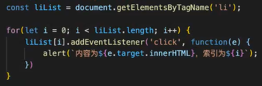
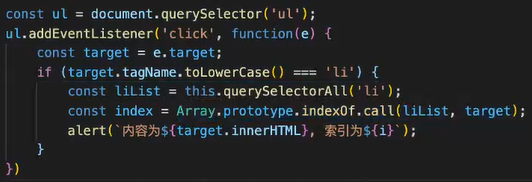

<!--truncate-->

## 1  基本概念

捕获：自顶向下

冒泡：自底向上

## 2  window.addEventListener 监听的阶段的事件

```javascript
// 冒泡阶段

window.addEventListener('click', () => {

} )

// 捕获阶段

window.addEventListener('click', () => {

}, true )
```

## 3  平常有哪些场景用到了这个机制

基础做法：



事件委托：



## 4  一个历史页面，上面有若干按钮的点击逻辑，每个按钮都有自己的click事件。新需求来了：给每一个访问的用户添加一个属性， banned = true, 此用户点击页面上的任何按钮或者元素，都不可响应原来的函数。而是直接alert提示，你被封禁了。

```javascript
window.addEventListener('click', () => {
	if (banned) {
		e.stopPropagtion()
	}
}, true )
```