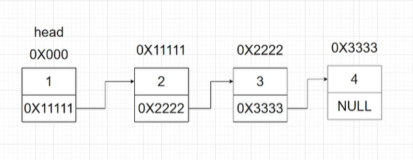
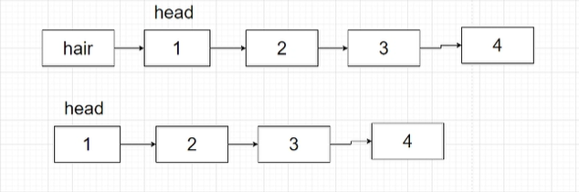
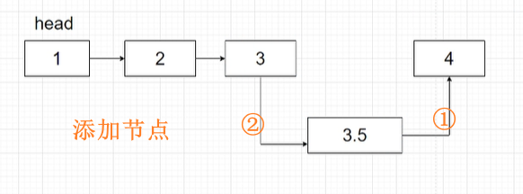
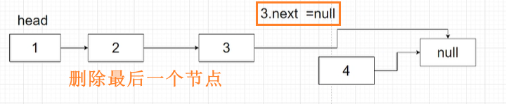
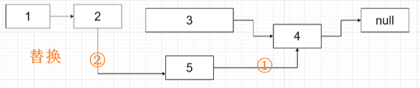
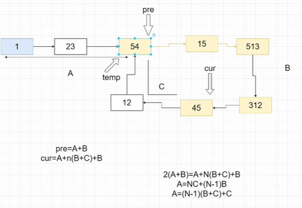

> 
> 题目来源：力扣（LeetCode）
>
> 著作权归领扣网络所有。

<!--truncate-->

## 1  链表的基础知识

链表是一种物理存储单元上非连续、非顺序的存储结构，数据元素的逻辑顺序是通过链表中的指针链接次序实现的。链表由一系列结点（链表中每一个元素称为结点）组成，结点可以在运行时动态生成。每个结点包括两个部分：一个是存储数据元素的数据域，另一个是存储下一个结点地址的指针域。

抽象概念：链表代表了一种唯一指向思想

链表适合用于存储一些经常增加、删除的数据











## 2  链表的访问

### LeetCode141 环形链表

思路：快慢指针

1.首先，快指针每次向前移动两步，慢指针每次向前移动一步，进行遍历整个列表。

2.接着，当快指针的next节点为null，或者快指针本身节点为null时，说明该链表没有环，遍历结束。

3.思考：我们再来看一下有环的情况是怎样的?

4.我们定义两个指针，一个慢指针（用红色标记），一个快指针（用黄色标记），并且，一开始，慢指针和快指针同时指向head节点。然后，快指针每次向前移动两步，慢指针每次向前移动一步，开始遍历链表。如果链表有环，那么快慢指针一定会相遇，指向同一个节点，当指向同一个节点时，遍历结束。

代码演示：

```javascript
var reverseList = function (head) {
    if (!head) return false;
    let pre = head, cur = head;
    while (cur && cur.next) {
        pre = pre.next;
        cur = cur.next.next;
        if (pre === cur) {
            return true;
        }
    }
    return false;
};
```

### LeetCode142 环形链表II

思路总结：使用快慢指针，

1. 我们假设链表头到入环口的距离为a，从入环口到相遇点的距离为b，从相遇点到入环口的距离为c。

2. 慢指针走过a+b的距离，快指针走过a+n(b+c)+b的距离。由于快指针是慢指针的二倍，所以:2(a+b)= a+n(b+c)+b,而我们实际上并不用关心n是多少，有可能是10，也有可能是1,因此上述公式可以简化为：a=c;

3. 因此当快慢指针相遇后，重新定义一个新指针从a的起始位置向后移动，慢指针继续向后移动。

4. 新指针从a的起始位置向后移动，慢指针继续向后移动。

5. 当新指针和慢指针相遇时，就是入环点



代码演示：

```javascript
var detectCycle = function (head) {
    if (!head) return null;
    let pre = head, cur = head;
    while (cur && cur.next) {
        pre = pre.next;
        cur = cur.next && cur.next.next;
        if (pre === cur) {
            cur = head;
            while (pre !== cur) {
                pre = pre.next;
                cur = cur.next;
            }
            return pre;
        }
    }
    return null;
};
```

### LeetCode202 快乐数

思路：

1. 当输入值为19时，平方和就转换成了：19——>82——>68 ——>100——>1;

2. 题目就可以转化为，判断一个链表是否有环。如果遍历某个节点为1，说明没环，就是快乐数。如果遍历到重复的节点值，说明有环，就不是快乐数。

3. 当输入值为116时，平方和构成的链表就是：116——>38——>73——>58——>89——>145——>42——>20——>4——>16——>37

代码演示：

```javascript
var isHappy = function (n) {
    let pre = n, cur = getNext(n);
    while (pre != cur && cur != 1) {
        pre = getNext(pre);
        cur = getNext(getNext(cur));
    }
    return cur == 1;
};
var getNext = function (n) {
    let temp = 0;
    while (0) {
        temp += (n % 10) * (n % 10);
        n = Math.floor(n / 10);
    }
    return temp;
}
```

## 3  链表的反转

### LeetCode206 反转链表

思路：

1.  定义指针——pre，pre指向空，定义指针——cur,cur指向我们的头节点。

   定义指针——next，next指向cur所指向节点的下一个节点。这样我们的指针就初始化完毕了。

2.  首先，我们将cur指针所指向的节点指向pre指针所指向的节点。然后移动指针pre到指针cur所在的位置，移动cur到next所在的位置

3.  然后移动指针pre到指针cur所在的位置，移动cur到next所在的位置。此时，我们已经反转了第一个节点。

4.  将我们的next指针指向cur指针所指向节点的下一个节点。然后重复上述操作

5.  当cur指针指向null的时候，我们就完成了整个链表的反转

```javascript
var reverseList = function (head) {
    if (head) return null;
    let pre = null, cur = head;
    while (cur) {
        [cur.next, pre, cur] = [pre, cur, cur.next];
    }
    return pre;
};
```

### LeetCode92 反转链表II

思路：

1. 首先我们定义一个虚拟头节点，起名叫做hair，将它指向我们的真实头节点。

2. 定义一个指针pre指向虚拟头节点。

3. 定义一个指针cur指向pre指针所指向节点的下一个节点。

4. 让我们的pre指针和cur指针同时向后移动，直到我们找到了第m个节点。

5. 定义指针con和tail，con指向pre所指向的节点，tail指向cur指针所指向的节点。

6. con所指向的节点，将是我们将部分链表反转后，部分链表头节点的前驱节点。tail则是部分链表反转后的尾节点。

7. 开始我们的链表反转，首先定义一个指针third指向cur所指向的节点的下一个节点，然后，将cur所指向的节点指向pre所指向的节点，将pre指针移动到cur指针所在的位置。将cur指针移动到third指针所在的位置，直到我们的pre指针指向第n个节点。

8. 重复上述步骤。

9. 此时pre指针指向了第m个节点并且将第m到第n个节点之间反转完毕。

10. 我们将con指针所指向的节点指向pre指针所指向的节点。

11. 将tail指针所指的节点指向cur指针所指的节点，整理一下，显示出最终的链表。

```javascript
var reverseBetween = function (head, left, right) {
    if (!head) return null;
    let ret = new ListNode(-1, head), pre = ret, cnt = right - left + 1;
    while (--left) {
        pre = pre.next;
    }
    pre.next = reverse(pre.next, cnt);
    return ret.next;
};
var reverse = function (head, n) {
    let pre = null, cur = head;
    while (n--) {
        [cur.next, pre, cur] = [pre, cur, cur.next];
    }
    head.next = cur;
    return pre;
};
```

### LeetCode25 K个一组翻转链表

思路：

1. 首先我们创建一个虚拟头节点 hair，并将虚拟头节点指向链表的头节点。

2. 定义指针 pre 指向虚拟头节点,定义指针 tail 指向 pre 所指的节点。

3. 移动tail指针，找到第K个节点。

4. 反转从head节点到tail节点之间的链表，我们可以参照前面的反转链表方法，将反转链表操作抽取出来成为一个方法命名为reverse。

5. 我们向reverse方法中传入head节点以及tail指针所指向的节点 。

6. 定义一个指针prev指向tail指针所指节点的下一个节点，定义指针P指向head节点，定义指针next指向P指针所指向节点的下一个节点。

7. 将指针P所指的节点指向指针prev所指的节点。

8. 将pre指针挪动到P指针所指针的节点上。

9. 将P指针挪动到next指针所指的节点上。

10. next指针则继续指向P指针所指节点的下一个节点。

11. 重复上述步骤。

12. 当指针prev与指针tail指向同一节点的时候，我们的K个一组的链表反转完成了，然后将这部分链表返回。

13. 让pre指针所指的节点指向tail指针所指的节点。

14. pre指针移动到head指针所在的位置，head指针移动到pre指针所指节点的下一个节点。

15. tail指针再次指向pre指针所指的节点。

16. 然后tail节点再移动K步，如果tail节点为空，证明后面的节点不足K个，返回链表。

```javascript
var reverseKGroup = function(head, k) {
    if (!head) return null;
    let ret = new ListNode(-1, head), pre = ret;
    do {
        pre.next = reverse(pre.next, k);
        for (let i = 0; i < k && pre; i++) {
            pre = pre.next;
        }
        if (!pre) break;
    } while (1);
    return ret.next;
};
var reverse = function (head, n) {
    let pre = head, cur = head, con = n;
    while (--n && pre) {
        pre = pre.next;
    }
    if (!pre) return head;
    pre = null;
    while (con--) {
        [cur.next, pre, cur] = [pre, cur, cur.next];
    }
    head.next = cur;
    return pre;
};
```

