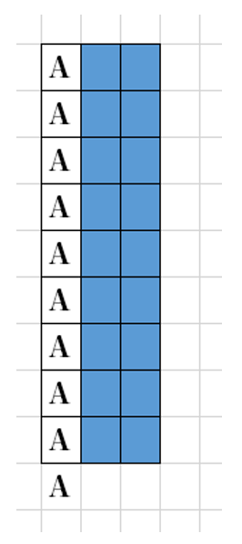
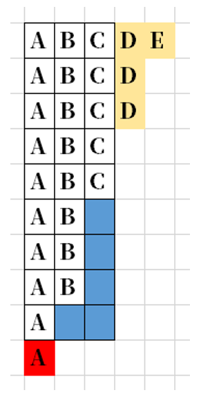

> 题目来源：力扣（LeetCode）
>
> 著作权归领扣网络所有。

<!--truncate-->

## 1  队列的基础知识

队列是连续的存储区，可以存储一系列的元素。是FIFO（先入先出，First-
In-First-Out）结构。

队列通常具有头尾指针（左闭右开区间），头指针指向第一个元素，尾指
针指向最后一个元素的下一位。

队列支持（从队尾）入队（enqueue）、（从队首）出队（dequeue）操
作。

循环队列可以通过取模操作更充分地利用空间。

## 2  队列的典型应用场景

- ### 场景一  CPU的超线程技术

- ### 场景二  线程池的任务队列


## 3  链表的复习

### LeetCode 86 分隔链表

使用两个链表，一个用于插入小于x的元素，一个用于插入大于等于x的元
素，最后合并两个链表即可。

思路：
1.这道题类似于快排，找到一个中间值，比它大的放后面，比它小的放后面，但是不同的 是，分割链表的相对位置要保持不变
2.创建两个链表，一个存储比x小的元素，另一个是比x大的元素
3.为两个链表定义两个指针
4.定义原链表的头指针，然后进行比较，连接到对应的链表，然后进行移动
5.将两个链表拼接到了一起

```javascript
/**
* Definition for singly-linked list.
* function ListNode(val, next) {
* this.val = (val===undefined? 0 : val)
* this.next = (next===undefined? null : next)
* }
*/
/**
* @param {ListNode} head
* @param {number} x
* @return {ListNode}
*/
var partition = function (head, x) {
 	if (!head) return null;
 	let h1 = new ListNode(), h2 = new ListNode(), p1 = h1, p2 = h2;
 	for (let p = head, q; p; p = q) {
 		q = p.next;
 		p.next = null;
		if (p.val < x) {
			[p1.next, p1] = [p, p];
		} else {
			[p2.next, p2] = [p, p];
		}
	}
	p1.next = h2.next;
	return h1.next;
};
```

### LeetCode 138 复制带随机指针的链表

难点在于复制随机指针。 

这里可以使用一个小技巧对节点进行复制：

将原本的 A → B → C 复制成 A → A′ → B → B′ → C → C′ 。 

然后将复制节点中的随机指针域向后推进一格，这样复制节点的随机指针域，就指向了随机指针的复制节点。

最后将复制的节点拆下来即可。

```javascript
/*
*
* [138] 复制带随机指针的链表
*/

// @lc code=start
/**
* // Definition for a Node.
* function Node(val, next, random) {
* this.val = val;
* this.next = next;
* this.random = random;
* };
*/

/**
* @param {Node} head
* @return {Node}
*/
var copyRandomList = function (head) {
	if (!head) return null;
 	let p = head, q;
 	while (p) {
 		q = new ListNode(p.val);
 		q.random = p.random;
 		q.next = p.next;
 		p.next = q;
 		p = q.next;
	}
 	p = head.next;
 	while (p) {
 		p.random && (p.random = p.random.next);
		(p = p.next) && (p = p.next);
	}
 	p = q = head.next;
 	while (q.next) {
 		head.next = head.next.next;
 		q.next = q.next.next;
 		head = head.next;
 		q = q.next;
	}
 	head.next = null;
 	return p;
};
```

## 4  队列的封装与使用

### LeetCode 622 设计循环队列

思路：

1. 首先创建一个容量为k的数组，用来存储数据

2. 定义变量：capacity 表示队列最大容量,front 表示队首的索引,rear 表示队尾的索引,count表示当前队列长度

3. capacity 初始值为 k,front 初始值为 0,rear 初始值为 0,count 初始值为 0 , count == 0表示链表为空

4. 添加一个元素时，向queue[rear]位置插入元素,然后队尾索引向后移动 rear = ( rear + 1 ) % capacity，并且count++

5. 添加一个元素时，rear = ( rear + 1 ) % capacity，并且count++

6. 删除一个元素时，front向后移动即可，front = ( front + 1 ) % capacity，并且count--

7. 添加一个元素时，rear = ( rear + 1 ) % capacity，并且count++

8. 获取最后一个元素 (rear - 1 + capacity) % capacity,注意：为了循环到队尾所以加上capacity

9. 添加一个元素时，rear = ( rear + 1 ) % capacity，并且count++

10. 当capacity和count相等时，说明队列已满

```javascript
/*
*
* [622] 设计循环队列
*/
// @lc code=start
/**
* @param {number} k
*/
var MyCircularQueue = function (k) {
 this.front = 0;
 this.rear = 0;
 this.max = k;
 this.queue = Array(k + 1);
};

/**
* @param {number} value
* @return {boolean}
*/
MyCircularQueue.prototype.enQueue = function (value) {
 if (this.isFull()) return false;
 this.queue[this.rear] = value;
 this.rear = (this.rear + 1) % (this.max + 1);
 return true;
};

/**
* @return {boolean}
*/
MyCircularQueue.prototype.deQueue = function () {
 if (this.isEmpty()) return false;
 this.front = (this.front + 1) % (this.max + 1);
 return true;
};

/**
* @return {number}
*/
MyCircularQueue.prototype.Front = function () {
 if (this.isEmpty()) return -1;
 return this.queue[this.front];
};

/**
* @return {number}
*/
MyCircularQueue.prototype.Rear = function () {
 if (this.isEmpty()) return -1;
 return this.queue[(this.rear + this.max) % (this.max + 1)];
};

```

### LeetCode 641 设计双端循环队列

思路：

1. 首先创建一个容量为k的数组，用来存储数据

2. 定义变量：capacity 表示队列最大容量;front 表示队首的索引;rear 表示队尾的索引，它指向下一个从队尾入队元素的位置;count 表示当前队列长度;

3. capacity 初始值为 k;front 初始值为 0;rear 初始值为 0;count 初始值为 0 ，count == 0表示链表为空;

4. 从队尾添加一个元素时，向queue[rear]位置插入元素,然后队尾索引向后移动rear = ( rear + 1 ) % capacity，并且count++

5. 从队尾添加一个元素时，先添加元素，然后rear后移，rear = ( rear + 1 ) % capacity，并且count++

6. 从队尾添加一个元素时，先添加元素，然后rear后移，rear = ( rear + 1 ) % capacity，并且count++

7. 从队尾删除一个元素时，rear向前移动，rear = ( rear – 1 + capacity ) % capacity，并且count++

8. 从队尾添加一个元素时，先添加元素，然后rear后移，rear = ( rear + 1 ) % capacity，并且count++

9. 从队首删除一个元素时，front向后移动即可，front = ( front + 1 ) % capacity，并且count--

10. 从队首添加一个元素时，front先向前移动一位，front = ( front – 1 + capacity ) % capacity再添加元素，并且count++

11. 从队尾添加一个元素时，先添加元素，然后rear后移，rear = ( rear + 1 ) % capacity，并且count++

12. 当capacity和count相等时，说明队列已满

```javascript
/*
 *
 * [641] 设计循环双端队列
 */
// @lc code=start
/**
 * Initialize your data structure here. Set the size of the deque to be k.
 * @param {number} k
 */
var MyCircularDeque = function (k) {
  this.front = 0;
  this.rear = 0;
  this.max = k;
  this.deque = Array(k + 1);
};
/**
 * Adds an item at the front of Deque. Return true if the operation is successful. 
 * @param {number} value 
 * @return {boolean}
 */
MyCircularDeque.prototype.insertFront = function (value) {
  if (this.isFull()) return false;
  this.front = (this.front + this.max) % (this.max + 1);
  this.deque[this.front] = value;
  return true;
};
/**
 * Adds an item at the rear of Deque. Return true if the operation is successful.
 * @param {number} value 
 * @return {boolean} 
 */
MyCircularDeque.prototype.insertLast = function (value) {
  if (this.isFull()) return false;
  this.deque[this.rear] = value;
  this.rear = (this.rear + 1) % (this.max + 1);
  return true;
};
/**
 * Deletes an item from the front of Deque. Return true if the operation is successful.
 * @return {boolean}
 */
MyCircularDeque.prototype.deleteFront = function () {
  if (this.isEmpty()) return false;
  this.front = (this.front + 1) % (this.max + 1);
  return true;
};
/**
 * Deletes an item from the rear of Deque. Return true if the operation is successful.
 * @return {boolean}
 */
MyCircularDeque.prototype.deleteLast = function () {
  if (this.isEmpty()) return false;
  this.rear = (this.rear + this.max) % (this.max + 1);
  return true;
};
/**
 * Get the front item from the deque. 
 * @return {number}
 */
MyCircularDeque.prototype.getFront = function () {
  if (this.isEmpty()) return -1;
  return this.deque[this.front];
};

/**
 * Get the last item from the deque.
 * @return {number}
 */
MyCircularDeque.prototype.getRear = function () {
  if (this.isEmpty()) return -1;
  return this.deque[(this.rear + this.max) % (this.max + 1)];
};
/**
 * Checks whether the circular deque is empty or not. 
 * @return {boolean} 
 */
MyCircularDeque.prototype.isEmpty = function () {
  return (this.rear - this.front + this.max + 1) % (this.max + 1) == 0;
};
/**
 * Checks whether the circular deque is full or not. 
 * @return {boolean} 
 */
MyCircularDeque.prototype.isFull = function () {
  return (this.rear - this.front + this.max + 1) % (this.max + 1) == this.max;
};
```

### LeetCode 1670 设计前中后队列

为便于后续操作，首先实现一个基于双向链表的双端队列。

使用两个双端队列，一个存放前半部分元素，一个存放后半部分元素。通过维护两个队列首尾节点的方式，平衡两个队列的元素数量，使得中间的元素始终处于固定的位置（如维持在第二个链表头部、或第一个链表尾部）。

思路：

1.这道题的整体思路是，对一个队列/数组，在第一位新增 / 删除一个新的元素,在最后一位 新增 / 删除一个元素，在最中间新增 / 删除一个元素
2.首先举例，我们有【1，2，3，4，5，7】这样的一个队列，我们整体的思路是，命名两 个队列，进行增添操作后，最中间的位置在右队列里面（这个不强制，随自己的意愿），然 后进行删除和新增操作
3.第一个要求，在队列的最前面新增一位，举例，将元素6 加到最前面。用两个队列，将队 列分为左右两个队列，左队列 leftArray 【1，2，3】用黄括号括起来，右队列 rightArray 【4，5，7】用绿括号括起来。左队列使用方法unshift,将元素6添加到队列的第一位 ，这个 时候，左队列的长度 > 右队列的长度，但是我们发现，左队列【6，1，2，3】 右队列【4，5，7】中间元素3在左队列里面;接下来，左队列使用方法pop 删除最后一位，右队列使用方 法unshift 将元素3添加到第一位；就是这样的效果左队列【6，1，2】 右队列【3，4，5， 7】 这就是在队列的最前面添加元素的效果【6，1，2，3，4，5，7】
4.第二个要求，在队列的最中间新增一位，举例将 6 添加到队列的最中间。用两个队列，左 队列 leftArray 【1，2，3】用黄括号括起来，右队列rightArray 【4，5，7】用绿色括号,首 先，判断如果左队列的长度 = 右队列的长度,将左队列的最后一位删除，用到了pop;然后， 将元素3，添加到右队列的第一位，用到了unshift。然后就是这种效果：左队列【1，2】 右队列 【3，4，5，7】然后，将元素6 添加到左队列的最后一位，用到了方法push。就是 这样的效果左队列【1，2，6】 右队列【3，4，5，7】最后，在队列的正中间添加元素的效 果就是【1，2，6，3，4，5，7】
5.第三个要求，在队列的最后面新增一位，举例将 6 添加到队列的最后面。用两个队列，左 队列 leftArray 【1，2，3】用黄括号括起来，右队列rightArray 【4，5，7】用绿色括号括 起来。首先，我们使用push 在右队列的最后一位新增元素6。这时候，效果是：左队列 【1，2，3】 右队列【4，5，7，6】我们发现，最中间的数在右队列里面，并且左队列的长 度< 右队列的长度，符合。这便是在队列最后面新增一位的效果：【1，2，3，4，5，7， 6】
6.第四个要求，将 最前面 的元素从队列中删除并返回值，如果删除之前队列为空，那么返 回 -1；举例还是这个【1，2，3，4，5，7】队列，删掉元素1；用两个队列，左队列 leftArray 【1，2，3】用黄色括号括起来，右队列 rightArray 【4，5，7】用绿括号括起 来。首先，判断左队列是否为空，为空返回-1；否则，使用方法shift删除队列最前面的元 素。这便是删除后的效果：【2，3，4，5，7】 这里注意一下：如果删除第一位后，左队列的长度 > 右队列的长度，举例：左队列【9， 8，2，3】右队列【4，5，7】这时候，左队列使用pop删除最后一位,将删除的元素，新增 到右队列的第一位；
7.第五个要求，将 正中间 的元素从队列中删除并返回值，如果删除之前队列为空，那么返 回 -1；举例还是这个【1，2，3，4，5，7】队列，删掉元素3；用两个队列，左队列 leftArray 【1，2，3】用黄色括号括起来  右队列 rightArray 【4，5，7】用绿括号括起 来。首先，判断左队列是否为空，为空返回-1；否则，在左队列的最后一位删除，用到了 pop，此时队列变成：左队列【1，2】 右队列【4，5，7】然后判断，左队列的长度 < 右队 列的长度；如果符合就不用继续操作。如果不符合，举例：左队列【8，1，2，9】 右队列 【4，5，7】左队列的长度> =右队列的长度,这时候我们还是将左队列的最后一位删除，将 它加到右队列的第一位。便是这种效果：左队列【8，1，2】 右队列 【9，4，5，7】
8.第六个要求，将 最后面 的元素从队列中删除并返回值，如果删除之前队列为空，那么返 回 -1；举例还是这个【1，2，3，4，5，7】队列，删掉元素7；用左右两个队列，黄色括号 是左队列【1，2，3】，绿色括号是右队列【4，5，7】 首先，判断右队列是否为空，为空 返回-1；否则，我们使用方法pop来删除右队列的最后一位。此时，最后一位被删除，但是 需要注意的地方是，左队列的长度 > 右队列的长度。我们要让，左队列的最后一位用方法pop删除，添加到右队列的第一位。此时，便是删除队列的最后一位的效果【1，2，3，4， 5】 

### LeetCode 933 最近请求次数

使用队列对过程进行模拟。不断弹出队首的过期元素，然后返回队列大小即可。

### LeetCode 面试题 17.09 第K个数

先考虑一个问题。对于初始状态{1}，我们应该怎么获得后续元素呢？

我们可以将{1}直接从数组中弹出，然后将他的 3 倍、 5 倍、 7 倍分别加入数组。

然后我们选择{3, 5, 7}中的最小值 3 ，将 3 从数组中弹出，将 3 的 3 倍、 5 倍、 7倍分别加入数组。重复上述过程，直到我们得到第K个数。

由于我们每次都需要获得数组的最小值，因此能动态维护当前最值的优先队列（即最大/小堆）结构可以对此过程进行优化，此时的时间复杂度是 O(n lg n)。

这样结束了吗？我们不妨继续模拟一下这个过程。

注意带下划线的元素，这些是当前轮次中被新添加的元素。

{1} → {<u>3</u>, <u>5</u>, <u>7</u>} → {5, 7, <u>9</u>, <u>15</u>, <u>21</u>} → {7, 9, <u>15</u>, 15, 21, <u>25</u>, <u>35</u>}

在第 3 轮处理的时候，出现了重复元素 15 （ 5 × 3 ），而在之前也得到过这个元素（ 3 × 5 ）。

解决重复元素的方案也很简单。

如果当前正在处理的元素不包含因子 3 ，那么它的 3 倍就无需被加入队列。

如果当前正在处理的元素不包含因子 3 和 5 ，那么它的 3 倍和 5 倍就无需被加入队列。

因为这些元素的 3 倍 / 5倍一定在之前被其他元素的倍率得到过，可以通过质因数分解的表示形式对此进行证明。

由于在过程中遍历了所有数组中元素的 3 、 5 、 7 倍并选择了当前的最小值，因此这个做法是不重复、不遗漏的。

分析到这里其实已经可以AC这道题了。但我们还可以想一下是否可以继续优化。

能否优化掉这个 lg n 呢？

这个 lg n  来自于优先队列的维护过程。实际上我们的枚举过程本身是有序的，而被弹出的元素的 3 倍、 5 倍、 7 倍中，我们并不一定需要把 5 倍和 7 倍也提前加入队列参与这个排序过程。因为 5 倍值和 7 倍值之间，大概率还存在着其他元素的 3 倍值和 5 倍值。

我们可以使用 3 个指针p3，p5，p7来指向我们结果数组中的元素。指针p
指向的值，其 3 倍在当前循环结束后加入结果数组；p5，p7同理。

循环的每一轮， 3 × ans[p3]， 5 × ans[p5]， 7 × ans[p7]中的最小值将被加
入结果数组，然后对应的指针向前推进一格，直到结果数组中有K个数。

对于不重复的证明是显然的，在推进过程中，每次循环结束后，加入数组中的值一定严格小于指针正在指向的值的倍率，因此数组是严格单调递增的 —— 3个 if 中，可能有两个是同时成立的，这导致了p3，p5，p7可能同时被推进一格。

对于不遗漏的严格证明，细节较为繁多，在此不做赘述。由于每个元素都是由数组内的元素的倍率生成的，我们可以通过考虑指针推进的过程，来直观得到这一结论。

### LeetCode 859 亲密字符串


### LeetCode 860 柠檬水找零

分情况讨论即可，注意不要漏掉样例中给出的边缘情况。

### LeetCode 969 煎饼排序

每次将第N大的元素先翻转到第 1 位，再翻转到第N位，这样第N位就无需在后续进程中再进行处理，只需要考虑前N-1位即可。

由于每个元素只需要 2 次翻转即可归位，因此所需的次数最多只需2N次，符合题目需求。

对于这种做法，可行的优化主要有两个：

一是可以去除值为“1”的翻转（值为“1”的翻转相当于未操作）；

二是可以跳过已经在正确位置上的元素。

:::tip 

对于煎饼排序的最优解，在《编程之美》中有更加详细的讨论。

:::

### LeetCode 621 任务调度

首先考虑这样一个问题，对于存在冷却时间的情况，任务调度最少要花费多少的空间？

我们首先对任务进行分类，根据任务出现的次数对任务进行排序。

以{"A":  10, "B":  8, "C":  5, "D":  3, "E":  1}，且冷却时间为 2 为例。

无论如何安排，任务A都至少要花费 9 * (1 + n) + 1 的时间，原因如图所示（带有黑色边框的部分是无法节省的时间部分，蓝色部分为冷却时间）。



对于任务B，我们可以将其安排在任务A的冷却时间中。对于任务C同理。

由于冷却时间n=2，因此接在C后面的元素，在右边竖着接下去的时候，由于同名任务相隔距离大于 2 ，就不再受冷却的限制，可以理解为可以任意排布。



但是我们注意到，任务的安排还可以再优化。黄色部分的内容可以按顺序地接在蓝色部分，让冷却时间得到利用。

因此，可以得到如下计算式：

