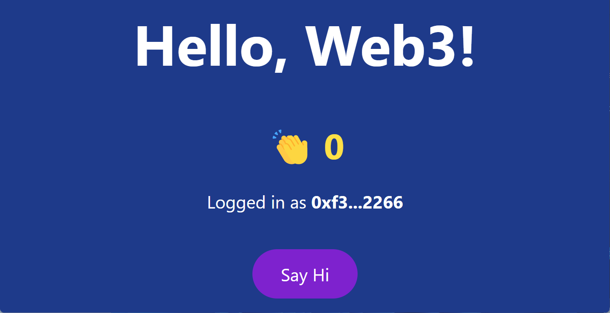

学习探索什么是 Web 3.0

通过建立一个计数器体验一下 Web 3.0 的开发流程

使用到的框架和语言：

- HardHat（以太坊 Ethereum 本地开发环境）

- Solidity 建立智能合约

- React.js 建立前端网站 

- Ethers.js 简易的 Web3 框架

<!--truncate-->

## 第一步：创建名为 “hello-web3” 的文件夹

## 第二步：初始化项目

打开终端，输入命令：

```powershell
npx hardhat init
```


选项默认即可


运行命令安装依赖：

```powershell
npm install --save-dev "hardhat@^2.8.4" "@nomiclabs/hardhat-waffle@^2.0.0" "ethereum-waffle@^3.0.0" "chai@^4.2.0" "@nomiclabs/hardhat-ethers@^2.0.0" "ethers@^5.0.0"
```

HardHat 是一套完善的 Ethereum 本地开发套件，我们可以通过它来进行智能合约的测试和部署

使用 VSCode 打开项目


先将 contracts 和 scripts 目录下的文件移除，从零开始编写第一个智能合约

## 第三步：从零开始编写第一个智能合约

在 contracts 目录下建立一个名为 ” Counter.sol “ 文件

:::info

.sol 是 Solidity 的副档名

:::

合约一开始都会有一句版权声明，例如： `// SPDX-License-Identifier: UNLICENSED`

然后是定义 solidity 的版本号，例如：`pragma solidity ^0.8.0;`

再载入 `console.log()` 的套件：`import "hardhat/console.sol";`

:::tip

其实 Solidity 与 JavaScript 很多方面都很相似

:::

定义合约使用 contract 关键字

定义一个 state 变量，名为 counts，用来记住计数器的数字

定义一个 constructor 将它初始化为 0

添加一个 `function add()` 使 counts 加 1

不需要使用 this 即可引用到 counts

再加入一个 `function getCounts() public view returns (unit) {}` 

其中的 `view` 的意思是说这个函数只返回资料，并不涉及到交易

可以先简单理解为呼叫这个函数是不用花钱的

至此，这份简单的智能合约就写好了

接下来是测试的部分

在 scripts 目录下新增一个名为 `run.js` 的文件

定义一个函数 main，注意要加上 async 关键词

因为函数内执行的很多语句都需要等待，

所以一般习惯使用 `async / await` 的模式去编写

先将 Counter 这份智能合约获取回来，

然后 `await Counter.deploy()` 将合约部署到区块链上

由于上链需要时间，所以还会有一句 `await counter.deployed()`

代表确保智能合约完成部署到区块链上之后，

使用 `console.log` 将合约地址输出一下，然后执行 `main()`

在成功执行的时候输出 success 并且正常退出，

发生错误的话就输出错误讯息，并且退出

:::tip 为什么这里的 hre 不需要载入？

hre 是 HardHat Runtime Environment 的简写，

由于稍后我们会使用 hardhat 来执行这个文件，

所以 hre 是会在环境中直接植入，毋须专门去引用它

:::

切换到终端中，使用 hardhat 运行它

执行：`npx hardhat run scripts/run.js`

合约会先进行编译再执行，完成运行后会显示合约地址

:::caution

执行过程中可能会遇到问题：


对此问题有两个解决方法：

① 尝试卸载 Node.js 17+ 版本并重新安装 Node.js 16+ 版本

② 打开终端输入：

```shell
适用于 Linux & Mac OS (windows git bash):

export NODE_OPTIONS=--openssl-legacy-provider

适用于 Windows 命令提示符:

set NODE_OPTIONS=--openssl-legacy-provider
```


:::

再执行一次，会发现由于并没有通过节点执行合约，合约地址依旧相同

但在正式部署的时候，合约地址每次都会不一样的

回到 VSCode，会看到新建了一个 artifacts 的目录，

里面有很多在刚才编译时生成的文件，

其中比较重要的是 `Counter.json` 文件，

里面有 Counter 这份智能合约编译后的编码以及合约内的函数名称等


接着用另一种方式进行本机测试

打开一个新的终端，运行 `npx hardhat node`

这样会运行一个本机的节点，并且会提供 20 个钱包地址及私匙


:::danger 特别提醒

这些私匙也是确确实实可以在真实环境中使用的，

但是由于这些私匙都被公开了的，

所以除了测试用途，请勿在正式环境中使用

:::

可见每个钱包都有 10000 个 ETH，这足够我们进行任何测试了

然后再使用 run 指令运行合约，

这次加上 `--network localhost` 的设定，

就会将合约在本机的节点上运行了

运行后，可以在节点的终端中看到有一份新的智能合约成功部署了


并且花费了一些 Gas，即是手续费

再试着部署一次，这次会发现合约的地址就不同了

所以要记住一个概念：合约是不能更新的，只能部署一份新的合约

至此，合约就成功部署并且运行了

接着试执行以下刚才我们定义的两个函数

首先，运行合约内的 `getCounts()` 获取 counts 的值

通过 `console.log()` 输出

然后运行合约内的 `add()` 函数，

同样将最新的 counts 输出，在输出的内容中标示一下编号

再来一次，前后总共获取 3 次，增加 2 次

运行一下，可以看到输出了 3 次结果


符合我们的预期

回到节点的终端上，可以看到：


第一笔记录是部署智能合约，花费了一些 Gas 费用

然后是 Contract Call 执行 `getCounts()` 函数

再来是执行 `add()` 函数

需要注意的是，执行 `add()` 就很不同了，

它是一个 Transaction，即是交易，需要花费一些 Gas 费用

我们可以留意一下，`getCounts()` 是不需要付费的，而 `add()` 需要

这是由于 `getCounts()` 只是读取 counts 的值，

而 `add()` 需要改动 counts 的值，所以需要支付一些上链的费用

## 第四步：建立一个 React.js 的项目

通过 create-react-app 建立一个名为 react-hello-web3 的项目

`npx create-react-app react-hello-web3`

然后再安装 TailwindCSS 

```powershell
npm install -D tailwindcss postcss autoprefixer

npx tailwindcss init
```

运行 `npm run start` 启动本地测试服务器


运行成功，回到 VSCode，修改一下 `App.js` 的样式

确保 Tailwind CSS 已经成功安装

```react
function App() {
  return (
    <div className='text-5xl text-center text-blue-800'>
      <h1>Hello, Web3!</h1>
    </div>
  );
}
```


接下来建立一下页面的结构：分别有

一个大标题：Hello, Web3!

一个表情符号：👏

加上一个数字，代表 Hello 了多少次

再加一个按钮，点击它的话就会将数字加 1

然后载入 useState 和 useEffect

使用 React Hooks 来管理 state

定义 count 和 setCount 的 state，初始化为 0

然后用 count 将数字替换掉


下一步需要判断用户是否已经使用钱包登入

定义 account 和 setAccount，初始化为 null

然后判断一下，如果未登入的话，就显示 Connect Wallet 的按钮，

登入了就显示数量和加 1 的按钮

接下来是钱包的安装

## 第五步：安装钱包

目前其中一个主流的钱包是 MetaMask

:::info

如果你使用 Safari 浏览器，请注意：

Safari 不支持安装这些钱包，

可以切换到 Chrome 浏览器

:::

MetaMask 官方网站：https://metamask.io/


<iframe width="560" height="315" src="https://www.youtube.com/embed/YVgfHZMFFFQ" title="YouTube video player" frameborder="0" allow="accelerometer; autoplay; clipboard-write; encrypted-media; gyroscope; picture-in-picture" allowfullscreen></iframe>

以 Chrome 浏览器的版本为例：

点击后会跳转到官方的商店中去下载插件

https://chrome.google.com/webstore/detail/metamask/nkbihfbeogaeaoehlefnkodbefgpgknn

安装完成后，建立一个新的钱包，设置一个解锁密码

如果忘记解锁密码，可以重新设置

关键是不要把私匙遗失

不过自从 BIP39 的提案后，可以使用一种叫助记词的方式去导入你的钱包

它会给你 12 个英文生词，只要按他的顺序输入这 12 个英文生词，就能将钱包回复

而一套助记词又可以生成多组钱包地址，等于保管着多条私匙的意思，

所以必须好好保管

由于只是做本地的开发测试，属于可以用完即弃的，

所以就不去记录这些助记词了


完成建立，可以看到目前有 0 个 ETH


然后运行本机的节点 `npx hardhat node`

将其中一组的私匙复制一下

然后在 MetaMask 的 Import Account


将这个测试用的钱包通过私匙回复


可以看到，这个地址在正式环境中竟然会有资产

:::danger


这些是已经公开了的钱包私匙，

私匙有别于密码，是不能更改的，

所以除了测试以外，不要作其他用途

千万记得不要在正式环境中使用

:::

然后在 Networks 中


在 Localhost 这个本机测试网络中

将 Chain ID 从 1337 改为 31337

这只需要做一次，符合 HardHat 的设定

然后当切换到 Localhost 这个网络时，

钱包中就会显示目前有 10000 个 ETH 了

现在我们再试试运行一下 `npx hardhat run scripts/run.js --network localhost`

节点终端上显示有对应的交易

然后切换到钱包上一看，目前就扣掉了一点 ETH 了，剩余 9999.9998 ETH

现在回到 React 项目中，将登入钱包，显示 counts 和 加 1 这些功能都做进网页中

## 第六步：完善 React 项目

首先安装一个名为 ethers 的 JavaScript 库 `npm install ethers`

ethers 是一个简单版的 Web3 框架，方便我们调用 Web3 的 API

在 App.js 中载入它

然后定义一个函数 checkIfWalletIsConnected 检查钱包是否已经登入网站

先从 window 物件中获取 ethereum 物件

这个物件是由 MetaMask 植入的,

所以如果不存在的话，就代表没有安装 MetaMask

然后尝试执行它的 API eth_accounts

如果是已经授权了的话，就会返回钱包地址

所以如果有地址的话，就通过 `setAccount()` 将它储存起来

通过 `useEffect()` 加上空白数组的方式，在页面加载时执行一次

这就等于 React 的 `componentDidMount()` 的方法

```react
const checkIfWalletIsConnected = async () => {
  try {
    const { ethereum } = window

    if (ethereum) {
      console.log(`MetaMask is available`)
    } else {
      console.log(`Please install metamask`)
    }

    const accounts = await ethereum.request({
      method: "eth_accounts"
    })

    if (accounts.length !== 0) {
      const account = accounts[0]
      console.log(`Found account with address`, account)
      setAccount(account)
    } else {
      console.log(`No authorized account found`)
    }
  } catch (err) {
    console.error(err)
  }
}

useEffect(() => {
  checkIfWalletIsConnected()
}, [])
```
然后在 Connect Wallet 按钮上加入 onClick 事件，执行使用钱包登入的逻辑

定义 connectWallet 函数，同样先判断 ethereum 物件是否可用

然后执行 API 方法 eth_requestAccounts

这样就会询问用户是否授权我们这个网站去获取钱包地址

有的话就通过 `setAccount()` 记下来

```react
  const connectWallet = async () => {
    try {
      const { ethereum } = window

      if (!ethereum) {
        alert(`Please install MetaMask`)
        return
      }

      const accounts = await ethereum.request({
        method: "eth_requestAccounts"
      })
      console.log(accounts[0])

      setAccount(accounts[0])
    } catch (err) {
      console.error(err)
    }
  }
```

点一下按钮，会弹出 MetaMask 的授权视窗

我们会发现是可以多选的，所以为什么在代码中 accounts 是一个数组

点击 Connect 的话，就可以获取到钱包地址了

也可以在 MetaMask 中断开连接，

这样网站就会回复到未登入的状态了

登录完成 Connect Wallet 按钮隐藏，显示数字和 Say Hi 按钮


修改一下 `App.js` ，使得在页面上显示一下登入了的钱包地址

由于地址太长，所以只显示地址的首 4 位和尾 4 位

在视觉上就更加美观了

```react
<h3 className='mt-12 text-center text-3xl text-bold text-white'>
  Logged in as {" "}
  <strong>
    {`${account.substring(0, 4)}...${account.substring(account.length - 4)}`}
  </strong>
</h3>
```



接下来处理 Say Hi 按钮的逻辑

在按钮上加入 onClick 事件以及对应的处理函数

先判断 ethereum 物件是否可用

这次有一点不同，因为要执行合约内的函数，

所以要先经由 ethereum 物件去获取 Provider

然后再经由 Provider 获取 Signer

Signer 就是执行合约的签名方

再来就是建立一个合约的实体，要求三个参数：

Ⅰ 智能合约的地址

Ⅱ 合约的 ABI 即 HardHat 编译后的 JSON 文件

Ⅲ Singer 即是谁在执行合约

先定义一下 contractAddress，然后将刚刚部署在节点上的合约地址填上去

回到智能合约的项目中，将 Counter.json 的内容复制一下

在 React 项目中，建立一个名为 utils 的目录

建立 `Counter.json` 文件，并将内容贴上

在 `App.js` 中载入它的内容

试试执行合约的 `add()` 函数，在前面加上 await 关键词

因为这个动作必须等待它完成

```react
import abi from "./utils/Counter.json"

const contractAddress = "0x5fbdb2315678afecb367f032d93f642f64180aa3"
const contractABI = abi.abi

...

const hi = async () => {
  try {
    const { ethereum } = window

    if (ethereum) {
      const provider = new ethers.providers.Web3Provider(ethereum)
      const signer = provider.getSigner()
      const CounterContract = new ethers.Contract(contractAddress, contractABI, signer)

      await CounterContract.add()
    }
  } catch (err) {
    console.error(err)
  }
}
```

点击 Say Hi 按钮，神奇的事情出现了

会看到一个交易的画面，下面列出所需要的费用，同意的话就确认

现在执行 add 函数，由于会变更 counts 的值的关系

所以要更改它需要支付一定的上链费用

目前我们还未将最新的 counts 值获取回来，

所以定义一个新的函数 `getCounts()`

检查 ethereum 物件是否可用这些逻辑都是大同小异

不同的地方是，这次是执行 `getCounts()` 函数

然后将获取到的值通过 `setCount()` 更新到 state 中

在检查了钱包是否登入以后，再执行 `getCounts()`

```react
useEffect(() => {
  checkIfWalletIsConnected().then(() => {
    getCounts()
  })
}, [])

...

const getCounts = async () => {
  try {
    const { ethereum } = window

    if (!ethereum) {
      alert(`Ethereum object is not available`)
      return
    }
    
    const provider = new ethers.providers.Web3Provider(ethereum)
    const signer = provider.getSigner()
    const CounterContract = new ethers.Contract(contractAddress, contractABI, signer)

    const counts = await CounterContract.getCounts()
    setCount(counts)
  } catch (err) {
    console.error(err)
  }
}
```

刷新一下，可以看到画面白了，有一些错误

提示 BigNumber，原因是 `getCounts()` 返回的数字


打印一下 counts 可以发现 长度非常大，

所以在 JavaScript 中返回了一个物件


通过 `toNumber()` 转换一下即可

可以看到目前的数字是 2


试试在 `add()` 之后就执行 `getCounts()` 将最新的值获取回来

在执行 `add()` 之后会返回一个 Transaction

在这里要执行

```react
let tx = await CounterContract.add()
await tx.wait()
await getCounts()
```

等待这个 `add()` 里面修改 counts 的动作完成上链后，才去获取新的值

测试一下，这次就正常了

最后，做一些 `UI / UX` 上的优化

## 第七步：优化 UI / UX

由于上链的动作一般都需要等待，

所以最好有一个 Loading 的提示

加入 isLoading 和 setIsLoading 的 state 设定值

`const [isLoading, setIsLoading] = useState(false)`

修改一下 HTML 结构

判断如果 isLoading 是 true 的时候，显示一个 Loading 图标

再在适当的位置，将 isLoading 设定为对应的值


> 参考 B站 UP主 CodingStartup起码课 视频 BV1ES4y1r7DL