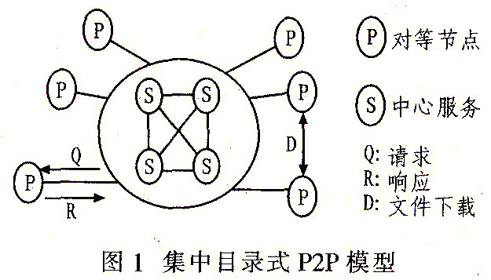
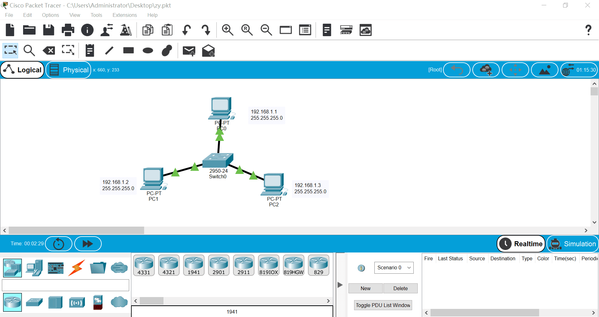

> **【** **知识目标** **】**
>
> 1. 选择网络类型；
> 2. 对等网；
> 3. 客户机 / 服务器网络。
>
> **【** **能力目标** **】**
>
> 1. 理解对等网的结构、组成和特点；
> 2. 理解客户机 / 服务器网络的结构、组成和特点。

## **一  对等网络**

对等网络，即对等计算机网络，是一种在对等者（Peer）之间分配任务和工作负载的分布式应用架构，是对等计算模型在应用层形成的一种组网或网络形式。“Peer” 在英语里有“对等者、伙伴、对端”的意义。因此，从字面上，P2P 可以理解为对等计算或对等网络。国内一些媒体将 P2P 翻译成“点对点”或者“端对端”，学术界则统一称为对等网络（Peer-to-peer networking）或对等计算（Peer-to-peer  computing），其可以定义为：网络的参与者共享他们所拥有的一部分硬件资源（处理能力、存储能力、网络连接能力、打印机等），这些共享资源通过网络提供服务和内容，能被其它对等节点（Peer）直接访问而无需经过中间实体。在此网络中的参与者既是资源、服务和内容的提供者（Server），又是资源、服务和内容的获取者（Client）。 

在 P2P 网络环境中，彼此连接的多台计算机之间都处于对等的地位，各台计算机有相同的功能，无主从之分，一台计算机既可作为服务器，设定共享资源供网络中其他计算机所使用，又可以作为工作站，整个网络一般来说不依赖专用的集中服务器，也没有专用的工作站。网络中的每一台计算机既能充当网络服务的请求者，又对其它计算机的请求做出响应，提供资源、服务和内容。通常这些资源和服务包括：信息的共享和交换、计算资源（如CPU计算能力共享）、存储共享（如缓存和磁盘空间的使用）、网络共享、打印机共享等。

## **二  对等网络模型**

:::tip  对等网络模型的特点

　　(1)  非中心化

　　网络中的资源和服务分散在所有结点上，信息的传输和服务的实现都直接在结点之间进行，无需中间环节和服务器的介入，避免了可能的“瓶颈”。以下棋系统为例，下棋的业务流程直接在下棋者的两个结点之间完成，无需中心服务器的参与(除了统一计费、记分等需要集中管理的服务)。非中心化是 P2P 的基本特点，带来了其在可扩展性、健壮性等方面的优势。

　　(2)  可扩展性

　　在 P2P 网络中，随着用户的加入，不仅服务的需求增加了，系统整体的资源和服务能力也在同步扩充(因为新加入的用户本身也提供服务和资源)，因此能够较好地满足用户的需要。整个体系是全分布的，不存在明显的“瓶颈”。以下棋系统为例，下棋的业务能力主要是通过下棋者的结点来提供(包括棋盘的绘制，下棋的流程规则管理等)，对下棋服务器增加的负担较小。

　　(3)  健壮性

　　P2P 架构具有耐攻击、高容错的优点。P2P 网络通常都是以自组织的方式建立起来的，并允许结点自由地加入和离开。不同的 P2P 网络采用不同的拓扑构造方法，根据网络带宽、结点数、负载等变化不断自适应地调整拓扑结构。由于服务是分散在各个结点之间进行的，部分结点或网络遭到破坏对其他部分的影响很小(即两个下棋人之间的网络被破坏，不会直接影响其他的下棋用户)，即便是部分结点失效了，P2P 网络也能通过自动调整机制重构整体拓扑，保持与其他结点的连通性。

　　(4)  高性价比

　　采用 P2P 架构可以有效地利用互联网中散布的大量普通结点，将计算任务或存储资料分布到所有结点上，利用其中闲置的计算能力或存储空间，达到高性能计算和海量存储的目的。

　　(5)  隐私保护

　　在P2P网络中，由于信息的传输分散在各结点之间进行而无需经过某个集中环节，用户的隐私信息被窃听和泄漏的可能性大大缩小。目前，解决 Internet 隐私问题主要采用中继转发的技术方法，从而将通信的参与者隐藏在众多的网络实体之中。在传统的匿名通信系统中，实现这一机制依赖于某些中继服务器结点(比如传统的下棋系统中的计费和记分，一般都需要通过中心服务器来实现)。而在 P2P 中，所有参与者都可以提供中继转发的功能，因而大大提高了匿名通信的灵活性和可靠性，能够为用户提供更好的隐私保护。这个优点恰恰也是 P2P 系统的缺点，这种特性导致了它常常被非法组织用于私密信息传递。

:::

### **1 集中目录式P2P模型**  

​	集中目录式P2P结构是最早的P2P应用模式，因其仍具有中心化的特点也被称为非纯粹的P2P结构，Napster是这种模型的典型代表，如图l所示。集中目录式模型，是由一个中心服务器来负责记录共享信息以及反馈对这些信息的查询，每一个对等实体要对它所需共享的信息以及进行的通信负责。当某节点希望搜索一个不知道位置的资源时，该节点向目录服务器发送请求，目录服务器在数据库中查询到匹配的资源后将其定位信息返回该节点，然后在两个节点之间执行交互。

​    与传统的客户朋艮务器模式不同，这种模式中客户所需要的资料并非存储在服务器上，而是存贮在P2P网络内的各个节点中，当查询节点收到节点地址信息列表后，会根据网络流量和延迟等信息选择合适的节点建立直接连接，其文件传递并不经过中央目录服务器，而是直接在节点之间通过TCP协议进行。此外服务器与对等实体以及对等实体之间都互有交互能力。

### **2 分布式P2P模型**

​	分布式 P2P 网络采用随机图的组织方式，利用 TTL(Time-to-Live)，洪泛(Flooding)，随机漫步或有选择转发等方式搜索网络资源。当节点度数服从幂率(power—law) 规律时，该方式能够较快发现目标结点，而且面对网络的动态变化体现了较好的容错能力。代表性网络是 Gnutella，如图2所示。

### **3 结构化P2P模型**

结构化 P2P 模式是一种采用纯分布式的消息传递机制和根据关键字(KEY)的定位服务，从根本上改变了 P2P 网络无结构的状态。其中主流的方法就是采用分布式哈希表(Distributed Hash  Table，DHT)技术，是目前扩展性最好的 P2P 路由方式之一。DHT 首先为网络中的每一个节点分配虚拟地址(VID)，同时用一个关键字(KEY)表示其可提供的共享内容。通过一个特定的哈希函数(一般使用的是安全哈希函数，如SHA一1等)将文件名(KEY)与节点信息(VID)运算为一个哈希值 H(KEY，VID)，当网络上其它节点进行资源定位的时候，可以容易地根据 H(Key) 值获得文档的精确存储位置。由于 DHT 各节点并不需要维护整个网络的信息，只在节点中存储其临近的后继节点信息，因此较少的路由信息可有效地实现到目标节点，同时又取消了洪泛算法，该模型有效地减少了节点信息的发送数量，增强了 P2P 网络的扩展性。同时，出于冗余度及延时的考虑，大部分 DHT 总是在节点的虚拟标识与关键字最接近的 K 个节点上备份冗余信息，避免了单一节点失效的问题。

### **4 混合式P2P模型**  

混合式 P2P 网络结合了集中式结构和分布式拓扑的优点，网络中存在着中间服务器，文件目录是分布的。在分布式模式的基础上引入了超级节点(Super  Node)概念，将用户节点按能力(处理、存储、带宽等方面性能)分为搜索节点和普通节点两类．搜索节点与其临近的若干普通节点之间构成一个自治的簇(Cluster)，簇内采用基于集中目录式的 P2P 模式，而整个 P2P 网络中存在着众多这样的簇，各个不同的簇之间再通过分布式 P2P 模式将搜索节点相连起来，甚至可在各个搜索节点之间，再次选取性能最优的节点或者另外引入一新的性能最优的节点作为索引节点，来保存整个网络中可以利用的搜索节点信息，并且负责维护整个网络的结构。混合式 P2P 模型消除了分布式 P2P 结构中使用 Flooding 算法带来的网络拥塞、搜索迟缓等不利影响，吸收了集中式拓扑的易管理性与分布式拓扑的可扩展性，在异构的 P2P 网络环境下是一种较好的模式选择。其中最典型的案例就是 Fastrack ，如图3所示。

## **三  客户机 / 服务器网络**

### **1 客户机 / 服务器系统**

客户机 / 服务器系统 Client/server system 简称 C / S 系统。是一类按新的应用模式运行的分布式计算机系统。现在的 LAN，Internet 提供的多种服务都是这种模式。

:::note

#### 客户机

通常在一个LAN上链接由多台网络工作站，就成为客户机，每台客户机都是具有一定处理能力的自主计算机，客户的进程都在上面运行。

#### 服务器

一台性能更高的机器，上面由网络文件系统和数据库系统等，一直处于工作状态，接收用户请求，为网上用户提供多种服务，将结果返回给用户。

:::

### **2 客户机 / 服务器模式**

:::tip   一个完整的交互过程

1. 客户机发消息：把信息装配成请求消息，发往服务器，然后进入等待状态
2. 服务器收消息：服务器接收进程平时就一直处于等待状态，将收到消息用相应软件进行处理
3. 服务器回消息：再把处理结果装配成响应消息发送出去
4. 客户机收消息：接收响应

:::

:::note   **客户机 / 服务器模式 的优缺点 （摘自CSDN）**

> #### **优点**
>
> C/S结构的优点是能充分发挥客户端PC的处理能力，很多工作可以在客户端处理后再提交给服务器。对应的优点就是客户端响应速度快。具体表现在以下两点：
>
> 应用服务器运行数据负荷较轻。最简单的C/S体系结构的数据库应用由两部分组成，即客户应用程序和数据库服务器程序。二者可分别称为前台程序与后台程序。运行数据库服务器程序的机器，也称为应用服务器。一旦服务器程序被启动，就随时等待响应客户程序发来的请求；客户应用程序运行在用户自己的电脑上，对应于数据库服务器，可称为客户电脑，当需要对数据库中的数据进行任何操作时，客户程序就自动地寻找服务器程序，并向其发出请求，服务器程序根据预定的规则做出应答，送回结果，应用服务器运行数据负荷较轻。
>
> 数据的储存管理功能较为透明。在数据库应用中，数据的储存管理功能，是由服务器程序和客户应用程序分别独立进行的，并且通常把那些不同的（不管是已知还是未知的）前台应用所不能违反的规则，在服务器程序中集中实现，例如访问者的权限，编号可以重复、必须有客户才能建立定单这样的规则。所有这些，对于工作在前台程序上的最终用户，是“透明”的，他们无须过问（通常也无法干涉）背后的过程，就可以完成自己的一切工作。在客户服务器架构的应用中，前台程序不是非常“瘦小”，麻烦的事情都交给了服务器和网络。在C/S体系下，数据库不能真正成为公共、专业化的仓库，它受到独立的专门管理。
>
> #### **缺点**
>
> 随着互联网的飞速发展，移动办公和分布式办公越来越普及，这需要我们的系统具有扩展性。这种方式远程访问需要专门的技术，同时要对系统进行专门的设计来处理分布式的数据。
>
> C/S架构的劣势还有高昂的维护成本且投资大。首先，采用C/S架构，要选择适当的数据库平台来实现数据库数据的真正“统一”，使分布于两地的数据同步完全交由数据库系统去管理，但逻辑上两地的操作者要直接访问同一个数据库才能有效实现，有这样一些问题，如果需要建立“实时”的数据同步，就必须在两地间建立实时的通讯连接，保持两地的数据库服务器在线运行，网络管理工作人员既要对服务器维护管理，又要对客户端维护和管理，这需要高昂的投资和复杂的技术支持，维护成本很高，维护任务量大。
>
> 其次，传统的C/S结构的软件需要针对不同的操作系统系统开发不同版本的软件，由于产品的更新换代十分快，代价高和低效率已经不适应工作需要。
>
> ————————————————
>
> 版权声明：本文为CSDN博主「机器视觉001」的原创文章，遵循CC 4.0 BY-SA版权协议，转载请附上原文出处链接及本声明。
> 原文链接：https://blog.csdn.net/liubing8609/article/details/88071067

:::

## **四  用思科模拟器组建对等网**

