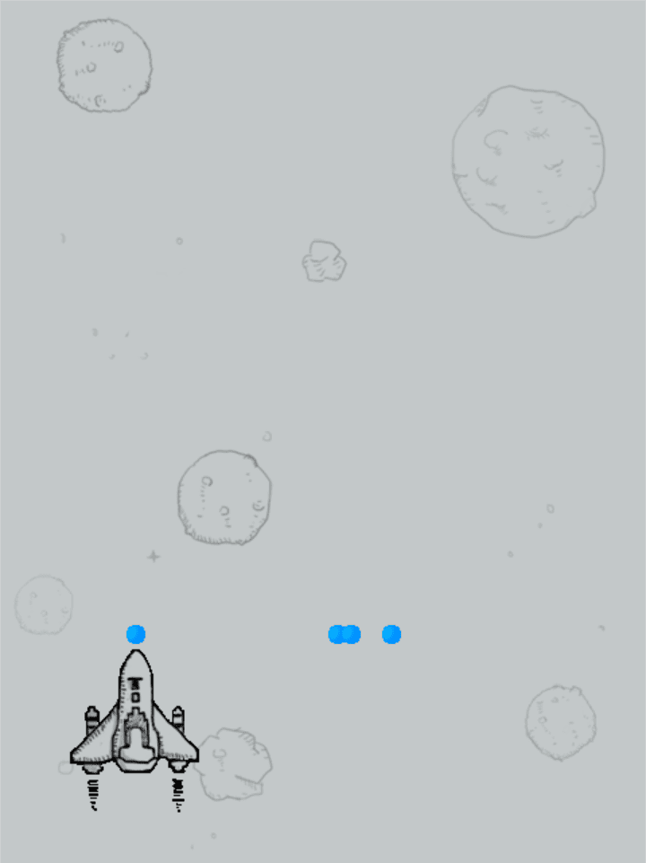
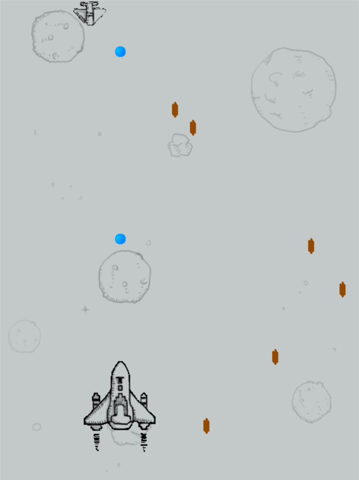
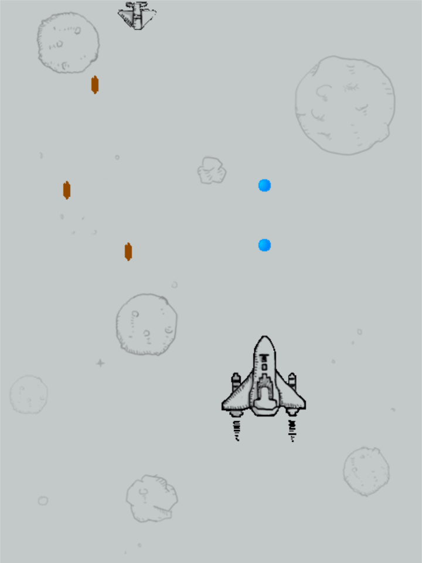
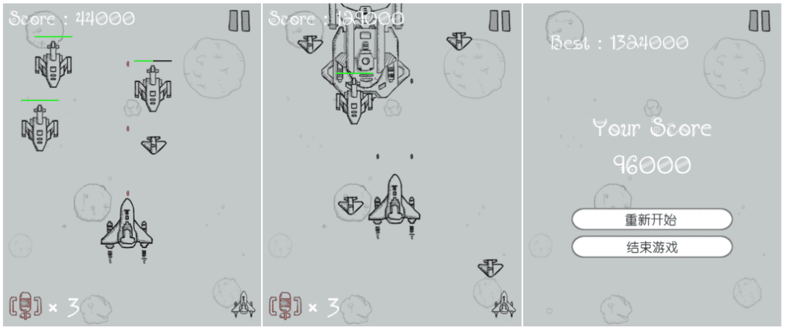

**Python 程序设计课大作业**

<!--truncate-->

## 01 初始版本 1

main.py

```python
import pygame
from pygame.locals import *
from plane import *
from bullet import *
# 开始游戏
def start() :
    # 1. 创建一个窗口，用来显示内容
    screen = pygame.display.set_mode((480,642),0,32)
    # 2. 创建一个和窗口大小的图片，用来充当背景
    image_file_path = './feiji/background.png'
    background = pygame.image.load(image_file_path).convert()
    # 3. 创建一个飞机对象
    hero_plane = HeroPlane(screen)
    # bullet = Bullet(hero_plane.x,hero_plane.y,screen)
    # 4. 游戏主循环：
    # 将背景图片放到窗口中显示
    while True :
        screen.blit(background,(0,0))
        hero_plane.display()
        # 判断是否点击退出
        for event in pygame.event.get() :
            if event.type == QUIT :
                print("exit")
                exit()
            elif event.type == KEYDOWN :
                if event.key == K_a or event.key == K_LEFT :
                    print('left')
                    hero_plane.move_left()
                elif event.key == K_d or event.key == K_RIGHT :
                    print("right")
                    hero_plane.move_right()
                elif event.key == K_SPACE :
                    print("space")
                    hero_plane.launch_bullet()
        pygame.display.update()

if __name__ == '__main__' :
    start()
```

plane.py

```python
import pygame
from bullet import *
class HeroPlane :
    def __init__(self,screen):
        # 设置飞机默认的位置
        self.x = 200
        self.y = 480
        # 设置要显示内容的窗口
        self.screen = screen
        # 保存飞机的图片
        self.image_name = "./feiji/hero.gif"
        # 根据图片路径生成飞机图片
        self.image = pygame.image.load(self.image_name).convert()
        # 用来存储飞机发射的所有子弹
        self.bullet_list = []
    def display(self):
        self.screen.blit(self.image,(self.x,self.y))
        for bullet in self.bullet_list :
            bullet.display()
    # 飞机左移和右移
    def move_left(self):
        self.x -= 10
    def move_right(self):
        self.x += 10
    # 发射子弹
    def launch_bullet(self):
        new_bullet = Bullet(self.x,self.y,self.screen)
        self.bullet_list.append(new_bullet)

```

bullet.py

```python
import pygame
class Bullet :
    def __init__(self,x,y,screen):
        self.x = x + 40
        self.y = y - 20
        self.screen = screen
        self.image = pygame.image.load("./feiji/bullet-3.gif").convert()
    def display(self):
        self.screen.blit(self.image,(self.x,self.y))

```



## 02 初始版本 2

main.py

```python
import time
import pygame
from pygame.locals import *
from plane import *
from bullet import *

# 开始游戏
def start() :
    # 1. 创建一个窗口，用来显示内容
    screen = pygame.display.set_mode((480,642),0,32)
    # 2. 创建一个和窗口大小的图片，用来充当背景
    image_file_path = './feiji/background.png'
    background = pygame.image.load(image_file_path).convert()
    # 3. 创建一个飞机对象
    hero_plane = HeroPlane(screen)
    enemy_plane = EnemyPlane(screen)
    # bullet = Bullet(hero_plane.x,hero_plane.y,screen)
    # 4. 游戏主循环：
    # 将背景图片放到窗口中显示
    while True :
        screen.blit(background,(0,0))
        hero_plane.display()
        enemy_plane.display()
        enemy_plane.move()
        enemy_plane.launch_bullet()
        # 判断是否点击退出
        for event in pygame.event.get() :
            if event.type == QUIT :
                print("exit")
                exit()
            elif event.type == KEYDOWN :
                if event.key == K_a or event.key == K_LEFT :
                    print('left')
                    hero_plane.move_left()
                elif event.key == K_d or event.key == K_RIGHT :
                    print("right")
                    hero_plane.move_right()
                elif event.key == K_SPACE :
                    print("space")
                    hero_plane.launch_bullet()
        # 通过延时来降低while循环的循环速度，从而降低CPU占用率
        time.sleep(.01)
        pygame.display.update()

if __name__ == '__main__' :
    start()
```

plane.py

```python
import random
import pygame
from bullet import *
class HeroPlane :
    def __init__(self,screen):
        # 设置飞机默认的位置
        self.x = 200
        self.y = 480
        # 设置要显示内容的窗口
        self.screen = screen
        # 保存飞机的图片
        self.image_name = "./feiji/hero.gif"
        # 根据图片路径生成飞机图片
        self.image = pygame.image.load(self.image_name).convert()
        # 用来存储飞机发射的所有子弹
        self.bullet_list = []
    def display(self):
        self.screen.blit(self.image,(self.x,self.y))
        need_del_list = []
        for item in self.bullet_list :
            if item.judge() :
                need_del_list.append(item)
        for del_item in need_del_list :
            self.bullet_list.remove(del_item)
        for bullet in self.bullet_list :
            bullet.display()
            bullet.move()
    # 飞机左移和右移
    def move_left(self):
        self.x -= 10
    def move_right(self):
        self.x += 10
    # 发射子弹
    def launch_bullet(self):
        new_bullet = Bullet(self.x,self.y,self.screen)
        self.bullet_list.append(new_bullet)

class EnemyPlane :
    def __init__(self, screen):
        # 设置飞机默认的位置
        self.x = 0
        self.y = 0
        # 设置初始运动方向
        self.direction = "right"
        # 设置要显示内容的窗口和图像
        self.screen = screen
        self.image_name = "./feiji/enemy-1.gif"
        self.image = pygame.image.load(self.image_name).convert()
        # 用来存储敌人飞机发射的所有子弹
        self.bullet_list = []
    def display(self):
        # 更新飞机的位置
        self.screen.blit(self.image, (self.x, self.y))
        # 存放需要删除的对象信息
        need_del_list = []
        for item in self.bullet_list :
            if item.judge() :
                need_del_list.append(item)
        for del_item in need_del_list :
            self.bullet_list.remove(del_item)
        for bullet in self.bullet_list :
            bullet.display()
            bullet.move()
    def move(self):
        # 如果碰到了右边边界，那么往左走；如果碰到了左边边界，那么往右走
        if self.direction == "right" :
            self.x += 2
        elif self.direction == "left" :
            self.x -= 2
        if self.x > 480 - 50 :
            self.direction = "left"
        elif self.x < 0 :
            self.direction = "right"
    # 发射子弹
    def launch_bullet(self):
        number = random.randint(1, 100)
        if number == 88 :
            new_bullet = EnemyBullet(self.x,self.y,self.screen)
            self.bullet_list.append(new_bullet)
```

bullet.py

```python
import pygame
class Bullet :
    def __init__(self,x,y,screen):
        self.x = x + 40
        self.y = y - 20
        self.screen = screen
        self.image = pygame.image.load("./feiji/bullet-3.gif").convert()
    def display(self):
        self.screen.blit(self.image,(self.x,self.y))
    def move(self):
        self.y -= 2
    def judge(self):
        if self.y < 0 :
            return True
        else:
            return False

class EnemyBullet :
    def __init__(self, x, y, screen):
        self.x = x + 30
        self.y = y + 30
        self.screen = screen
        self.image = pygame.image.load("./feiji/bullet-1.gif").convert()
    def display(self):
        self.screen.blit(self.image,(self.x,self.y))
    def move(self):
        self.y += 2
    def judge(self):
        if self.y > 642 :
            return True
        else:
            return False
```



## 03 初始版本 3

main.py

```python
import time
import pygame
from pygame.locals import *
from plane import *
from bullet import *

# 开始游戏
def start() :
    # 1. 创建一个窗口，用来显示内容
    screen = pygame.display.set_mode((480,642),0,32)
    # 2. 创建一个和窗口大小的图片，用来充当背景
    image_file_path = './feiji/background.png'
    background = pygame.image.load(image_file_path).convert()
    # 3. 创建一个飞机对象
    hero_plane = HeroPlane(screen)
    enemy_plane = EnemyPlane(screen)
    # bullet = Bullet(hero_plane.x,hero_plane.y,screen)
    # 4. 游戏主循环：
    # 将背景图片放到窗口中显示
    while True :
        screen.blit(background,(0,0))
        hero_plane.display()
        enemy_plane.display()
        enemy_plane.move()
        enemy_plane.launch_bullet()
        # 判断是否点击退出
        for event in pygame.event.get() :
            if event.type == QUIT :
                print("exit")
                exit()
            elif event.type == KEYDOWN :
                if event.key == K_a or event.key == K_LEFT :
                    print('left')
                    hero_plane.move_left()
                elif event.key == K_d or event.key == K_RIGHT :
                    print("right")
                    hero_plane.move_right()
                elif event.key == K_w or event.key == K_UP :
                    print("down")
                    hero_plane.move_up()
                elif event.key == K_s or event.key == K_DOWN :
                    print("down")
                    hero_plane.move_down()
                elif event.key == K_SPACE :
                    print("space")
                    hero_plane.launch_bullet()
        # 通过延时来降低while循环的循环速度，从而降低CPU占用率
        time.sleep(.01)
        pygame.display.update()

if __name__ == '__main__' :
    start()
```

plane.py

```python
import random
import pygame
from bullet import *
class HeroPlane :
    def __init__(self,screen):
        # 设置飞机默认的位置
        self.x = 200
        self.y = 480
        # 设置要显示内容的窗口
        self.screen = screen
        # 保存飞机的图片
        self.image_name = "./feiji/hero.gif"
        # 根据图片路径生成飞机图片
        self.image = pygame.image.load(self.image_name).convert()
        # 用来存储飞机发射的所有子弹
        self.bullet_list = []
    def display(self):
        self.screen.blit(self.image,(self.x,self.y))
        need_del_list = []
        for item in self.bullet_list :
            if item.judge() :
                need_del_list.append(item)
        for del_item in need_del_list :
            self.bullet_list.remove(del_item)
        for bullet in self.bullet_list :
            bullet.display()
            bullet.move()
    # 飞机左移和右移
    def move_left(self):
        self.x -= 10
    def move_right(self):
        self.x += 10
    # 飞机上移和下移
    def move_up(self):
        self.y -= 10
    def move_down(self):
        self.y += 10
    # 发射子弹
    def launch_bullet(self):
        new_bullet = Bullet(self.x,self.y,self.screen)
        self.bullet_list.append(new_bullet)

class EnemyPlane :
    def __init__(self, screen):
        # 设置飞机默认的位置
        self.x = 0
        self.y = 0
        # 设置初始运动方向
        self.direction = "right"
        # 设置要显示内容的窗口和图像
        self.screen = screen
        self.image_name = "./feiji/enemy-1.gif"
        self.image = pygame.image.load(self.image_name).convert()
        # 用来存储敌人飞机发射的所有子弹
        self.bullet_list = []
    def display(self):
        # 更新飞机的位置
        self.screen.blit(self.image, (self.x, self.y))
        # 存放需要删除的对象信息
        need_del_list = []
        for item in self.bullet_list :
            if item.judge() :
                need_del_list.append(item)
        for del_item in need_del_list :
            self.bullet_list.remove(del_item)
        for bullet in self.bullet_list :
            bullet.display()
            bullet.move()
    def move(self):
        # 如果碰到了右边边界，那么往左走；如果碰到了左边边界，那么往右走
        if self.direction == "right" :
            self.x += 2
        elif self.direction == "left" :
            self.x -= 2
        if self.x > 480 - 50 :
            self.direction = "left"
        elif self.x < 0 :
            self.direction = "right"
    # 发射子弹
    def launch_bullet(self):
        number = random.randint(1, 100)
        if number == 88 :
            new_bullet = EnemyBullet(self.x,self.y,self.screen)
            self.bullet_list.append(new_bullet)

```

bullet.py

```python
import pygame
class Bullet :
    def __init__(self,x,y,screen):
        self.x = x + 40
        self.y = y - 20
        self.screen = screen
        self.image = pygame.image.load("./feiji/bullet-3.gif").convert()
    def display(self):
        self.screen.blit(self.image,(self.x,self.y))
    def move(self):
        self.y -= 2
    def judge(self):
        if self.y < 0 :
            return True
        else:
            return False

class EnemyBullet :
    def __init__(self, x, y, screen):
        self.x = x + 30
        self.y = y + 30
        self.screen = screen
        self.image = pygame.image.load("./feiji/bullet-1.gif").convert()
    def display(self):
        self.screen.blit(self.image,(self.x,self.y))
    def move(self):
        self.y += 2
    def judge(self):
        if self.y > 642 :
            return True
        else:
            return False

```



## 04 最新版本

当前版本参考了网络上的一些资料，并使用 pyinstaller 将当前版本打包成 exe 文件

