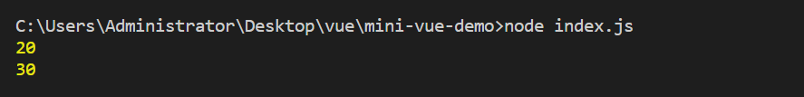
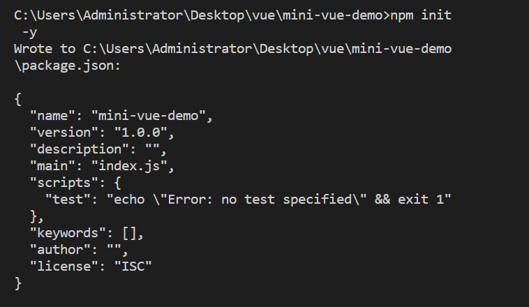
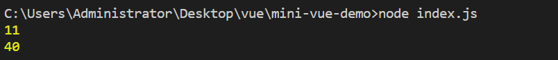
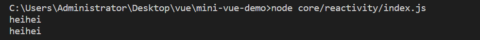
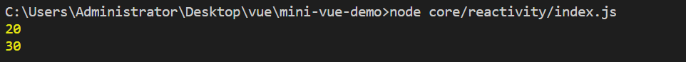
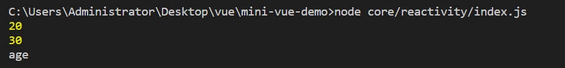
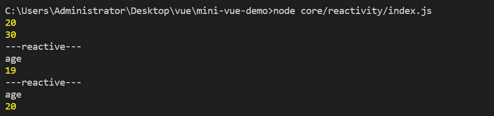
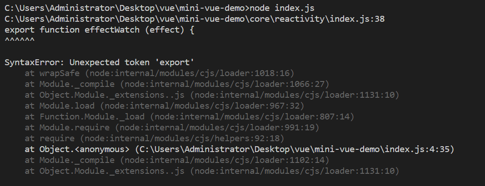
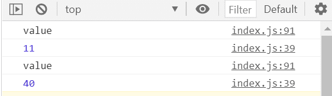

**完成一个简版Vue3  Day 01 reactivity 响应式实现**

<!--truncate-->

## v1

```javascript
// v1

let a = 10
let b = a + 10
console.log(b)

a = 20
b = a + 10
console.log(b)
```

## v2

```javascript
// v2

let a = 10
let b
update()
function update() {
  b = a + 10
  console.log(b)
}

a = 20
update()
```


## v3

```shell
npm init
```



```shell
npm i @vue/reactivity
```

```shell
+ @vue/reactivity@3.0.5
added 2 packages from 1 contributor and audited 2 packages in 8.981s
found 0 vulnerabilities
```

```javascript
const { effect, reactive } = require('@vue/reactivity')

// v3
// a 发生变更了，我想让 b 自动更新
// 声明一个响应式对象
let a = reactive({
    value: 1,
})
let b
effect(() => {
    // 函数
    // 1. 会执行以下
    b = a.value + 10
    console.log(b)
})

// a 响应式对象的值发生改变之后 再次执行
a.value = 30
```



## 响应式库

```javascript
// 响应式库

// 依赖
let currentEffect
class Dep {
    constructor(val) {
        // ES6 +
        this.effects = new Set()
        this._val = val
    }

    get value() {
        return this._val
    }
    
    set value(newVal) {
        this._val = newVal
    }

    // 1. 收集依赖
    depend() {
        if (currentEffect) {
            this.effects.add(currentEffect)
        }
    }

    // 2. 触发依赖
    notice() {
        // 触发一下我们之前收集到的依赖
        this.effects.forEach(effect => {
            effect()
        })
    }
}

function effectWatch (effect) {
    // 收集依赖
    currentEffect = effect
    effect()
    dep.depend()
    currentEffect = null
}

const dep = new Dep(10)

let b

effectWatch(() => {
    console.log("heihei")
    b = dep.value + 10
})

// 值发生变更
dep.value = 20
dep.notice()
```



heihei 不太明显，换成 b :

```javascript
effectWatch(() => {
    b = dep.value + 10
    console.log(b)
})
```



代码优化：

```javascript
// 响应式库

// 依赖
let currentEffect
class Dep {
    constructor(val) {
        // ES6 +
        this.effects = new Set()
        this._val = val
    }

    get value() {
        this.depend()
        return this._val
    }
    
    set value(newVal) {
        this._val = newVal
        this.notice()
    }

    // 1. 收集依赖
    depend() {
        if (currentEffect) {
            this.effects.add(currentEffect)
        }
    }

    // 2. 触发依赖
    notice() {
        // 触发一下我们之前收集到的依赖
        this.effects.forEach(effect => {
            effect()
        })
    }
}

function effectWatch (effect) {
    // 收集依赖
    currentEffect = effect
    effect()
    // dep.depend()
    currentEffect = null
}

// ref → 很像
const dep = new Dep(10)

let b

effectWatch(() => {
    b = dep.value + 10
    console.log(b)
})

// 值发生变更
dep.value = 20
// dep.notice()
```

实现 reactive ：

```javascript
// reactive
// dep → number string
// object → key → dep

// 1. 知道这个对象在什么时候改变的
// object.a → get
// object.a = 2 → set

// vue2
// proxy
function reactive (raw) {
    return new Proxy(raw, {
        get(target, key) {
            console.log(key)
        }
    })
}

const user = reactive({
    age: 19,
})

user.age
```



```javascript
// 响应式库

// 依赖
let currentEffect
class Dep {
    constructor(val) {
        // ES6 +
        this.effects = new Set()
        this._val = val
    }

    get value() {
        this.depend()
        return this._val
    }
    
    set value(newVal) {
        this._val = newVal
        this.notice()
    }

    // 1. 收集依赖
    depend() {
        if (currentEffect) {
            this.effects.add(currentEffect)
        }
    }

    // 2. 触发依赖
    notice() {
        // 触发一下我们之前收集到的依赖
        this.effects.forEach(effect => {
            effect()
        })
    }
}

function effectWatch (effect) {
    // 收集依赖
    currentEffect = effect
    effect()
    // dep.depend()
    currentEffect = null
}

// ref → 很像
const dep = new Dep(10)

let b

effectWatch(() => {
    b = dep.value + 10
    console.log(b)
})

// 值发生变更
dep.value = 20
// dep.notice()

// reactive
// dep → number string
// object → key → dep

// 1. 知道这个对象在什么时候改变的
// object.a → get
// object.a = 2 → set

// vue2
// proxy
const targetMap = new Map()

function getDep (target, key) {
    let depsMap = targetMap.get(target)
    if (!depsMap) {
        depsMap = new Map()
        targetMap.set(target, depsMap)
    }

    let dep = depsMap.get(key)
    if (!dep) {
        dep = new Dep()
        depsMap.set(key, dep)
    }

    return dep
}

function reactive (raw) {
    return new Proxy(raw, {
        get(target, key) {
            console.log(key)
            // key - dep
            // dep 存储在哪里
            const dep = getDep(target, key)

            // 依赖收集
            dep.depend()

            return Reflect.get(target, key)
        },
        set(target, key, value) {
            // 触发依赖
            // 要获取到 dep
            const dep = getDep(target, key)
            const result = Reflect.set(target, key, value)
            dep.notice()
            return result
        }
    })
}

const user = reactive({
    age: 19,
})

let double

effectWatch(() => {
    console.log("---reactive---")
    double = user.age
    console.log(double)
})

user.age = 20
```



将 effectWatch 和 reactive 导出：

```javascript
// 响应式库

// 依赖
let currentEffect
class Dep {
    constructor(val) {
        // ES6 +
        this.effects = new Set()
        this._val = val
    }

    get value() {
        this.depend()
        return this._val
    }
    
    set value(newVal) {
        this._val = newVal
        this.notice()
    }

    // 1. 收集依赖
    depend() {
        if (currentEffect) {
            this.effects.add(currentEffect)
        }
    }

    // 2. 触发依赖
    notice() {
        // 触发一下我们之前收集到的依赖
        this.effects.forEach(effect => {
            effect()
        })
    }
}

export function effectWatch (effect) {
    // 收集依赖
    currentEffect = effect
    effect()
    // dep.depend()
    currentEffect = null
}

// ref → 很像
// const dep = new Dep(10)

// let b

// effectWatch(() => {
//     b = dep.value + 10
//     console.log(b)
// })

// // 值发生变更
// dep.value = 20
// dep.notice()

// reactive
// dep → number string
// object → key → dep

// 1. 知道这个对象在什么时候改变的
// object.a → get
// object.a = 2 → set

// vue2
// proxy
const targetMap = new Map()

function getDep (target, key) {
    let depsMap = targetMap.get(target)
    if (!depsMap) {
        depsMap = new Map()
        targetMap.set(target, depsMap)
    }

    let dep = depsMap.get(key)
    if (!dep) {
        dep = new Dep()
        depsMap.set(key, dep)
    }

    return dep
}

export function reactive (raw) {
    return new Proxy(raw, {
        get(target, key) {
            console.log(key)
            // key - dep
            // dep 存储在哪里
            const dep = getDep(target, key)

            // 依赖收集
            dep.depend()

            return Reflect.get(target, key)
        },
        set(target, key, value) {
            // 触发依赖
            // 要获取到 dep
            const dep = getDep(target, key)
            const result = Reflect.set(target, key, value)
            dep.notice()
            return result
        }
    })
}

// const user = reactive({
//     age: 19,
// })

// let double

// effectWatch(() => {
//     console.log("---reactive---")
//     double = user.age
//     console.log(double)
// })

// user.age = 20
```

去掉原来文件中引用的官方文件，引入自己编写的文件，并修改：

```javascript
// reactivity 响应式实现

// const { effect, reactive } = require('@vue/reactivity')
const { effectWatch, reactive } = require('./core/reactivity')

// v1
// let a = 10
// let b = a + 10
// console.log(b)

// a = 20
// b = a + 10
// console.log(b)

// v2
// let a = 10
// let b
// update()
// function update() {
//     b = a + 10
//     console.log(b)
// }

// a = 20
// update()

// v3
// a 发生变更了，我想让 b 自动更新
// 声明一个响应式对象
let a = reactive({
    value: 1,
})
let b
effectWatch(() => {
    // 函数
    // 1. 会执行以下
    b = a.value + 10
    console.log(b)
})

// a 响应式对象的值发生改变之后 再次执行
a.value = 30
```

报错



创建 index.html 文件：

```html
<!DOCTYPE html>
<html lang="en">
<head>
    <meta charset="UTF-8">
    <meta http-equiv="X-UA-Compatible" content="IE=edge">
    <meta name="viewport" content="width=device-width, initial-scale=1.0">
    <title>Document</title>
</head>
<body>
    <script type="module" src="./index.js"></script>
</body>
</html>
```

修改 js 文件中引入文件 由 require 改为 import ：

```javascript
// const { effectWatch, reactive } = require('./core/reactivity')
import { effectWatch, reactive } from './core/reactivity'
```

执行 html 文件

报错：

```javascript
Failed to load module script: The 127.0.0.1/:1 server responded with a non-JavaScript MIME type of "text/html". Strict MIME type checking is enforced for module scripts per HTML spec.
```

将 js 中的 import 写全：

```javascript
import { effectWatch, reactive } from './core/reactivity/index.js'
```

重新执行 html 文件，效果如图：




**项目仓库：**  [点此访问](https://github.com/YancyQi2002/mini-vue-demo)