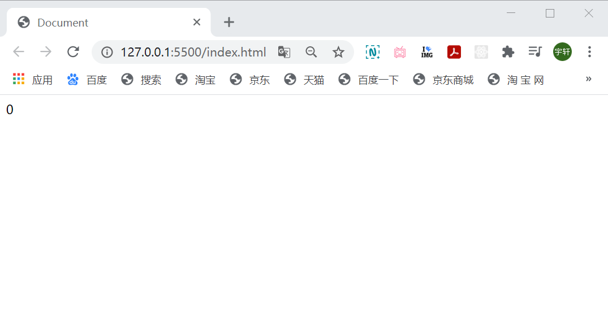
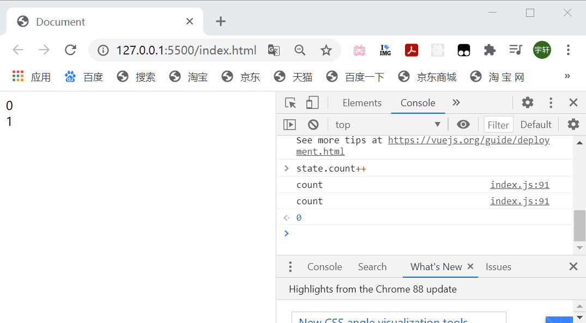
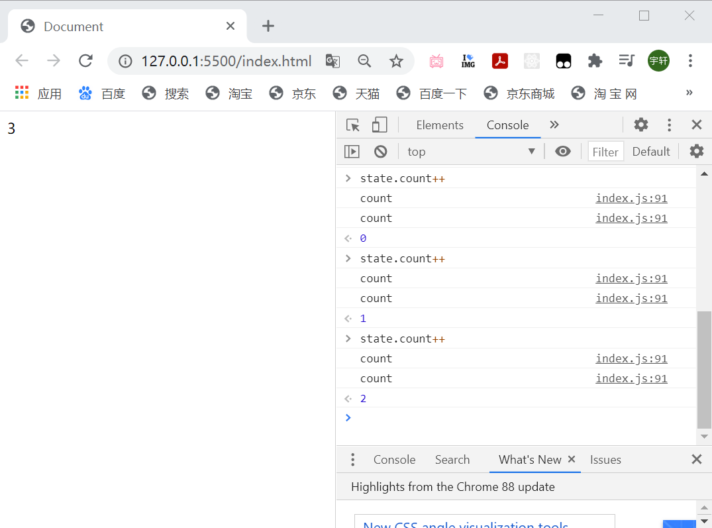
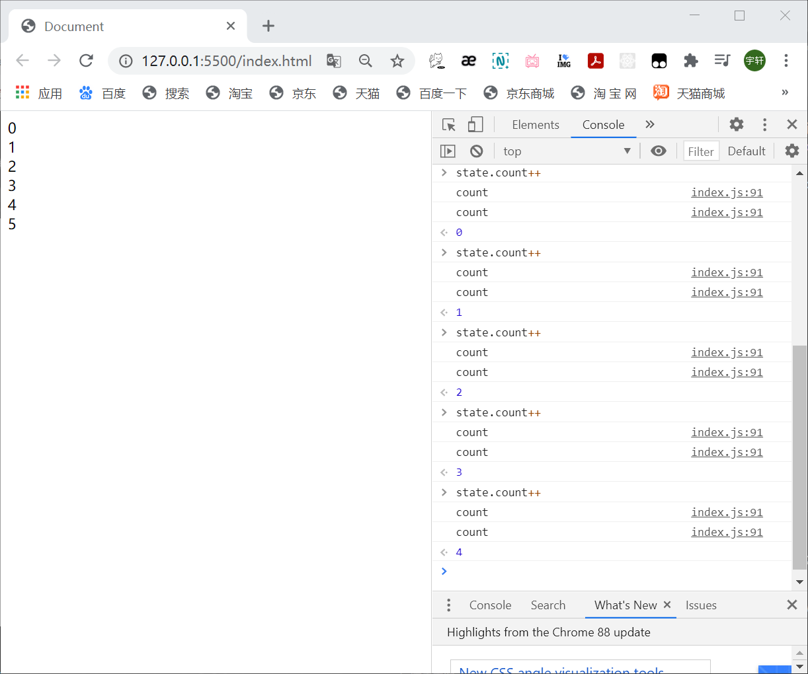
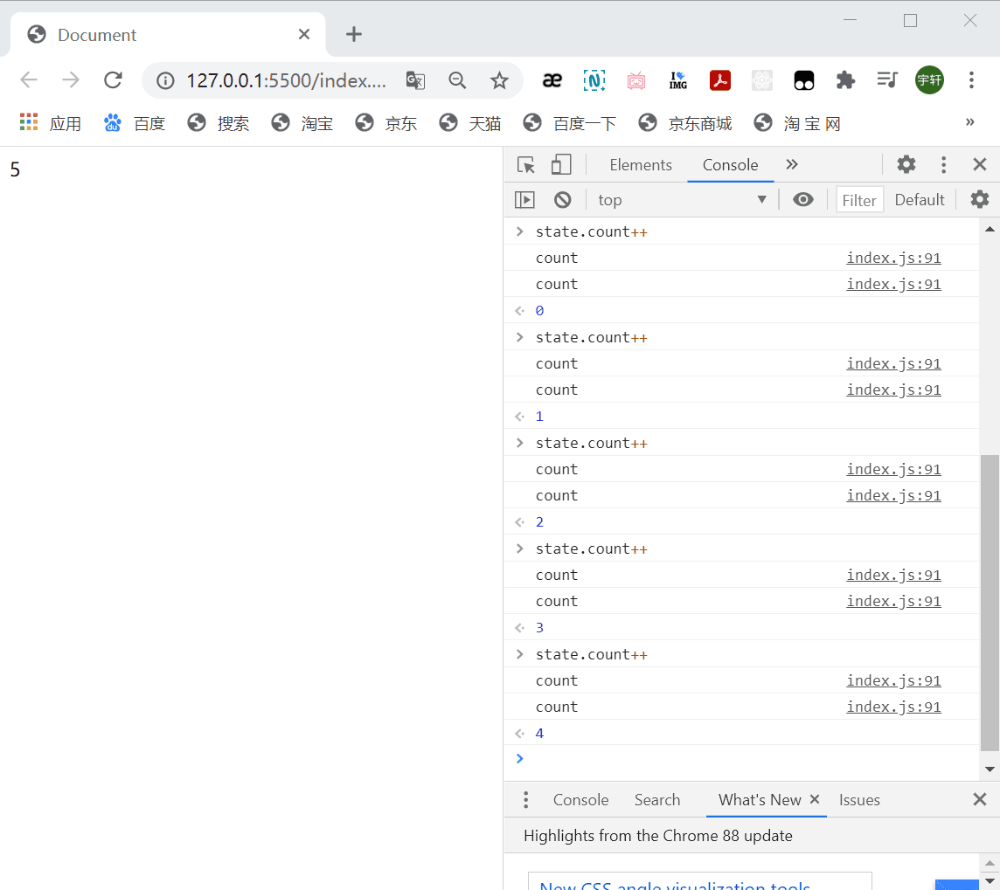

**完成一个简版Vue3  Day 02 render & setup**

<!--truncate-->

```javascript
// reactivity 响应式实现

// const { effect, reactive } = require('@vue/reactivity')
// const { effectWatch, reactive } = require('./core/reactivity')
import { effectWatch, reactive } from './core/reactivity/index.js'

// v1
// let a = 10
// let b = a + 10
// console.log(b)

// a = 20
// b = a + 10
// console.log(b)

// v2
// let a = 10
// let b
// update()
// function update() {
//     b = a + 10
//     console.log(b)
// }

// a = 20
// update()

// v3
// a 发生变更了，我想让 b 自动更新

// 声明一个响应式对象
let a = reactive({
    value: 1,
})
let b
effectWatch(() => {
    // 函数
    // 1. 会执行以下
    b = a.value + 10
    console.log(b)
})

// a 响应式对象的值发生改变之后 再次执行
a.value = 30

// vue3

const App = {
    render(context) {
        // 构建 view = b
        const div = document.createElement("div")
        div.innerText = context.state.count

        // root
        document.body.append(div)
    },
    setup() {
        // a = 响应式数据
        const state = reactive({
            count: 0
        })
        return { state }
    },
}

App.render(App.setup())
```



```javascript
// vue3

const App = {
    render(context) {
        // 构建 view = b

        effectWatch(() => {
            const div = document.createElement("div")
            div.innerText = context.state.count

            // root
            document.body.append(div)
        })
    },
    setup() {
        // a = 响应式数据
        const state = reactive({
            count: 0
        })
        window.state = state
        return { state }
    },
}

App.render(App.setup())
```



```javascript
effectWatch(() => {
	// reset
	document.body.innerText = ``

	const div = document.createElement("div")
	div.innerText = context.state.count

	// root
	document.body.append(div)
})
```



在 core 目录下创建 index.js 文件：

```javascript
import { effectWatch } from './reactivity/index.js'

export function createApp (rootComponent) {
    return {
        mount(rootContainer) {
            const context = rootComponent.setup()
            
            effectWatch(() => {
                const element = rootComponent.render(context)
                rootContainer.append(element)
            })
        },
    }
}
```

修改根目录下的 index.js ，并重命名为 App.js :

```javascript
// reactivity 响应式实现

// const { effect, reactive } = require('@vue/reactivity')
// const { effectWatch, reactive } = require('./core/reactivity')
import { effectWatch, reactive } from './core/reactivity/index.js'

// v1
// let a = 10
// let b = a + 10
// console.log(b)

// a = 20
// b = a + 10
// console.log(b)

// v2
// let a = 10
// let b
// update()
// function update() {
//     b = a + 10
//     console.log(b)
// }

// a = 20
// update()

// v3
// a 发生变更了，我想让 b 自动更新

// 声明一个响应式对象
let a = reactive({
    value: 1,
})
let b
effectWatch(() => {
    // 函数
    // 1. 会执行以下
    b = a.value + 10
    console.log(b)
})

// a 响应式对象的值发生改变之后 再次执行
a.value = 30

// vue3

const App = {
    // template → render
    render(context) {
        // 构建 view = b

        // view → 每次都需要重新创建
        // 要计算出最小的更新点 → vdom
        // js → diff

        // reset
        const div = document.createElement("div")
        div.innerText = context.state.count

        return div
    },
    setup() {
        // a = 响应式数据
        const state = reactive({
            count: 0
        })
        window.state = state
        return { state }
    },
}
```

修改 index.html 文件：

```html
<!DOCTYPE html>
<html lang="en">
<head>
    <meta charset="UTF-8">
    <meta http-equiv="X-UA-Compatible" content="IE=edge">
    <meta name="viewport" content="width=device-width, initial-scale=1.0">
    <title>Document</title>
</head>
<body>
    <div id="app"></div>
    <script type="module" src="./index.js"></script>
</body>
</html>
```

在根目录下新建 index.js 文件：

```javascript
import App from './App.js'
import { createApp } from './core/index.js'

createApp(App).mount(document.querySelector("#app"))
```



清空一下：

```javascript
import { effectWatch } from './reactivity/index.js'

export function createApp (rootComponent) {
    return {
        mount(rootContainer) {
            const context = rootComponent.setup()
            
            effectWatch(() => {
                rootContainer.innerHTML = ``
                const element = rootComponent.render(context)
                rootContainer.append(element)
            })
        },
    }
}
```




**项目仓库：**  [点此访问](https://github.com/YancyQi2002/mini-vue-demo)