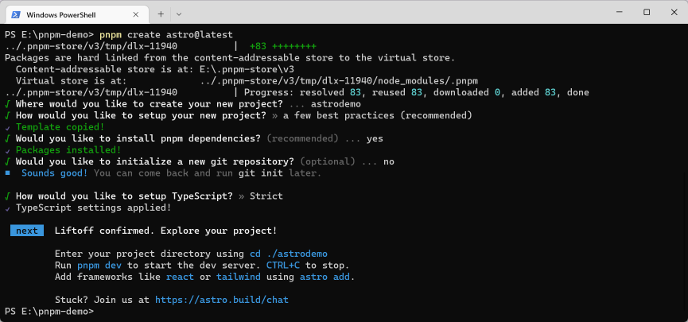
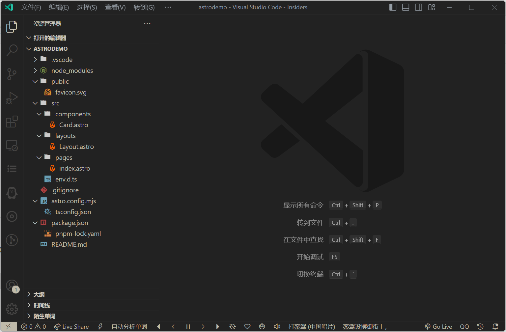
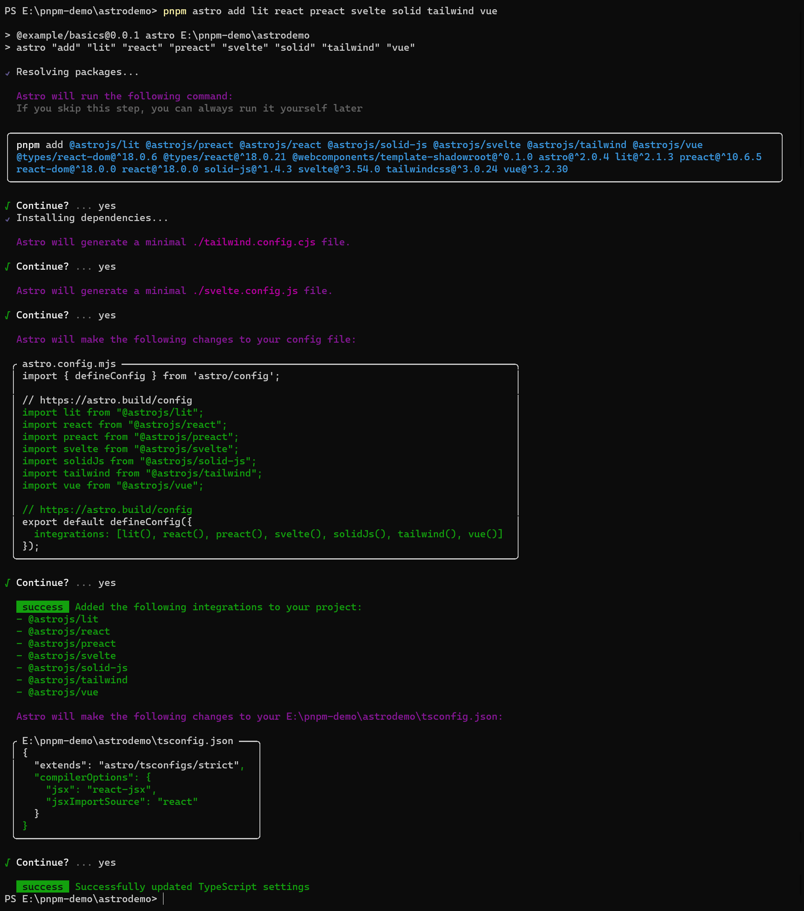
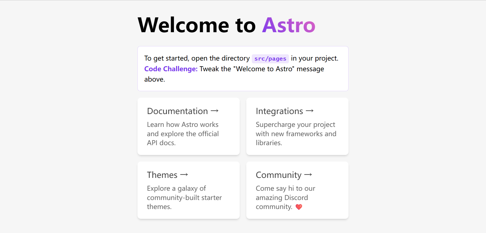

- [x] **初始化 Astro 项目**

<!--truncate-->

import Tabs from '@theme/Tabs';
import TabItem from '@theme/TabItem';

## 一、开始搭建 Astro

按照 Astro 官网指南使用命令行创建项目：

<Tabs>
  <TabItem value="npm" label="npm">

    npm create astro@latest

  </TabItem>
  <TabItem value="yarn" label="yarn">

    yarn create astro

  </TabItem>
  <TabItem value="pnpm" label="pnpm" default>

    pnpm create astro@latest

  </TabItem>
</Tabs>



在 Visual Studio Code - Insiders 中打开所创建的项目，可以看到当前的目录结构：



## 二、集成框架组件

Astro 可以集成 React、Preact、Svelte、Vue、SolidJS、AlpineJS 和 Lit 中的一个或多个 Astro 框架

:::caution **注意**

1. 目前只默认支持官方 Astro 集成（发布在 npm 的 `@astrojs/` 范围包）
2. 使用 `--experimental-integrations` CLI 运行 Astro，或在 Astro 配置文件中包括 `experimental: { integrations: true }`以启用第三方集成

:::  

Astro 推出了**实验性的** `astro add` 命令可以快速的集成各类框架，

不需要进行手动的配置，只需运行 `astro add [name]`，

就会更新你的配置文件并安装任何必要的依赖，此外还可同时配置多个集成

<Tabs>
  <TabItem value="npm" label="npm">

    npx astro add lit react preact svelte solid tailwind vue
  
  </TabItem>
  <TabItem value="yarn" label="yarn">

    yarn astro add lit react preact svelte solid tailwind vue
  
  </TabItem>
  <TabItem value="pnpm" label="pnpm" default>

    pnpm astro add lit react preact svelte solid tailwind vue
  
  </TabItem>
</Tabs>



因为 Astro 可以集成多个框架，所以可以在同一个 Astro 组件中导入并渲染来自多个框架的组件，如官网示例：

> ```html title="src/pages/mixing-frameworks.astro"
> ---
> // 示例：在同一个页面混合多个框架的组件。
> import MyReactComponent from '../components/MyReactComponent.jsx';
> import MySvelteComponent from '../components/MySvelteComponent.svelte';
> import MyVueComponent from '../components/MyVueComponent.vue';
> ---
> <div>
>   <MySvelteComponent />
>   <MyReactComponent />
>   <MyVueComponent />
> </div>
> ```
>
> 来源：[Astro 混合框架 官网链接](https://docs.astro.build/zh-cn/core-concepts/framework-components/#%E6%B7%B7%E5%90%88%E6%A1%86%E6%9E%B6)

接下来配置一下 PostCSS

Astro 已经内置了 PostCSS，下面为项目进行配置

在项目根目录下创建 `postcss.config.js` 文件

然后安装一些常用的 PostCSS 插件

```bash npm2yarn

npm install -D autoprefixer postcss-nesting @tailwindcss/nesting postcss-preset-env

```

再来对图片进行优化，Astro 官方提供了两种用以渲染经过优化的图片的 Astro 组件：`<Image />` 和 `<Picture />`，直接运行 `pnpm astro add image` 来安装相应组件


## 三、配置别名

```json title="tsconfig.json"
{
  "compilerOptions": {
    "baseUrl": ".",
    "paths": {
      "@assets/*": ["src/assets/*"],
      "@components/*": ["src/components/*"],
      "@layouts/*": ["src/layouts/*"]
    }
  }
}
```

## 四、类型检验

为了防止在包含 TypeScript 错误的情况下被构建，

先执行 `pnpm add -D vue-tsc svelte-check` 安装相关依赖，

再将 `package.json` 中的 `build` 脚本更改为：

```bash
astro check && tsc --noEmit && vue-tsc --noEmit && svelte-check && astro build
```

在同一个项目中使用多个 JSX 框架时可能会出现问题，

因为每个框架在 `tsconfig.json` 中的不同需求有时会相互冲突。

**解决方案**：对于默认设置 `jsxImportSource: react`，在来自不同框架的任何冲突文件中使用编译指示（pragma comment）进行注释，如：

```jsx
// For Preact
/** @jsxImportSource preact */

// For Solid
/** @jsxImportSource solid-js */
```

## 五、运行效果

在终端执行 `pnpm run dev` 打开浏览器查看效果：



