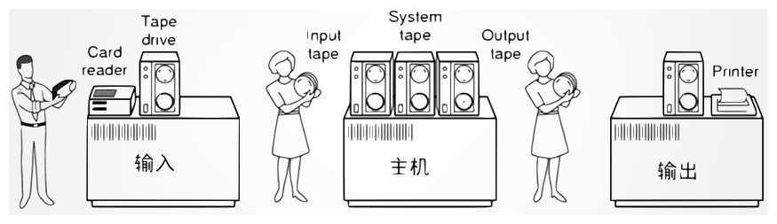

## 一 什么是操作系统

操作系统（Operating System, OS）是计算机系统中的一个系统软件

1. 它能有效地控制和管理计算机系统中的硬件和软件资源；

2. 合理地组织计算机系统的工作流程；

3. 提供用户与计算机硬件之间的软件接口，
   
   使用户能够方便、有效、安全、可靠地使用计算机；

4. 使整个计算机系统高效地运行。

## 二 OS 的作用

### OS 是用户与计算机硬件之间的接口

OS 处于用户与硬件系统之间，用户通过 OS 来使用计算机硬件系统。

### OS 是计算机系统资源的管理者

一个计算机系统包含的软硬件资源可分为四类：

1. 处理器

2. 存储器

3. IO 设备

4. 文件（数据和程序）

OS 就是对这四类资源进行有效管理的。

:::note OS 对不同资源的管理方式与目标是不同的：

- CPU：分配、控制
- 存储器：分配、管理、回收
- IO 设备：分配、操纵、回收
- 文件：存取、共享、保护

:::

### OS 实现了对计算机资源的抽象

为方便用户对系统资源的使用，OS 将计算机资源抽象为一组数据结构及操作命令（对象），然后再设计出对这些抽象资源的管理软件，然后再将这些管理软件**逐层覆盖**在计算机硬件之上，形成一层层的**虚拟器**。这些虚拟器是逐层**系统软件**覆盖在裸机上而成的逻辑计算机。

:::note

用户对计算机的使用大多集中在 IO 操作上。

 - 第 1 层抽象：对 IO 设备的管理。
 - 第 2 层抽象：对文件的管理。
 - 第 3 层抽象：对图形操作的管理。
 - ...
 - 第 n 层抽象

:::

## 三 操作系统的发展历程

操作系统发展的动力：作业调度算法与用户体验。

### 裸机

第一代计算机：电子管计算机 （1946 年第一台计算机诞生 至 20 世纪 50 年代中期）

裸机的发展过程经历了两个阶段：纯人工操作阶段 和 脱机 IO 阶段

#### 纯人工操作阶段

缺点：用户独占全机，CPU 等待人工操作。

#### 脱机 IO 阶段

为了解决**人机**矛盾及 **CPU 与 IO 设备速度不匹配**矛盾，

在 20 世纪 50 年代末出现了脱机 IO 技术。

:::note 脱机 IO 技术：

将 IO 设备从主机中分离，主机只对磁带进行读写操作。

主机不再直接与慢速的 IO 设备打交道，而是与速度相对较快的磁带机发生关系。

:::

### 单道批处理系统

第二代计算机：晶体管计算机 （20 世纪 50 年代末期 至 60年代中期）

该系统需要用户事先将一批作业以脱机方式输入到磁带上。

该系统中配上了监督程序 Monitor . 

在 Monitor 控制下，使这批作用逐个连续处理，充分利用了主机资源。

- 单道：内存中始终只有一道作业
- 批处理：磁带上有多道作业，安装一次磁带，可以处理一批作业

其具体处理过程：

- Monitor 将磁带上的第一个作业装入内存，并将运行控制权交给该作业
- 当该作业处理完毕后，再将运行控制权还给 Monitor
- Monitor 再将磁带上的第二个作业装入内存，并将运行控制权交给该作业
- 以此类推，直到当前磁带上的所有作业运行完毕。整个过程中无法进行交互

:::caution 单道批处理系统存在的问题：

IO 执行过程中，主机是闲置状态，主机利用率低。因为内存中只有一道作业

:::

### 多道批处理系统

第三代计算机：小规模集成电路计算机

1964 年 IBM 生产了第一台小规模集成电路计算机 IBM System/360，

并为该计算机开发了 OS/360 操作系统，其为第一个多道批处理系统。

多道批处理系统同样要求事先将多道作业存放到外存上并排成一个队列，称为**后备队列**。

然后由作业调度程序 Monitor 按照一定的算法，从后备队列中选则出**若干**作业调入内存，

使它们共享 CPU 与系统中的其它资源。

为充分利用作业调用 IO 的间隙，在 Monitor 的控制下完成这些作业间 CPU 使用权的切换。

多道批处理系统的优点：处理机利用率高、系统吞吐量大

多道批处理系统的缺点：作业平均周转时间长、无交互能力

:::note 多道批处理系统尚需解决的问题：

- 处理机竞争问题
- 内存分配和保护问题
- IO 设备分配问题
- 文件的组织与管理问题
- 作业管理问题
- 用户与系统接口问题

:::

### 分时系统

分时系统：在一台主机上连接多个配有显示器与键盘的终端并由此构成的系统。

该系统允许多个用户同时通过自己的终端，以交互方式使用计算机，共享主机中的资源。

#### 多路卡

在系统中配置一个多路卡，用于及时接收多终端的用户输入，实现分时多路复用。主机会以很快的速度周期性的扫描各个终端，在每个终端处停留很短的时间（如30ms），用于接收从终端发来的数据。

终端输入通过多路卡进入主机内存，以期将来获得到CPU资源进行运算。

#### 时间片

在多道批处理系统中，对于一个没有 IO 的长作业，其会长时间独占处理器直至其运行完毕。而这将导致其它作业无法被处理。这是与分时系统的两大特征（人机交互、共享主机）相违背的。为了避免这种情况的发生，分时系统中引入了**时间片**概念。

一个时间片就是一段很短的时间（如 30 ms）。系统规定每个作业每次只能运行一个时间片，然后就暂停该作业的执行，并调度下一个作业运行。这样，在较短的时间内就能使所有作业都能执行一个时间片，使每个用户都能及时与自己的作业交互。

### 实时系统

实时系统：系统能及时响应外部事件的请求，在规定时间内完成对该事件的处理，并控制所有实时任务协调一致地运行。

#### 实时任务分类

站在不同的角度，实时任务有不同的分类方式：

（1）

（2）

### 微机操作系统

随着大规模集成电路与计算机体系结构的发展，出现了微机，即 PC 机。

微机操作系统也有一个发展过程：
- 单用户单任务系统
- 单用户多任务系统
- 多用户多任务系统

### 网络操作系统

与微机操作系统类似，不过其提供的服务类型不同。

### 云操作系统

云操作系统（云计算操作系统、云计算中心操作系统）：

1. 是以云计算、云存储技术作为支撑的操作系统，
2. 是云计算后台数据中心的整体管理运营系统，
3. 是一个架构于服务器、存储、网络等基础硬件资源和单机操作系统、中间件、数据库等基础软件之上的、管理海量的基础硬件、软件资源的云平台综合管理系统。

## 四 操作系统的基本特性

### （1）并发 Concurrence

**并发：**两个或多个事件在同一时间间隔内发生。

该特性使得 OS 能有效提高系统中资源的利用率，增加系统的吞吐量。

:::note 与并行对比：

- 并行：两个或多个事件在同一时刻发生。
- 并发：宏观上的并行，微观上的串行。

:::

**并发的实现：**

之所以可以实现并发，是因为引入了进程这个概念。

进程：在系统中能独立运行并作为资源分配的基本单位，

&nbsp;&nbsp;&nbsp;&nbsp;&nbsp;&nbsp;&nbsp;&nbsp;&nbsp;&nbsp;由一组指令、数据和堆栈等组成，是一个能独立运行的活动实体。

> 简单来说，进程就是一个正在执行的程序；
> 
> 或者说，进程就是一个具有独立功能的程序在其数据集上的运行过程。

### （2）共享 Sharing

OS 系统中的资源共享（资源复用）：

系统中的资源可供内存中多个并发执行的进程共同使用。

当系统中资源数量少于多个进程对资源的需求数量时，就会形成对共享资源的争夺。

根据进程对资源复用方式的不同，目前主要实现资源共享的方式有两种：

1. 互斥共享：某些资源只能互斥访问，如打印机、磁带机等。虽然可供多个进程使用，但在一段时间内，只允许一个进程访问该资源。这种互斥访问的资源，称为临界资源，或独占资源。
2. 同时访问：系统中还有一类资源，允许在一段时间内由多个进程同时访问。不过，对于这个“同时”需要注意，在单处理机环境中，其是宏观上的意义，微观上对这些资源的访问是交替进行，最典型的就是磁盘。

:::note

数据库中的数据本身属于“同时访问资源”，

而“写锁”属于互斥共享资源，“读锁”属于同时访问资源。

:::

### （3）虚拟 Virtual

通过某种技术将一个物理实体变为若干个逻辑上的对应物，在 OS 中这种功能称为虚拟。

而实现虚拟的技术称为虚拟技术。常用的虚拟技术有两种：

1. 时分复用技术：复用“某设备为一用户服务的空闲时间”为其它用户服务，以达到充分复用设备的目的。使得看起来好像是多个用户在同时使用多台相同设备。这种虚拟技术称为时分复用技术。
    :::note

    虚拟处理机技术、虚拟打印机技术、虚拟存储器技术等，都属于时分复用技术。
    
    需要注意速度问题：若某物理设备采用时分复用技术虚拟出了 N 个虚拟设备，那么每个虚拟设备的平均速度一定是小于等于物理设备速度的 1/N 的。

    :::

2. 空分复用技术：20 世纪初，电信业就已经使用频分复用技术来提高信道的复用率。它是指将一个频率范围比较宽的信道划分为多个频率范围较窄的信道（称为频带），其中的任何一个频带都仅供一对用户通话。这种频分复用技术就属于空分复用技术。
   :::note 需要注意空间问题：

   若某物理设备采用空分复用技术虚拟出了 N 个虚拟设备，则第个虚拟设备占用的实际空间一定是小于等于物理设备部空间的 1/N 的。

   :::

#### Dubbo 中的虚拟化：

Dubbo 在采用一致性 Hash 算法实现负载均衡时会出现一个问题：提供者 Server 的增减，仅对某个提供者的负载状态有影响，对其它提供者没有任何帮助。Dubbo 使用“虚拟化思想”对该算进行了优化，默认将一台物理提供者虚拟为了 360 个，解决了原来的问题。

### （4）异步 Asynchronism

#### 异步性（不可预知性，不确定性）：

对于内存中的每个进程，有的侧重于计算而 IO 少，有的则计算少而 IO 多。它们何时能够获取到处理器运行、何时由于提出临界资源请求而暂停，每道作业总共需要多少时间才能完成，都是不可预知的，不确定的。可能先进入内存的进程后完成，而后进入内存的作业先完成。这种进程以不可预知的速度向前推进的特性，称为异步性。

只要 OS 中配置有完善的进程同步机制，且运行环境相同，则作业即使经过多次运行，也可以获得完全相同的结果。即 OS 的异步性是不会影响到作业的运行结果的。

#### Zookeeper 的协调性：

ZooKeeper 是一种用于分布式应用程序的分布式开源协调服务。它公开了一组简单的基元，分布式应用程序可以基于这些基元进行构建，以实现更高级别的同步、配置维护以及组和命名服务。它被设计为易于编程，并使用以熟悉的文件系统目录树结构为样式的数据模型。

通过对 Zookeeper 的应用，可以实现分布式系统同步运行，实现各系统功能的协调推进。例如，可以实现集群管理、Master 选举、分布式锁、分布式队列等功能，都是 ZK 协调性机制的体现。

## 五 微内核 OS

微内核（MicroKernel）操作系统结构是 20 世纪 80 年代后期发展起来的。

现在的操作系统基本都是微内核结构的。

### 微内核特征

#### · 提供基础核心功能

在微内核操作系统中，内核是指精心设计的、能实现现代 OS 最基本核心功能的小型内核，微内核并非是一个完整的 OS，而只是将操作系统中最基本、最核心的功能放入微内核。这些基本功能大体可以划分为支撑功能与资源管理功能两大功能。这些基本核心功能运行的环境，通常称为内核态，或内核上下文。

#### · 基于 C/S 模式

将操作系统中最基本最核心的功能放入内核中，将绝大部分功能放在微内核之外的服务进程（服务器）中。客户进程与服务进程间的通信，及服务进程间的通信，都是通过消息传递机制来实现信息交互的。即它们间不能直接相互访问，必须通过内核进行消息传递：通过调用内核提供的系统调用实现。这些服务进程（服务器）运行的环境与客户进程运行的环境相同，都是在内核之外，通常称为用户态，或用户上下文。

#### · 机制与策略分离原理

在现代操作系统的结构设计中，经常采用“机制与策略分离原理”来构造 OS

- 机制：实现某一功能的具体执行机构
- 策略：在机制基础上借助某些参数和算法来实现对该功能的优化

机制处于系统的低层，而策略处于系统的高层。

在微内核OS中，通常将机制放在微内核中，策略放在微内核外围的服务进程中。

> 进程管理中设置一些进程优先级队列，然后就可以按照优先级从队列中取出进程，为之分配 CPU 让其运行。这一部分调度功能属于机制问题。而进程优先级算法就属于策略问题。对于虚拟存储器管理，将用户空间中的逻辑页地址转换为内存空间中的物理块地址，需要页表机制与地址转换机制，应在内核中实现。而页面转换所采用的算法，内存分配与回收等策略，应在内核的外置（服务进程）中实现。

### 微内核功能

#### · 支撑功能

该功能是内核提供给OS其它服务进程（服务器）模块的基本功能，

是其它服务进程模块功能实现的支撑。

主要包含三方面的支撑功能：

1. 中断处理：内核最基本的功能，是整个 OS 工作的基础，没有中断处理就没有 OS 的并发，OS 中的许多重要活动无不依赖于中断。当然，为了减少 CPU 中断的时间，提高程序执行的并发性，内核也只是对中断进行“短暂处理”，继而转入相关其它进程去完成后续工作。
2. 时钟管理：内核的一项基本功能，在 OS 中的许多功能都需要它的支撑。例如，时间片轮转调度中，每当时间片用完，时钟管理就会产生一个中断信号，使调度程序重新进行调度。
3. 原语操作：由一组指令构成，用于完成某一特定功能。这组操作中的指令具有的一个特征是，要么全做，要么全不做，即原子性。它们的执行过程是不允许被中断的。原语操作在系统态下执行，常驻内存。

#### · 资源管理功能

该功能实现了 OS 对系统中软、硬件资源的管理。

> OS 的四大资源：处理器、存储器、IO 设备、文件

1. 进程管理：OS 内核可以实现对进程的基础化管理，这些基础化管理功能要么使用频率很高，要么属于可以为其它服务进程提供基础化功能。将这些功能放入到内核中，可以大大提高 OS 的性能。
2. 存储器管理：OS 中存储器管理相关进程的运行频率非常得高，将它们放入到内核中，可以大大提升存储器的运行效率，提高读写速度。
3. 设备管理：由于设备管理与计算机硬件紧密相关，所以大部分功能都是常驻内核的。

## 六 处理器执行状态

### 用户态与系统态

为了防止 OS 本身及关键数据遭到应用程序有意或无意的破坏，

通常将 CPU 的执行状态分为用户态与系统态。

1. 系统态（内核态、管态）：运行在此状态的 CPU 具有较高的特权，能执行一切指令，可以访问所有寄存器及存储区。传统的 OS 都在系统态运行，微内核 OS 只有微内核运行在系统态。
2. 用户态（目态）：运行在此状态的 CPU 具有较低的特权，仅能执行规定的指令，访问指定的寄存器与存储区。应用程序只能在用户态运行，不能执行 OS 指令及访问 OS 区域。微内核 OS 中的服务进程（服务器）也是运行在用户态。

:::info 带来的问题

在微内核 OS 中，C/S 模式和消息传递机制给系统带来了很多的优点，

但也存在着潜在问题，使系统运行效率有所降低。

:::

:::info 微内核系统的优点

- 提高了系统的扩展性
- 增强了系统的可靠性
- 提升了系统的可移植性

:::

系统运行效率下降的主要原因：

在完成一次客户对 OS 提出的服务请求时，

CPU 需要在用户态与内核态进行多次上下文切换。

## 七 零拷贝

零拷贝：从一个存储区域到另一个存储区域的 copy 任务无需 CPU 参与就可完成。零拷贝的底层是通过 DMA 总线技术实现的。零拷贝与具体的编程语言无关，完全依赖于 OS，OS 支持就可使用，不支持设置了也不起作用。

DMA（Direct Memory Access，直接内存访问）是一种计算机系统内部的数据传输技术，需要 DMA 总线（硬件的体系结构）的硬件支持。其整个数据传输过程是在 DMA 控制器下完成的。

零拷贝在计算机内部数据拷贝及网络传输中都大量使用，用于减少 CPU 消耗和内存带宽占用，减少用户空间与内核空间的拷贝过程，减少用户态与内核态间的切换次数，提高系统效率，提升系统性能。例如远程服务器处理客户端浏览器的主页打开请求过程，就是一个零拷贝在网络传输中的典型应用。

### 传统拷贝方式

该拷贝方式共进行了 16 次用户空间与内核空间的上下文切换，

以及 4 次数据拷贝，其中两次拷贝存在 CPU 参与。

### 零拷贝方式

该拷贝方式共进行了 14 次用户空间与内核空间的上下文切换，以及 3 次数据拷贝，但整个拷贝过程均没有 CPU 的参与，这就是零拷贝。
