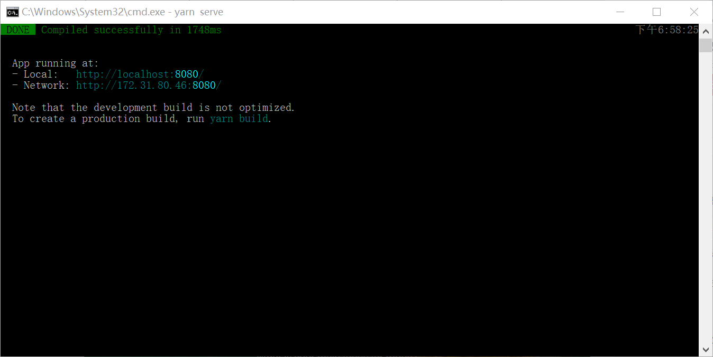
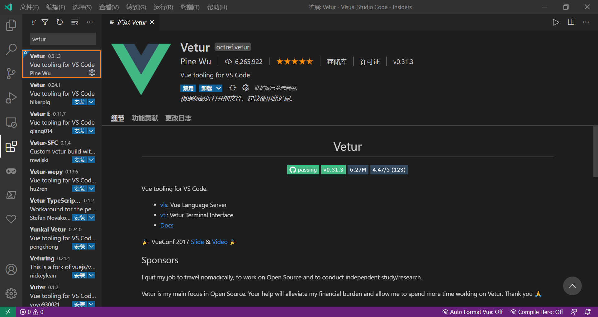
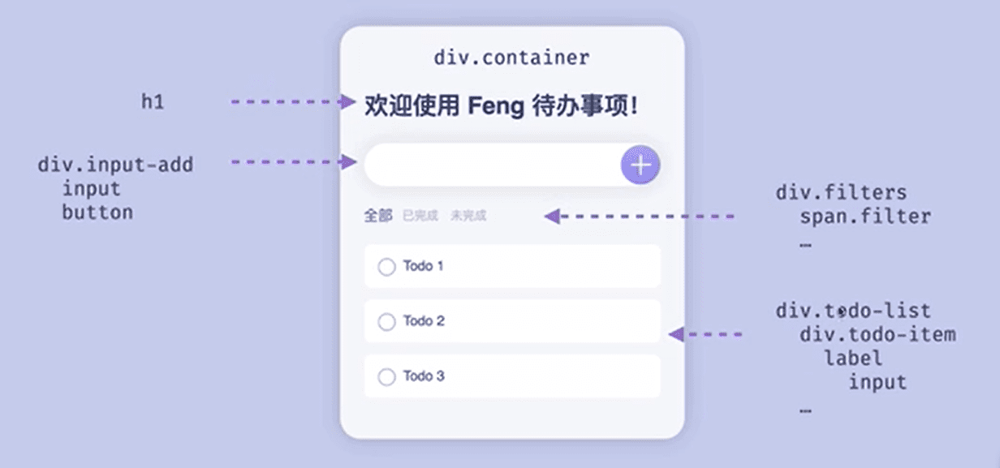
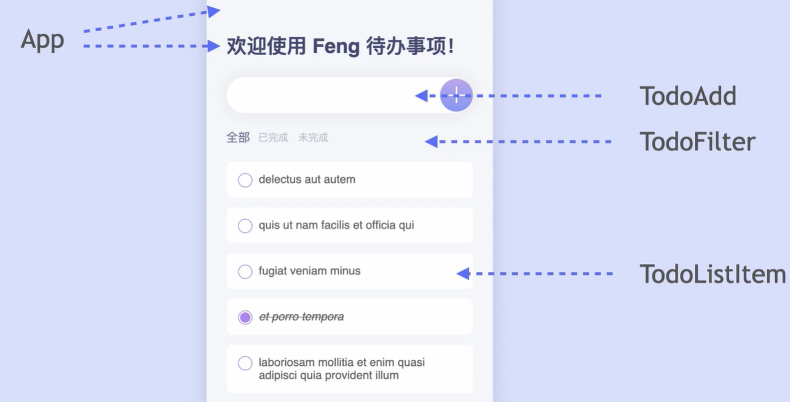
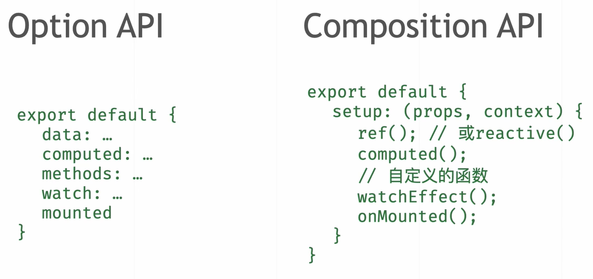
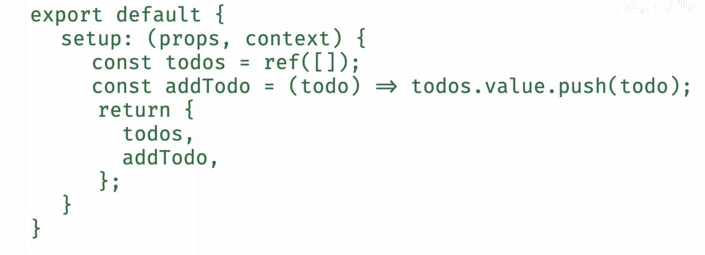
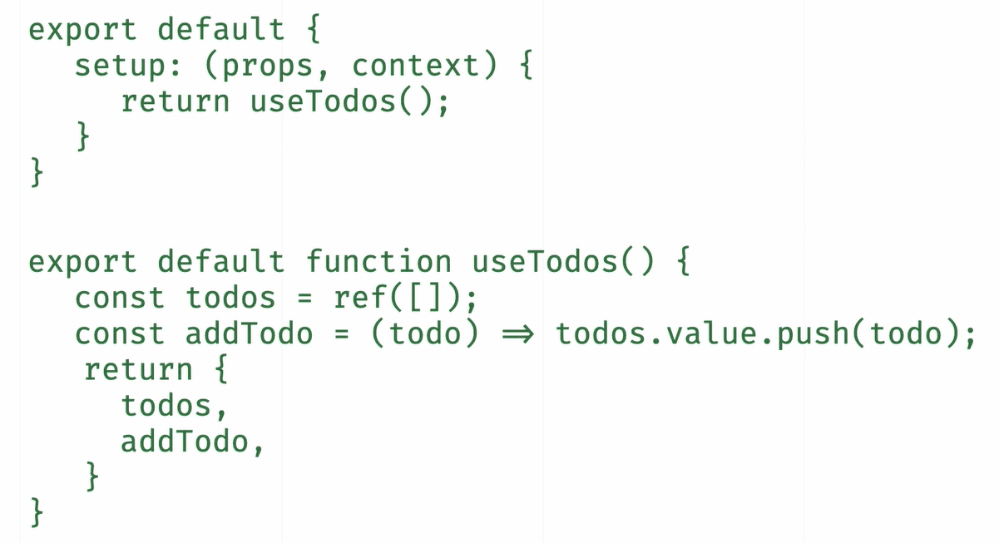
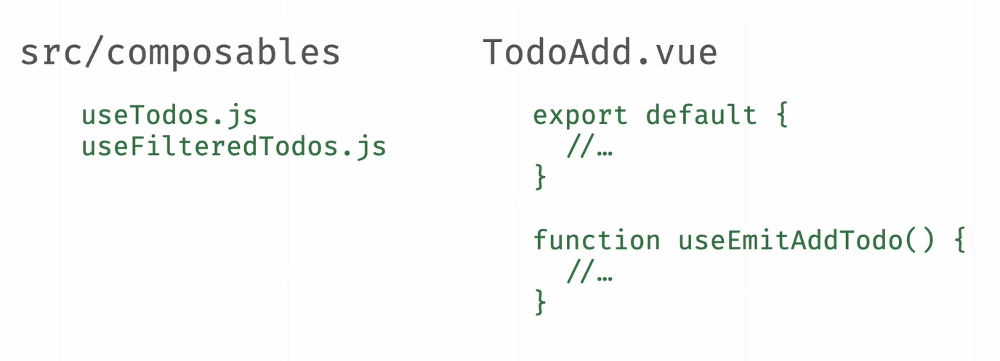
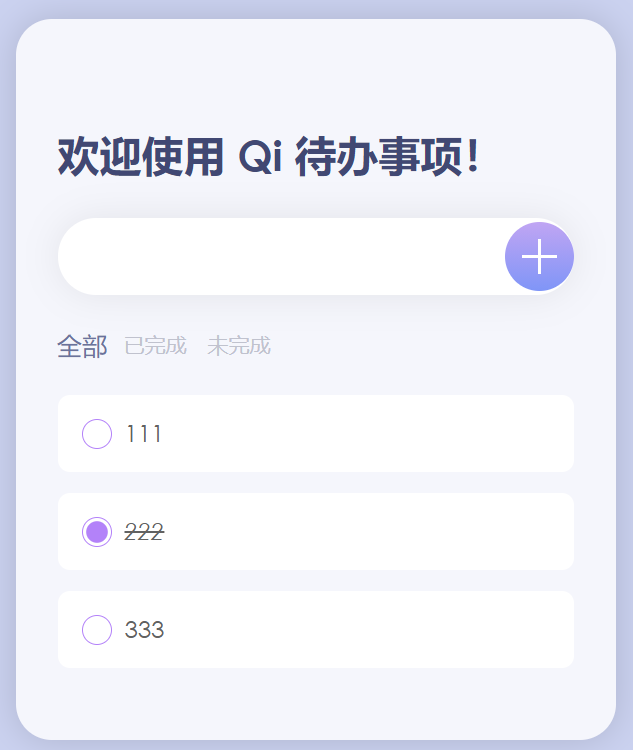

<!--truncate-->

## 00 简介

按照峰华前端工程师的视频教程，使用 Vue 3.0 的 Composition API 编写了一款 Todo Web App，在保持优雅 UI 的前提下，引入了 Vue 3.0 新特性的入门指南，教程介绍了如何利用 Composition API 抽离可复用的业务逻辑。

目录：

- [ ] 01 寻找灵感
- [ ] 02 搭建项目
- [ ] 03 编写页面
- [ ] 04 拆分组件
- [ ] 05 实现功能


## 01 寻找灵感

如何寻找灵感：

- Dribbble
- Codepen
- Github

## 02 搭建项目

1. 安装 vue cli :

```shell
npm install -g @vue/cli
```

2. 创建项目：

```shell
vue create [project name]
```

3. 选择创建 Vue 3 项目
4. 启动图形化客户端 : 方便管理项目依赖

```shell
vue ui
```

5. 运行创建的项目

```shell
yarn serve
```



注：Vue 语法高亮需安装 Vetur 插件



## 03 编写 HTML 结构



```html
<main>
	<div class="container">
        <h1>欢迎使用 Qi 代办事项！</h1>
        
        <div class="input-add">
            <input type="text" name="todo" />
            <button>
                <i class="plus"></i>
            </button>
        </div>
        
        <div class="filters">
            <span class="filter active">全部</span>
            <span class="filter">已完成</span>
            <span class="filter">未完成</span>
        </div>
        
        <div class="todo-list">
            <div class="todo-item">
                <label>
                	<input type="checkbox" />
                    Todo 1
                    <span class="check-button"></span>
                </label>
            </div>
            <div class="todo-item">
                <label>
                	<input type="checkbox" />
                    Todo 2
                    <span class="check-button"></span>
                </label>
            </div>
            <div class="todo-item">
                <label>
                	<input type="checkbox" />
                    Todo 3
                    <span class="check-button"></span>
                </label>
            </div>
        </div>
    </div>
</main>
```

## 04 编写 CSS 样式

App.vue

```css
* {
  box-sizing: border-box;
  margin: 0;
  padding: 0;
  font-family: "century gothic", Helvetica, "PingFang SC", "Microsoft Yahei", sans-serif;
}

/* 整个页面 */
main {
  display: grid;
  align-items: start;
  justify-items: center;
  padding: 10vh 0;
  width: 100vw;
  min-height: 100vh;
  background: rgb(203, 210, 240);
}

.container {
  padding: 48px 28px;
  width: 60%;
  max-width: 400px;
  box-shadow: 0px 0px 24px rgba(0, 0, 0, .15);
  border-radius: 24px;
  background-color: rgb(245, 246, 252);
}

/* 标题 */
h1 {
  margin: 24px 0;
  font-size: 28px;
  color: #414873;
}

/* 添加框 */
.input-add {
  position: relative;
  display: flex;
  align-items: center;
}

.input-add input {
  padding: 16px 52px 16px 18px;
  width: 100%;
  font-size: 16px;
  color: #626262;
  border: none;
  border-radius: 48px;
  outline: none;
  box-shadow: 0 0 24px rgba(0, 0, 0, .08);
}

.input-add button {
  position: absolute;
  right: 0;
  width: 46px;
  height: 46px;
  color: white;
  border-radius: 50%;
  background: linear-gradient(#c0a5f3, #7f95f7);
  border: none;
  cursor: pointer;
  outline: none;
}

.input-add .plus {
  display: block;
  width: 100%;
  height: 100%;
  background: linear-gradient(#fff, #fff), linear-gradient(#fff, #fff);
  background-size: 50% 2px, 2px 50%;
  background-position: center;
  background-repeat: no-repeat;
}

.filters {
  display: flex;
  margin: 24px 2px;
  color: #c0c2ce;
  font-size: 14px;
  cursor: pointer;
}

.filters .filter {
  margin-right: 14px;
  transition: .8s;
}

.filters .filter.active {
  color: #6b729c;
  transform: scale(1.2);
}

.todo-list {
  display: grid;
  row-gap: 14px;
}

.todo-item {
  background: white;
  padding: 16px;
  border-radius: 8px;
  color: #626262;
}

.todo-item label {
  position: relative;
  display: flex;
  align-items: center;
  cursor: pointer;
}

.todo-item.done label {
  text-decoration: line-through;
  font-style: italic;
}

.todo-item label span.check-button {
  position: absolute;
  top: 0;
}

.todo-item label span.check-button::before,
.todo-item label span.check-button::after {
  content: "";
  display: block;
  position: absolute;
  width: 18px;
  height: 18px;
  border-radius: 50%;
}

.todo-item label span.check-button::before {
  border: 1px solid #b382f9;
}

.todo-item label span.check-button::after {
  transition: 0.4s;
  background: #b382f9;
  transform: translate(1px, 1px) scale(0.8);
  opacity: 0;
}

.todo-item input {
  margin-right: 16px;
  opacity: 0;
}

.todo-item input:checked + span.check-button::after {
  opacity: 1;
}
```

## 05 抽离组件



- components
  - TodoAdd.vue
  - TodoFilter.vue
  - TodoList.vue
  - TodoListItem.vue

App.vue

```javascript
import TodoAdd from "./components/TodoAdd.vue";
import TodoFilter from "./components/TodoFilter.vue";
import TodoList from "./components/TodoList.vue";
```

TodoList.vue

```javascript
import TodoListItem from "./TodoListItem";
```

大致步骤：

1. 观察设计稿
2. 拆分组件
3. 拆解复杂组件
4. 减少嵌套层数
5. 复用组件或功能

## 06 处理事件和数据



App.vue

```javascript
export default {
    name: "App",
  	components: {
    	TodoAdd,
    	TodoFilter,
    	TodoList,
  	},
    setup() {
    	const {todos, addTodo} = useTodos();
    	const {filter, filteredTodos} = useFilteredTodos(todos);
    	return {
      		todos,
      		filter,
      		addTodo,
      		filteredTodos,
    	};
  },
}
```

```html
<todo-add :tid="todos.length" @add-todo="addTodo" />
<todo-filter :selected="filter" @change-filter="filter = $event" />
<todo-list :todos="filteredTodos" />
```

TodoAdd.vue

```javascript
export default {
  name: "TodoAdd",
  setup(props, context) {
    const todoContent = ref("");
    const emitAddTodo = () => {
        const todo = {
            id: props.id,
            content: todoContent.value,
            completed: false,
        };
        context.emit("add-todo", todo);
        todoContent.value = "";
    };
    return {
        todoContent,
        emitAddTodo,
    }
  },
};
```

TodoList.vue

```javascript
export default {
  name: "TodoList",
  components: {
    TodoListItem,
  },
  props: ["todos"],
};
```

```html
<todo-list-item
      v-for="todo in todos"
      :key="todo.id"
      @change-state="todo.completed = $event.target.checked"
      :todo-item="todo"
></todo-list-item>
```

TodoListItem.vue

```javascript
export default {
    name: "TodoListItem",
    props: ["todoItem"],
}
```

```html
<div class="todo-item" :class="{ done: todoItem.completed }">
    <label>
        <input
            type="checkbox"
            :checked="todoItem.completed"
            @click="$emit('change-state', $event)"
        />
            {{ todoItem.content }}
        <span class="check-button"></span>
    </label>
</div>
```

TodoFilter.vue

```javascript
export default {
  name: "TodoFilter",
  props: ["selected"],
  setup() {
    const filters = reactive([
      { label: "全部", value: "all" },
      { label: "已完成", value: "done" },
      { label: "未完成", value: "todo" },
    ]);

    return { filters };
  },
};
```

## 07 抽离composables



<hr /> 



<hr /> 



<hr /> 

- composables
  - useTodos.js
  - useFilteredTodos.js

useTodos.js

```javascript
import { onMounted, ref } from "vue";

export default function useTodos() {
  const todos = ref([]);
  const addTodo = (todo) => todos.value.push(todo);
  
  return {
    todos,
    addTodo,
  };
}
```

useFilteredTodos.js

```javascript
export default function useFilteredTodos(todos) {
    const filter = ref("all");
    const filteredTodos = computed(() => {
        switch (filter.value) {
          case "done":
            return todos.value.filter((todo) => todo.completed);
          case "todo":
            return todos.value.filter((todo) => !todo.completed);
          default:
            return todos.value;
        }
      });

      return {
          filter,
          filteredTodos,
      }
}
```

TodoAdd.vue

```javascript
function useEmitAddTodo(tid, emit) {
  const todoContent = ref("");

  const emitAddTodo = () => {
    const todo = {
      id: tid,
      content: todoContent.value,
      completed: false,
    };
    emit("add-todo", todo);
    todoContent.value = "";
  };

  return {
    todoContent,
    emitAddTodo,
  };
}
```

```javascript
export default {
  name: "TodoAdd",
  props: ["tid"],
  setup(props, context) {
    return useEmitAddTodo(props.tid, context.emit);
  },
};
```

useTodos.js

```javascript
// 获取远程 todos
const fetchTodos = async () => {
	const response = await fetch(
		"https://jsonplaceholder.typicode.com/todos?_limit=5" // ?_limit=5 显示5个示例
	);
	const rawTodos = await response.json();
	todos.value = rawTodos.map((todo) => ({
		id: todo.id,
		content: todo.title,
		completed: todo.completed,
	}));
};

onMounted(() => {
	fetchTodos();
});
```

大致步骤：

- 新建 composable
- 使用 use + action 命名
- 剪切粘贴已有业务逻辑
- 调用 composable
- 返回结果

## 08 总结

<iframe src="//player.bilibili.com/player.html?aid=797667221&bvid=BV1wy4y1k7Lr&cid=253041715&page=8" scrolling="no" border="0" frameborder="no" framespacing="0" width="600" height="600" allowfullscreen="true"> </iframe>

 

项目Github仓库地址 :  [**点此访问**](https://github.com/YancyQi2002/todo-app)

