**完成一个简版Vue3  Day 03 虚拟dom & domdiff**

<!--truncate-->

## 01 虚拟dom

在 core 目录下新建 h.js 文件：

```javascript
// 创建一个虚拟节点 vdom vnode
export function h (tag, props, children) {
    return {
        tag,
        props,
        children,
    }
}
```

修改 App.js 文件：

```javascript
// reactivity 响应式实现

// const { effect, reactive } = require('@vue/reactivity')
// const { effectWatch, reactive } = require('./core/reactivity')
import { effectWatch, reactive } from './core/reactivity/index.js'
import { h } from './core/h.js'

// v1
// let a = 10
// let b = a + 10
// console.log(b)

// a = 20
// b = a + 10
// console.log(b)

// v2
// let a = 10
// let b
// update()
// function update() {
//     b = a + 10
//     console.log(b)
// }

// a = 20
// update()

// v3
// a 发生变更了，我想让 b 自动更新

// 声明一个响应式对象
let a = reactive({
    value: 1,
})
let b
effectWatch(() => {
    // 函数
    // 1. 会执行以下
    b = a.value + 10
    console.log(b)
})

// a 响应式对象的值发生改变之后 再次执行
a.value = 30

// vue3

export default {
    // template → render
    render(context) {
        // 构建 view = b
        // view → 每次都需要重新创建
        // 要计算出最小的更新点 → vdom
        // js → diff
        // reset
        // tag
        // props
        // children
        // const div = document.createElement("div")
        // div.innerText = context.state.count
        // return div

        return h("div", null, context.state.count)
    },
    setup() {
        // a = 响应式数据
        const state = reactive({
            count: 0
        })
        window.state = state
        return { state }
    },
}

// App.render(App.setup())
```

修改 core 目录下的 index.js 文件：

```javascript
import { effectWatch } from './reactivity/index.js'

export function createApp (rootComponent) {
    return {
        mount(rootContainer) {
            const context = rootComponent.setup()
            
            effectWatch(() => {
                rootContainer.innerHTML = ``
                const subTree = rootComponent.render(context)
                console.log(subTree)
                
                // rootContainer.append(element)
            })
        },
    }
}
```

重新执行 html 文件：

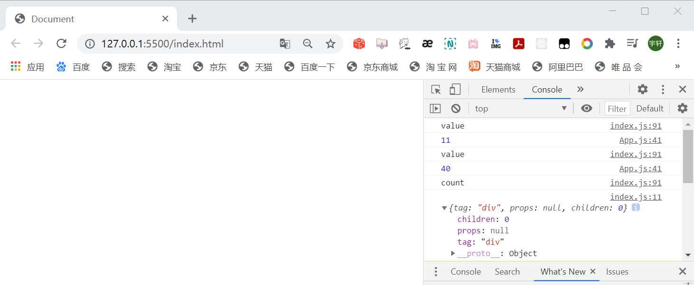

在 core 目录下新建 renderer 目录，在 renderer 目录下新建 index.js 文件：

```javascript
// vdom → dom
export function mountElement (vnode, container) {
    const { tag, props, children } = vnode
    
    // tag
    const element = document.createElement(tag)

    // props
    if (props) {
        for (const key in props) {
            const val = props[key]
            element.setAttribute(key, val)
        }
    }

    // children
    // 1. 可以接受一个 字符串类型 string
    if (typeof children === "string") {
        const textNode = document.createTextNode(children)
        element.append(textNode)
    }
    // 2. 可以接受一个数组

    // 插入
    container.append(element)
}
```

修改 App.js 文件：

```javascript
return h(
	"div",
	{
		id: "app - id",
		class: "showTime",
	},
	context.state.count
)
```
修改 core 目录下的  index.js 文件：

```javascript
import { effectWatch } from './reactivity/index.js'
import { mountElement } from './renderer/index.js'

export function createApp (rootComponent) {
    return {
        mount(rootContainer) {
            const context = rootComponent.setup()
            
            effectWatch(() => {
                rootContainer.innerHTML = ``
                const subTree = rootComponent.render(context)
                console.log(subTree)
                mountElement(subTree, rootContainer)
                // rootContainer.append(element)
            })
        },
    }
}
```

重新执行 html 文件：

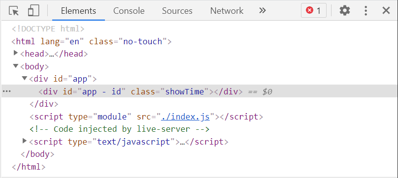

修改 App.js 文件：

```javascript
return h(
	"div",
	{
		id: "app - id",
		class: "showTime",
	},
	String(context.state.count)
)
```

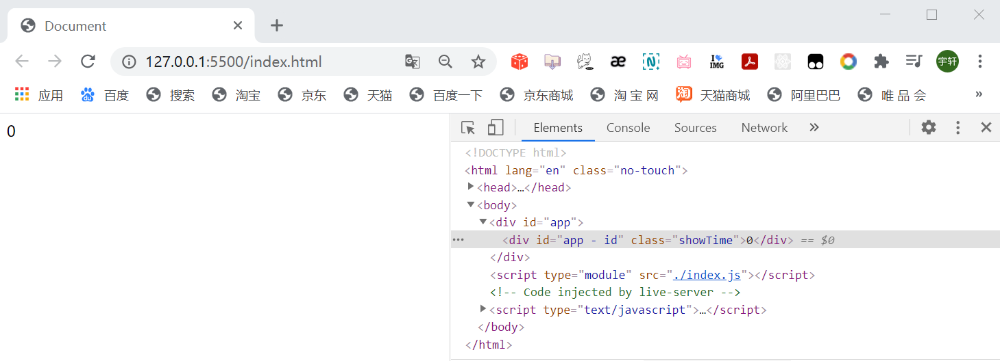

增加对数组的判断：
```javascript
// children
// 1. 可以接受一个 字符串类型 string
if (typeof children === "string") {
	const textNode = document.createTextNode(children)
	element.append(textNode)
} else if (Array.isArray(children)) {
	// 2. 可以接受一个数组
	children.forEach((vnode) => {
	mountElement(vnode, element)
	})
}
```

修改 App.js 文件：

```javascript
return h(
	"div",
	{
		id: "app - id",
		class: "showTime",
	},
	// String(context.state.count)
    [
        h("p", null, "heihei"),
        h("p", null, "hahaha"),
    ]
)
```

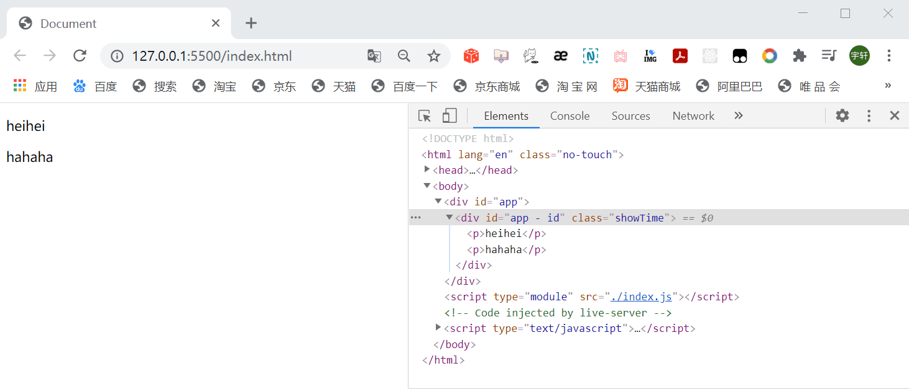

## 02 domdiff

修改 App.js 文件：

```javascript
return h(
	"div",
	{
		id: "app - id",
		class: "showTime",
	},
	// String(context.state.count)
    [
        h("p", null, String(context.state.count)),
        h("p", null, "hahaha"),
    ]
)
```

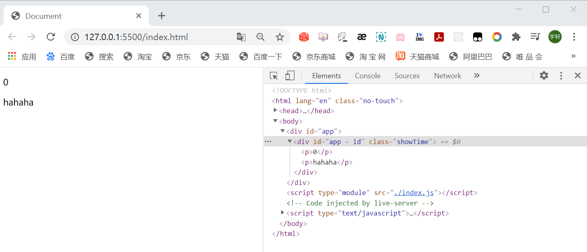

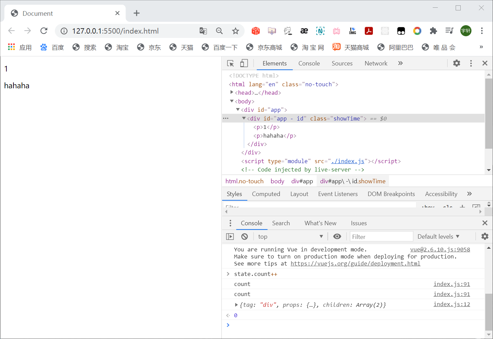

修改 core 目录下的  index.js 文件：

```javascript
import { effectWatch } from './reactivity/index.js'
import { mountElement, diff } from './renderer/index.js'

export function createApp (rootComponent) {
    return {
        mount(rootContainer) {
            const context = rootComponent.setup()
            const isMounted = false
            let prevSubTree
            
            effectWatch(() => {
                if (!isMounted) {
                    // init
                    rootContainer.innerHTML = ``
                    const subTree = rootComponent.render(context)
                    console.log(subTree)
                    mountElement(subTree, rootContainer)
                    prevSubTree = subTree
                } else {
                    // update
                    const subTree = rootComponent.render(context)
                    diff(prevSubTree, subTree)
                    prevSubTree = subTree
                }
                
                // diff
                // newVnode oldVnode

                // rootContainer.append(element)
            })
        },
    }
}
```

修改  renderer 目录下的 index.js 文件：

```javascript
// n1 → oldVnode
// n2 → newVnode
export function diff (n1, n2) {
    // 1. tag
    if (n1.tag !== n2.tag) {
        n1.el.replaceWith(document.createElement(n2.tag))
    } else {
        // 2. props
        // new: {id:"foo", class: "bar", a}
        // old: {id:"foo", class: "bar1", a, b}
        const {props: newProps} = n2
        const {props: oldProps} = n1
        
        if (newProps && oldProps) {
            Object.keys(newProps).forEach((key) => {
                const newVal = newProps[key]
                const oldVal = oldProps[key]
                if (newVal !== oldVal) {
                    n1.el.setAttribute(key, newVal)
                }
            })
        }

        if (oldProps) {
            Object.keys(oldProps).forEach((key) => {
                if (!newProps[key]) {
                    n1.el.removeAttribute(key)
                }
            })
        }
        // 3. children → (暴力的解法)
    }
}

// vdom → dom
export function mountElement (vnode, container) {
    const { tag, props, children } = vnode
    
    // tag
    const element = (vnode.el = document.createElement(tag))

    // props
    if (props) {
        for (const key in props) {
            const val = props[key]
            element.setAttribute(key, val)
        }
    }

    // children
    // 1. 可以接受一个 字符串类型 string
    if (typeof children === "string") {
        const textNode = document.createTextNode(children)
        element.append(textNode)
    } else if (Array.isArray(children)) {
        // 2. 可以接受一个数组
        children.forEach((vnode) => {
            mountElement(vnode, element)
        })
    }

    // 插入
    container.append(element)
}
```

修改 App.js 文件：

```javascript
return h(
	"div",
	{
		id: "app - " + context.state.count,
		class: "showTime",
	},
	// String(context.state.count)
	[
		h("p", null, String(context.state.count)),
		h("p", null, "hahaha"),
	]
)
```

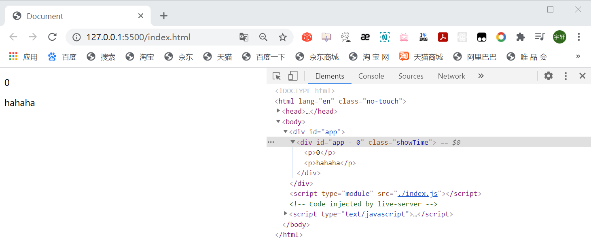

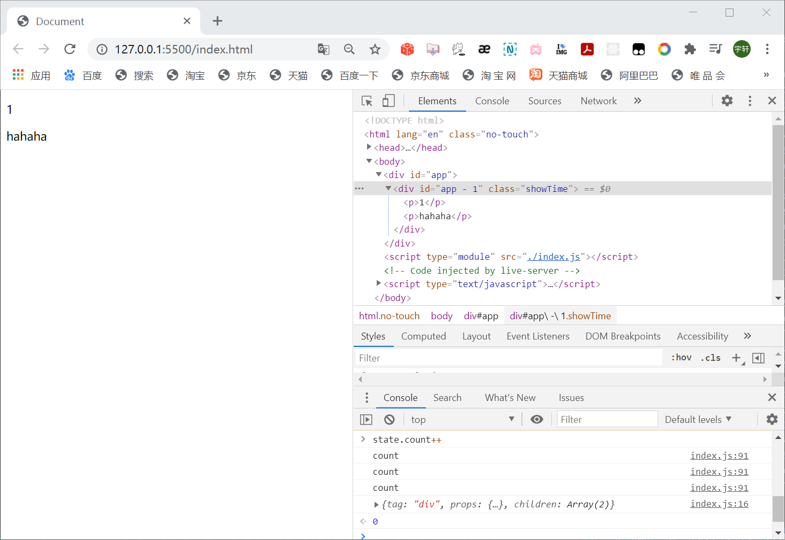

修改 core 目录下的  index.js 文件：
```javascript
import { effectWatch } from './reactivity/index.js'
import { mountElement, diff } from './renderer/index.js'

export function createApp (rootComponent) {
    return {
        mount(rootContainer) {
            const context = rootComponent.setup()
            let isMounted = false
            let prevSubTree
            
            effectWatch(() => {
                if (!isMounted) {
                    // init
                    isMounted = true
                    rootContainer.innerHTML = ``
                    const subTree = rootComponent.render(context)
                    console.log(subTree)
                    mountElement(subTree, rootContainer)
                    prevSubTree = subTree
                } else {
                    // update
                    const subTree = rootComponent.render(context)
                    diff(prevSubTree, subTree)
                    prevSubTree = subTree
                }
                
                // diff
                // newVnode oldVnode

                // rootContainer.append(element)
            })
        },
    }
}
```

console 一下：

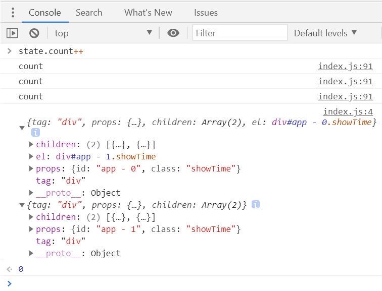

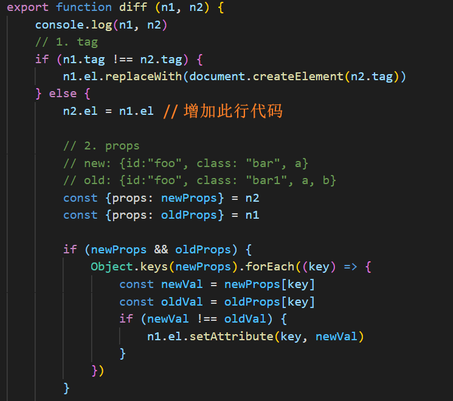

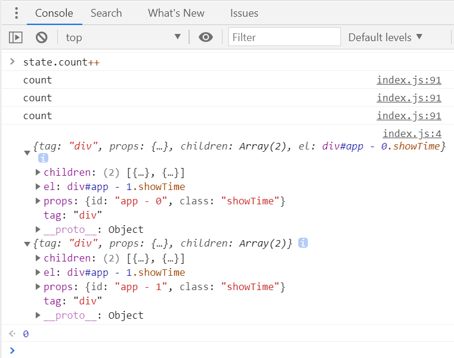

完整 diff 函数代码 大致如下：

```javascript
// n1 → oldVnode
// n2 → newVnode
export function diff (n1, n2) {
    console.log(n1, n2)
    // 1. tag
    if (n1.tag !== n2.tag) {
        n1.el.replaceWith(document.createElement(n2.tag))
    } else {
        // 小细节
        const el = (n2.el = n1.el)

        // 2. props
        // new: {id:"foo", class: "bar", a}
        // old: {id:"foo", class: "bar1", a, b}
        const {props: newProps} = n2
        const {props: oldProps} = n1
        
        if (newProps && oldProps) {
            Object.keys(newProps).forEach((key) => {
                const newVal = newProps[key]
                const oldVal = oldProps[key]
                if (newVal !== oldVal) {
                    el.setAttribute(key, newVal)
                }
            })
        }

        if (oldProps) {
            Object.keys(oldProps).forEach((key) => {
                if (!newProps[key]) {
                    el.removeAttribute(key)
                }
            })
        }

        // 3. children → (暴力的解法)
        //  ① newChildren → string  (oldChildren → string  oldChildren → array)
        //  ② newChildren → array  (oldChildren → string  oldChildren → array)
        const {children: newChildren} = n2
        const {children: oldChildren} = n1

        if (typeof newChildren === "string") {
            if (typeof oldChildren === "string") {
                if (newChildren !== oldChildren) {
                    el.textContent = newChildren
                }
            } else if (Array.isArray(oldChildren)) {
                el.textContent = newChildren
            }
        } else if (Array.isArray(newChildren)) {
            if (typeof oldChildren === "string") {
                el.innerText = `` // 先清空
                mountElement(n2, el)
            } else if (Array.isArray(oldChildren)) {
                // new {a,b,c,d,f}
                // old {a,e,c,d}
                
                const length = Math.min(newChildren.length, oldChildren.length)

                // 处理公共的 vnode
                for (let index = 0; index < length; index++) {
                    const newVnode = newChildren[index]
                    const oldVnode = oldChildren[index]
                    diff(newVnode, oldVnode)
                }

                if (newChildren.length > length) {
                    // 创建节点
                    for (let index = length; index < newChildren.length; index++) {
                        const newVnode = newChildren[index]
                        mountElement(newVnode)
                    }
                }

                if (oldChildren.length > length) {
                    // 删除节点
                    for (let index = length; index < oldChildren.length; index++) {
                        const oldVnode = oldChildren[index]
                        oldVnode.el.parent.removeChild(oldVnode.el)
                    }
                }
            }
        }
    }
}
```


**项目仓库：**  [点此访问](https://github.com/YancyQi2002/mini-vue-demo)