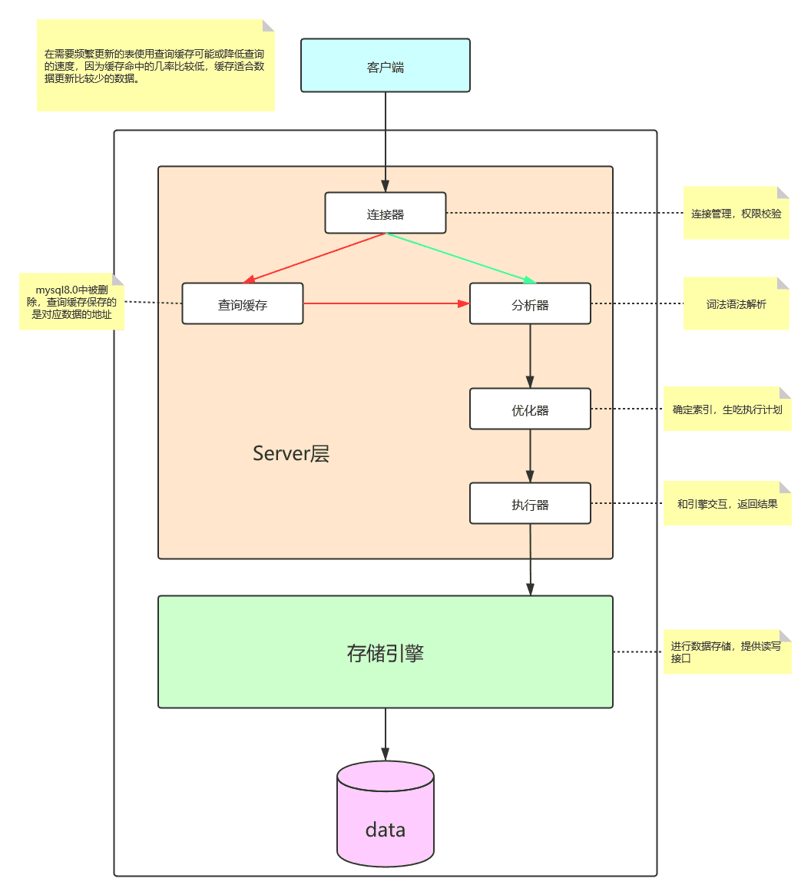

<!--truncate-->

:::note

1. 数据库： DataBase   （DB）
2. 用于存储和管理数据的仓库
3. 特点：
   1. 持久化存储数据
   2. 方便存储和管理数据
   3. 使用统一的方式操作数据库 —— SQL

:::

##  一   常见的数据库软件

> 数据库和数据库软件的关系：
>
> 数据库是一个基本的抽象概念，而数据库软件是数据库的具体实现，实现的方式有很多种，每一个公司都对数据库有不同的实现。

| 序号 |    名称    |                             历史                             |                             优点                             |                             缺点                             |
| :--: | :--------: | :----------------------------------------------------------: | :----------------------------------------------------------: | :----------------------------------------------------------: |
|  1   | SQL server | 最初是由Microsoft、Sybase 和Ashton-Tate三家公司共同开发在Windows NT 推出后，Microsoft与Sybase 在SQL Server 的开发上就分道扬镳了，Microsoft 将SQL Server移植到Windows NT系统上，专注于开发推广SQL Server 的Windows NT 版本。 | 易用性、适合分布式组织的可伸缩性、用 于决策支持的数据仓库功能、与许多其他服务器软件紧密关联的集成性、良好的性价比等 | 开放性：sqlserver 只能在windows上运行；伸缩性并行性：sql server 并行实施和共存模型并成熟难处理日益增多用户数和数据卷伸缩性有限；安全性：没有获得任何安全证书；性能 ：SQL Server 多用户时性能不佳。 |
|  2   |   MySQL    | 最早是由瑞典MySQL AB公司开发，1995年发布第一个版本，当时仅供公司内部使用。2000年基于GPL协议开放源码，2008年MySQL AB公司被Sun公司收购，2009年Sun公司又被Oracle公司收购。有了Oracle公司的技术支持，MySQL在2010年以后发布了多个版本，在各方面加强了企业级的特性。 | 1.体积小、速度快、总体拥有成本低，开源、支持多种操作系统；2.是开源数据库，提供的接口支持多种语言连接操作；3.MySql的核心程序采用完全的多线程编程；4.MySql有一个非常灵活而且安全的权限和口令系统；5.支持ODBC for Windows；6，支持大型的数据库；7.拥有一个非常快速而且稳定的基于线程的内存分配系统；8.MySQL同时提供高度多样性。 | 1.不支持热备份；2.MySQL最大的缺点是其安全系统；3.没有一种存储过程(StoredProcedure)语言；4.MySQL的价格随平台和安装方式变化。 |
|  3   |   Oracle   | 1977年埃里森与同事Robert Miner创立“软件开发实验室”（Software Development Labs），当时IBM发表“关系数据库的论文，埃里森以此造出新数据库，名为甲骨文。 | 1.开放性：Oracle 能所有主流平台上运行（包括 windows）完全支持所有工业标准采用完全开放策略使客户选择适合解决方案对开发商全力支持；2.安全性：获得最高认证级别的ISO标准认证；3.性能：Oracle 性能高 保持开放平台下TPC-D和TPC-C世界记录；4.客户端支持及应用模式：Oracle 多层次网络计算支持多种工业标准用ODBC、JDBC、OCI等网络客户连接；5.使用风险：Oracle长时间开发经完全向下兼容的广泛应用且风险低。 | 1.对硬件的要求很高；2.价格比较昂贵；3.管理维护麻烦一些；4.操作比较复杂，需要技术含量较高。 |
|  4   |  MongoDB   | MongoDB是一个基于分布式文件存储的数据库。由C++语言编写。旨在为WEB应用提供可扩展的高性能数据存储解决方案。MongoDB是一个介于关系数据库和非关系数据库之间的产品，是非关系数据库当中功能最丰富，最像关系数据库的。它支持的数据结构非常松散，是类似json的bson格式，因此可以存储比较复杂的数据类型。Mongo最大的特点是它支持的查询语言非常强大，其语法有点类似于面向对象的查询语言，几乎可以实现类似关系数据库单表查询的绝大部分功能，而且还支持对数据建立索引。 | ①弱一致性（最终一致），更能保证用户的访问速度；②文档结构的存储方式，能够更便捷的获取数据；③文档结构的存储方式，能够更便捷的获取数据；④内置Sharding；⑤第三方支持丰富；⑥性能优越。 |        ①mongodb不支持事务操作；②mongodb占用空间过大；        |
|  5   |   Sybase   | 美国Sybase公司研制的一种关系型数据库系统，是一种典型的UNIX 或WindowsNT 平台上/服务器环境下的大型数据库系统。 | 1.它是基于客户/服务器体系结构的数据库。2.它是真正开放的数据库。3.它是一种高性能的数据库。 | Sybase数据库支持的系统安全性和可靠性相对较差,这主要是因为Sybase采用Client/Server运行环境，**网络传输是必须的。** |
| ...  |    ...     |                             ...                              |                             ...                              |                             ...                              |

#### MySQL 目录结构

:::note

bin：存储了一些二进制的可执行文件，其中有很多的 .exe 文件。其中有个 mysql.exe 文件，就是在我们在我们进行登录的时候 `mysql -u -p` 所执行的命令。所有在安装的时候如果不配置 path 路径，不能直接使用该命令。

data：数据目录，存储了一些 mysql 的日志和数据文件（了解）

include：存储了 C 语言的头信息（了解）

lib：存储了 mysql 的一些需要的库文件

share：存储了 mysql 的一些错误信息（了解）

my.ini 文件：mysql 的配置文件，其中包含了一些 mysql 的信息。如果以后修改 mysql 的配置则在这里进行修改

:::

##  二   SQL

Structured Query Language：结构化查询语言

#### SQL的通用语法

1. SQL 语句可以单行或多行书写，以分号结尾。例如：show databases;
2. 可使用空格和缩进来增强语句的可读性。
3.  MySQL 数据库的 SQL 语句不区分大小写，关键字建议使用大写。
4. 注释：
   1. 单行注释: `-- 注释内容`或 `# 注释内容` (mysql 特有) 
   2. 多行注释: `/* 注释 */`
   3. -- 后最好加空格

#### SQL的分类

1. DDL(Data Definition Language)数据定义语言用来定义数据库对象：数据库，表，列等。关键字：create, drop,alter 等
2. DML(Data Manipulation Language)数据操作语言用来对数据库中表的数据进行增删改。关键字：insert, delete, update 等
3. DQL(Data Query Language)数据查询语言用来查询数据库中表的记录(数据)。关键字：select, where 等
4. DCL(Data Control Language)数据控制语言(了解)用来定义数据库的访问权限和安全级别，及创建用户。关键字：GRANT， REVOKE 等

#### 教程：[廖雪峰SQL教程](https://www.liaoxuefeng.com/wiki/1177760294764384)