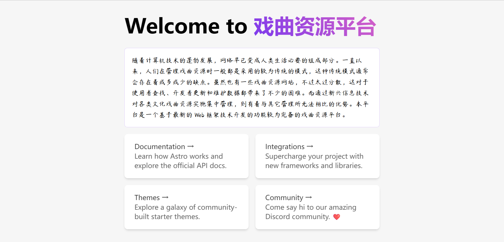
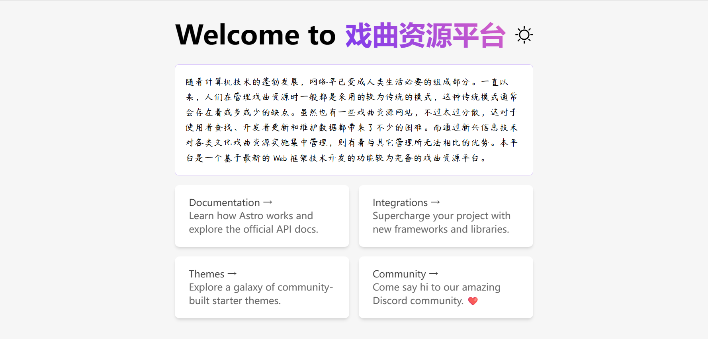
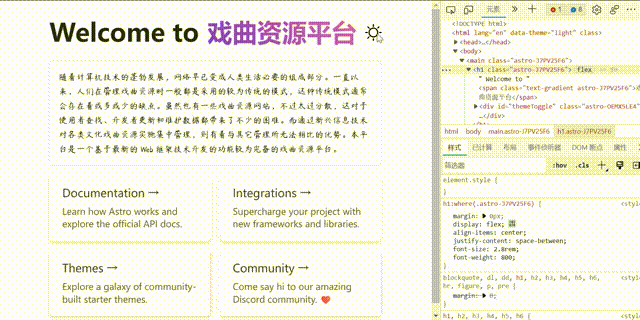

- [x] **首页简单布局**

<!--truncate-->

import Tabs from '@theme/Tabs';
import TabItem from '@theme/TabItem';

## 一、修改标题和简介

打开 `pages` 目录下的 `index.astro` 文件，对标题和简介部分进行简单修改：

```html
<Layout title="欢迎访问戏曲资源平台.">
	<main>
		<h1>Welcome to <span class="text-gradient">戏曲资源平台</span></h1>
		<p class="instructions">
			随着计算机技术的蓬勃发展，网络早已变成人类生活必要的组成部分。一直以来，人们在管理戏曲资源时一般都是采用的较为传统的模式，这种传统模式通常会存在着或多或少的缺点。虽然也有一些戏曲资源网站，不过太过分散，这对于使用者查找、开发者更新和维护数据都带来了不少的困难。而通过新兴信息技术对各类文化戏曲资源实施集中管理，则有着与其它管理所无法相比的优势。本平台是一个基于最新的 Web 框架技术开发的功能较为完备的戏曲资源平台。
		</p>
		...
	</main>
</Layout>
```

## 二、使用 TailwindCSS

上一篇中已经安装了 TailwindCSS，现在来导入并使用一下

首先在 `src/assets/css` 目录下新建 `index.css` 文件，

导入 TailwindCSS 官方的 Tailwind 指令和一些其它的样式文件，

:::caution **注意** 此处不推荐使用 `@tailwind` 写法

```css
/* 不推荐 */
@tailwind base;
@tailwind components;
@tailwind utilities;

/* 推  荐 */
@import "tailwindcss/base";
@import "tailwindcss/components";
@import "tailwindcss/utilities";
```

:::

```css
@import "tailwindcss/base";
@import "tailwindcss/components";
@import "tailwindcss/utilities";
@import url(https://cdn.jsdelivr.net/npm/firacode@6.2.0/distr/fira_code.css);

@font-face {
  font-family: yangrendongzhushi;
  src: url('../fonts/yangrendongzhushiziti.ttf');
}
```

回到 `pages` 目录下的 `index.astro` 文件，添加 class 属性，如：

```html
 <p class="
    instructions
<!-- highlight-next-line -->
+   select-none
 ">
     ...
 </p>
```

浏览器中可以看到已经禁用文本选择了，无法选择元素中的文本

顺便修改一下文本字体：

```css
p {
	font-family: 'yangrendongzhushi';
}
```

在浏览器中看一下当前效果：



## 三、添加主题切换

新建一个 `component` 组件 `ThemeIcon.astro`

```html title="src/components/ThemeIcon.astro"
---
---
<div id="themeToggle">
  <svg width="30px" xmlns="http://www.w3.org/2000/svg" viewBox="0 0 24 24">
    <path class="sun" fill-rule="evenodd" d="M12 17.5a5.5 5.5 0 1 0 0-11 5.5 5.5 0 0 0 0 11zm0 1.5a7 7 0 1 0 0-14 7 7 0 0 0 0 14zm12-7a.8.8 0 0 1-.8.8h-2.4a.8.8 0 0 1 0-1.6h2.4a.8.8 0 0 1 .8.8zM4 12a.8.8 0 0 1-.8.8H.8a.8.8 0 0 1 0-1.6h2.5a.8.8 0 0 1 .8.8zm16.5-8.5a.8.8 0 0 1 0 1l-1.8 1.8a.8.8 0 0 1-1-1l1.7-1.8a.8.8 0 0 1 1 0zM6.3 17.7a.8.8 0 0 1 0 1l-1.7 1.8a.8.8 0 1 1-1-1l1.7-1.8a.8.8 0 0 1 1 0zM12 0a.8.8 0 0 1 .8.8v2.5a.8.8 0 0 1-1.6 0V.8A.8.8 0 0 1 12 0zm0 20a.8.8 0 0 1 .8.8v2.4a.8.8 0 0 1-1.6 0v-2.4a.8.8 0 0 1 .8-.8zM3.5 3.5a.8.8 0 0 1 1 0l1.8 1.8a.8.8 0 1 1-1 1L3.5 4.6a.8.8 0 0 1 0-1zm14.2 14.2a.8.8 0 0 1 1 0l1.8 1.7a.8.8 0 0 1-1 1l-1.8-1.7a.8.8 0 0 1 0-1z"/>
    <path class="moon" fill-rule="evenodd" d="M16.5 6A10.5 10.5 0 0 1 4.7 16.4 8.5 8.5 0 1 0 16.4 4.7l.1 1.3zm-1.7-2a9 9 0 0 1 .2 2 9 9 0 0 1-11 8.8 9.4 9.4 0 0 1-.8-.3c-.4 0-.8.3-.7.7a10 10 0 0 0 .3.8 10 10 0 0 0 9.2 6 10 10 0 0 0 4-19.2 9.7 9.7 0 0 0-.9-.3c-.3-.1-.7.3-.6.7a9 9 0 0 1 .3.8z"/>
  </svg>
</div>

<style>
	.sun {
		fill: black;
	}
	.moon {
		fill: transparent;
	}

	:global(.dark) .sun {
		fill: transparent;
	}
	:global(.dark) .moon {
		fill: white;
	}
</style>
```

然后在 `pages` 目录下的 `index.astro` 里导入

简单美化一下样式，效果如下：



接下来为其添加客户端交互性：

1.安装 daisyUI

之所以选择 daisyUI 是因为 daisyUI 原生已经有很多精美制作的主题

```bash npm2yarn

npm install daisyui

```

2.在 `tailwind.config.js` 文件里追加 daisyUI 的设置

```javascript
module.exports = {
  daisyui: {
    styled: true,
	themes: true,
	base: true,
	utils: true,
	logs: true,
	rtl: false,
	prefix: "",
	darkTheme: "dark",
  },
  ...
  plugins: [require("daisyui")],
}
```

3.使用 `theme-change` 方便切换主题

（1）安装 `theme-change`

```bash npm2yarn

npm install theme-change

```

（2）将主题应用于所有的 astro 页面

```html title="src/layouts/Layout.astro"
<head>
	<script is:inline>
      // ☝️ This script prevent the FART effect.
      if (localStorage.getItem("theme") === null) {
        document.documentElement.setAttribute("data-theme", "light");
      } else
        document.documentElement.setAttribute(
          "data-theme",
          localStorage.getItem("theme")
        );
      // "theme" LocalStorage value is set by the package to remember user preference.
      // The value is checked and applyed before rendering anything.
    </script>
    <script>
      import { themeChange } from 'theme-change';
      themeChange();
      // 👆 you could import the CDN directly instead of these two lines
    </script>
    <meta charset="utf-8" />
    <title>My Cool Astro Layout Wraping All My Pages</title>
	<meta name="viewport" content="width=device-width, initial-scale=1" />
</head>
```

（3）完善 `ThemeIcon.astro`

```html title="src/components/ThemeIcon.astro"
...

<script>
  const theme: any = (() => {
    if (typeof localStorage !== 'undefined' && localStorage.getItem('theme')) {
      return localStorage.getItem('theme');
    }
    if (window.matchMedia('(prefers-color-scheme: dark)').matches) {
      return 'dark';
    }
      return 'light';
  })();
      
  if (localStorage.theme === 'dark' || (!('theme' in localStorage) && window.matchMedia('(prefers-color-scheme: dark)').matches)) {
    document.documentElement.classList.add('dark');
    document.documentElement.setAttribute("data-theme", "dark");
    document.documentElement.classList.toggle("dark");
  } else {
    document.documentElement.classList.toggle("dark");
    document.documentElement.classList.remove('dark');
    document.documentElement.setAttribute("data-theme", "light");
  }

  localStorage.setItem('theme', theme.toString());

  const handleToggleClick = () => {
    const element = document.documentElement;
    element.classList.toggle("dark");
    
    const isDark = element.classList.contains("dark");
    localStorage.setItem("theme", isDark ? "dark" : "light");
    element.setAttribute("data-theme", isDark ? "dark" : "light");
  }

  document.getElementById("themeToggle")?.addEventListener("click", handleToggleClick);
</script>
```

## 四、运行效果

