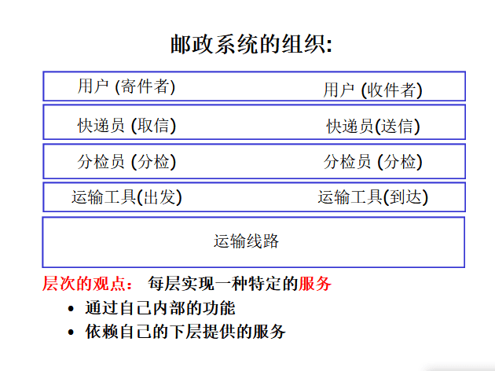
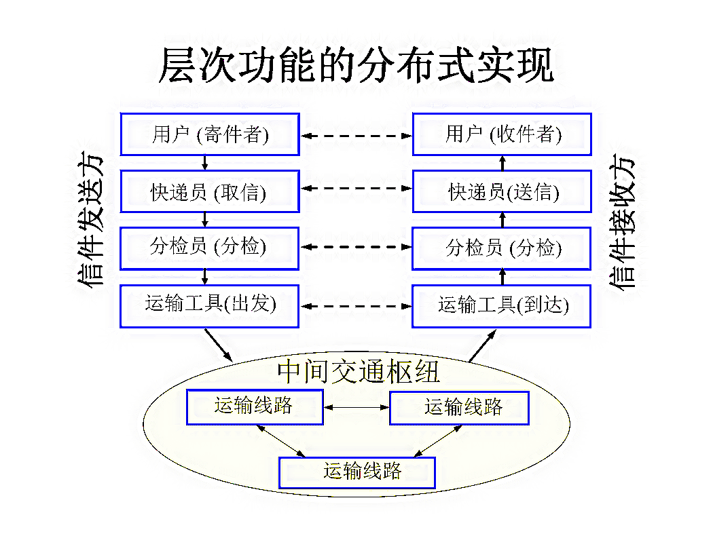
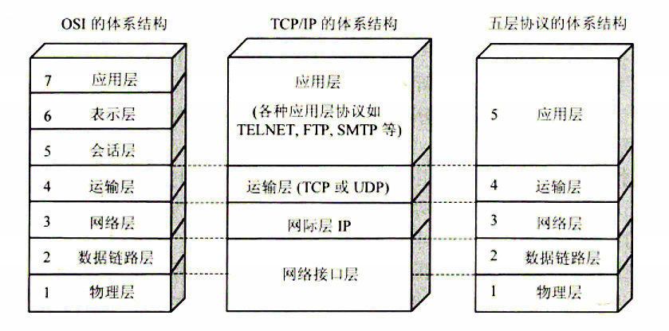
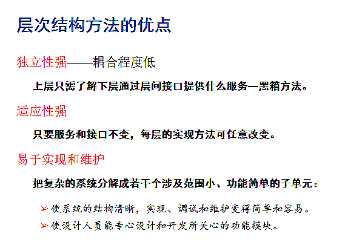
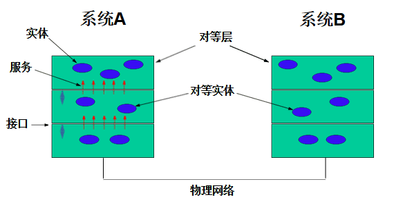
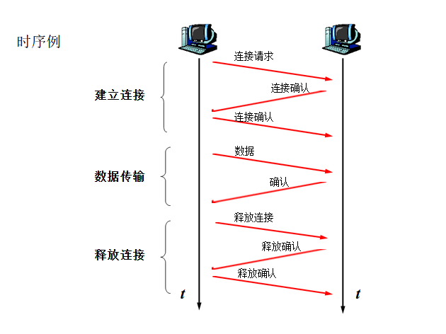
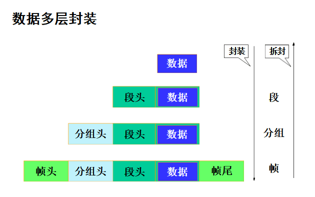
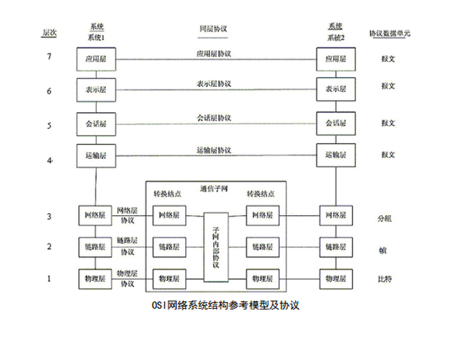
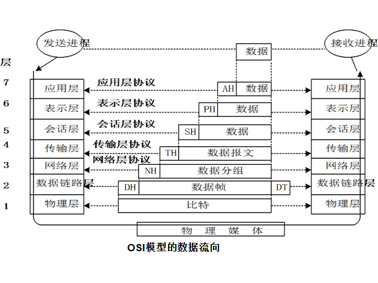
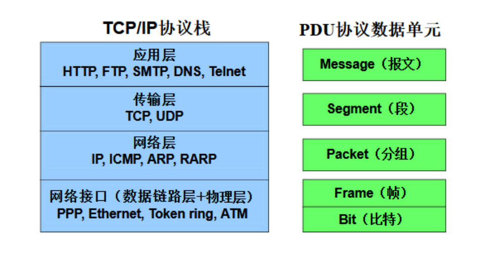

> **【** **知识目标** **】**
>
> 1. 层次化的网络体系结构；
> 2. 开放系统互联参考模型（OSI / RM）；
> 3. TCP / IP 体系结构；
> 4. OSI 和 TCP / IP 的主要层次功能。
>

## **一  计算机网络体系结构**

网络体系结构提出的背景——计算机网络的复杂性、异质性

- **不同的通信介质——有线、无线  ••• •••**
- **不同种类的设备——主机、路由器、交换机、复用设备 ••• •••**
- **不同的操作系统——Unix 、Windows •••**
- **不同的软 / 硬件、接口和通信约定（协议）**
- **不同的应用环境——固定、移动 ••• •••**
- **不同种类业务——分时、交互、实时  ••• •••**

### **1 计算机网络体系结构的定义** 

计算机网络中采用了分层方法，把复杂的问题划分为若干个较小的、单一的局部问题，在不同层上予以解决。

:::note   网络的层次结构方法要解决的问题：

网络应该具有哪些层次？每一层的功能是什么？（分层与功能）

各层之间的关系是怎样的？它们如何进行交互？（服务与接口）

通信双方的数据传输要遵循哪些规则？（协议）

:::

计算机网络的各层及协议集合是网络的体系结构。换种说法，计算机网络的体系结构就是这个计算机网络及其构件所应完成的功能的精确定义。

国际标准化组织 ISO 于1981年正式推荐了一个网络系统结构(七层参考模型)，叫做开放系统互连模型(Open System Interconnection，OSI )。由于这个标准模型的建立，使得各种计算机网络向它靠拢，大大推动了网络通信的发展。

但由于OSI体系结构太复杂，在实际应用中TCP/IP的四层体系结构得到广泛应用。

### **2 网络体系结构的分层原理** 

为了减少协议的复杂性，大多数网络都是按照分层的方式来组织的。

:::note	基本概念

实体：任何可以发送或接收信息的硬件 / 软件进程。

对等层：两个不同系统的同级层次。

对等实体：分别位于不同系统对等层中的两个实体。

接口：相邻两层之间交互的界面，定义相邻两层之间的操作及下层对上层的服务。

服务：某一层及以下各层的一种能力，通过接口提供给其相邻上层。

协议：通信双方在通信中必须遵守的规则。

:::

1. 分层的原则：

（1）每一层要为上层提供服务，并说明调用这种服务的接口，而处在高层的系统仅是利用较低层次的系统提供的功能和服务，不需要了解底层实现该功能和服务所采用的算法和协议。

（2）较底层也仅是使用从高层系统传下来的参数，这就是层次间的无关性。

（3）除在不同系统中的同层实体间是没有直接的物理通信能力，他们的通信是逻辑的通信，需要通过相邻下层以及更低各层的通信来完成。同时在不同系统的同层实体间通信必须遵循一组规则和约定。

2. 分层结构的好处：

  （1）独立性强

  （2）适应性强

  （3）易于实现和维护

:::note	OSI网络体系结构各层协议：

（1）应用层：

TELNET、FTP、TFTP、SMTP、SNMP、HTTP、BOOTP、DHCP、DNS；

（2）表示层：

文本：ASCII，EBCDIC

图形:TIFF，JPEG，GIF，PICT

声音：MIDI，MPEG，QUICKTIME;

（3）会话层：NFS、SQL、RPC 、X-WINDOWS、ASP、SCP;

（4）传输层：TCP、UDP、SPX;

（5）网络层：IP、IPX、ICMP、RIP、OSPF;

（6）数据链路层：SDLC、HDLC、PPP、STP、帧中继。

:::

:::note	对等通信的实质

对等通信 peer-to-peer communication 指为了使数据分组从源传送到目的地，源端OSI 模型的每一层都必须与目的端的对等层进行通信的通信方式。

对等层实体之间实现的是虚拟的逻辑通信；

下层向上层提供服务；

上层依赖下层提供的服务来与其它主机上的对等层通信；

实际通信在最底层完成。

:::

### **3 通信协议** 

:::tip	通信协议的三要素

- 语义
- 语法
- 时序

:::

## **二  网络系统结构参考模型 ISO / OSI**

## **三  OSI 参考模型七层结构综述**

### 1 物理层

在物理媒介上正确透明地传送比特流

### 2 数据链路层

在不可靠的物理线路上可靠地传输数据

### 3 网络层

将 IP 地址转换成 MAC 地址，选择合适的路由，把分组从源端传送到目的端。提供主机间的逻辑通信

### 4 传输层

在源端与目的端之间提供可靠的透明数据传输，使上层服务用户不必关心通信子网的实现细节。提供进程间的逻辑通信

### 5 会话层

进程之间建立、维护、终止通信

### 6 表示层

对来自应用层的数据进行解释

### 7 应用层

直接向用户提供服务，完成用户希望在网络上完成的各种工作。负责完成网络中应用程序与网络操作系统之间的联系

## **四  TCP / IP 体系结构**

