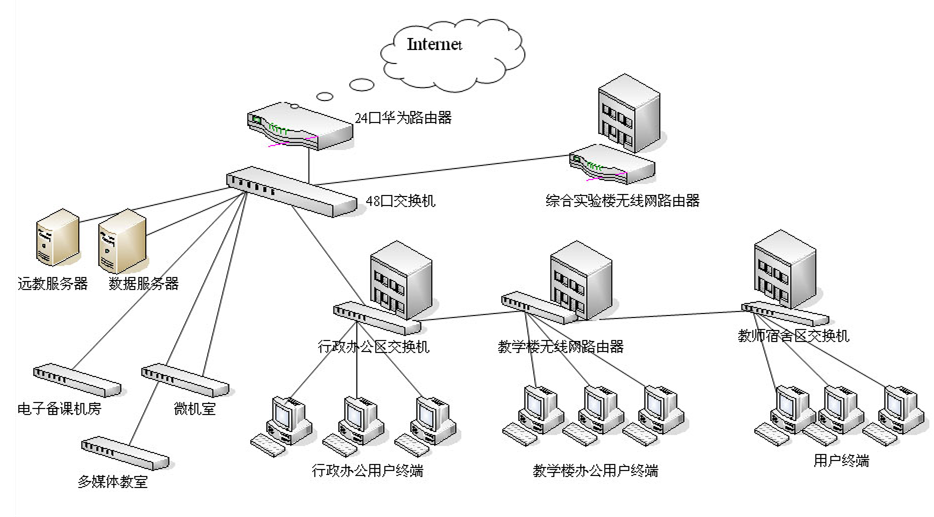
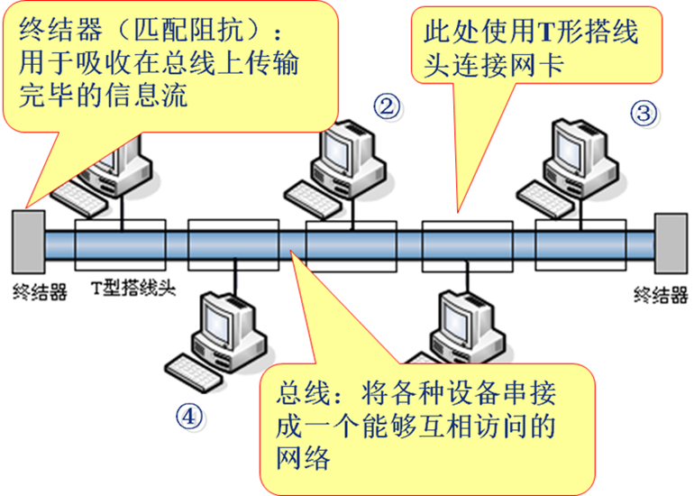
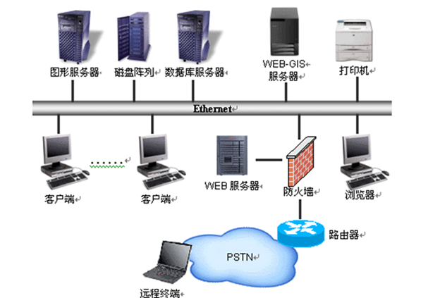
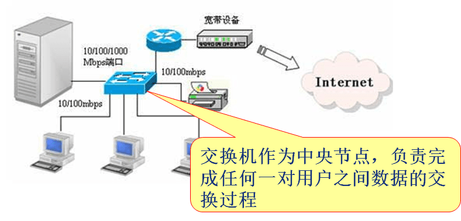
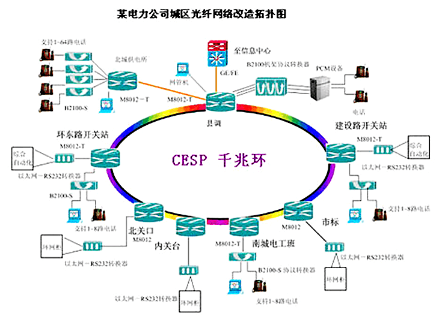
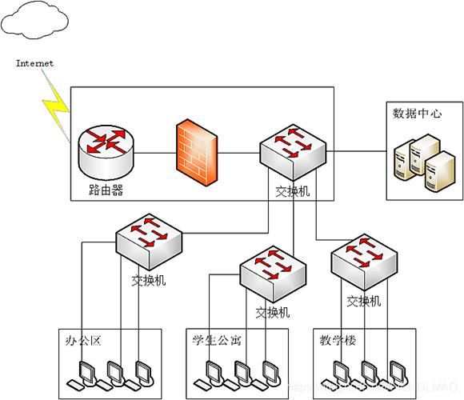
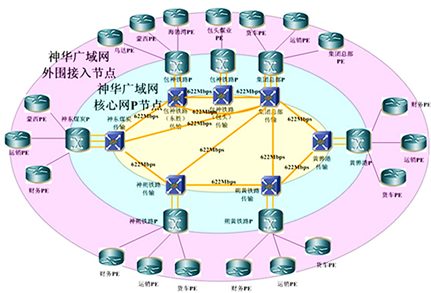

> **【** **知识目标** **】**
>
> 1. 认识计算机网络；
> 2. 计算机网络的组成；
> 3. 网络拓扑结构；
> 4. 计算机网络的功能。
>
> **【** **能力目标** **】**
>
> 1. 理解计算机网络的定义；
> 2. 了解计算机网络的组成及各种设备的基本作用；
> 3. 掌握计算机网络的拓扑结构的分类及各自的特点。
>

# **一  什么是计算机网络**

## **1  计算机网络的组成**

端系统（end system）通过通信链路（communication link）和分组交换机（packet switch）连接到一起。

端系统：也叫主机（host）,是连接到网络的各种设备，现在已经不局限于传统的PC机和手机。

通信链路：各种通信的物理媒介，同轴电缆、光纤、无线电频谱等。

分组交换机：分组交换机从它的入通信链路接受到达的分组，并从它的一条出通信链路转发分组。主要有两类：路由器（route）和链路层交换机（link-layer switch）。链路层交换机通常用于接入网中，而路由器通常用于网络核心中。

注：计算机网络与运输网络很相似，数据类似于货物，

分组类似于装了货物的卡车，通信链路类似于道路，

分组交换机类似于立交桥，端系统类似于建筑物。

:::note

**主机系统：提供各种资源**

- 服务器: 提供各种网络资源
- PC 机: 用于访问网络资源

**通信系统：完成通信任务**

- 路由器: 为某个局域网提供网关接口，实现不同网络之间的连接
- 交换机: 为局域网内部各种设备之间的连接提供接口
- 传输介质: 用于连接任意两个设备
- 网卡: 为主机接入到网络提供接口

 

网络中的主机系统主要用于提供各种网络资源，通常被称为资源子网

网络中的通信系统主要用于完成数据通信任务，通常被称为通信子网

 

:::

## **2  计算机网络的拓扑结构**

### 网络拓扑基本概念

1. 节点：一个“节点”其实就是一个网络端口。节点又分为“转节点”和“访问节点”两类。“转节点”的作用是支持网络的连接，它通过通信线路转接和传递信息，如交换机、网关、路由器、防火墙设备的各个网络端口等；而“访问节点”是信息交换的源点和目标点，通常是用户计算机上的网卡接口。
2. 结点：一个“结点”是指一台网络设备，因为它们通常连接了多个“节点”，所以称之为“结点”。在计算机网络中的结点又分为链路结点和路由结点，它们就分别对应的是网络中的交换机和路由器。
3. 链路：“链路”是两个节点间的线路。链路分物理链路和逻辑链路（或称数据链路）两种，前者是指实际存在的通信线路，由设备网络端口和传输介质连接实现；后者是指在逻辑上起作用的网络通路，由计算机网络体系结构中的数据链路层标准和协议来实现。如果链路层协议没有起作用，数据链路也就无法建立起来。
4. 通路：“通路”从发出信息的节点到接收信息的节点之间的一串节点和链路的组合。也就是说，它是一系列穿越通信网络而建立起来的节点到节点的链路串连。它与“链路”的区别主要在于一条“通路”中可能包括多条“链路”。

### 网络常见的拓扑结构

1. 总线型

:::tip **总线结构的特点**

- 优点：
	- 总线型拓扑结构其特点位置有一条双向通路，便于进行广播式传送信息；
	- 总线型拓扑结构属于分布式控制，无需中央处理器，故结构简单；
	- 结点的增、删和位置的变动较容易，变动中不影响网络的正常运行，系统扩充性能好；
	- 结点的接口通常采用无源线路，系统可靠性高；
	- 设备少、价格低、安装使用方便。

- 缺点：

	- 由于电气信息延迟时间不确定，故障隔离和检测困难。

:::

   **一个典型的总线结构的以太网示例图**

2. 星型

每个节点都由一个单独的通信线路连接到中心节点上。中心节点控制全网的通信，任何两台计算机之间的通信都要通过中心节点来转接。因些中心节点是网络的瓶颈，这种拓朴结构又称为集中控制式网络结构，这种拓扑结构是目前使用最普遍的拓扑结构，处于中心的网络设备跨越式集线器（Hub）也可以是交换机。

优点：结构简单、便于维护和管理，因为当中某台计算机或头条线缆出现问题时，不会影响其他计算机的正常通信，维护比较容易。

缺点：通信线路专用，电缆成本高；中心结点是全网络的可靠瓶颈，中心结点出现故障会导致网络的瘫痪。

:::tip  **星型结构特点**

- 中央节点可以方便地控制和管理网络，并及时发现和处理系统故障；

- 系统的可靠性较高，健壮性很好；

- 如果中央节点出现故障，则整个网络瘫痪 ；

- 若是交换机作为中央节点，网络中可以有多对用户同时完成数据交换，属于点到点式网络；

- 扩充容易，可以通过交换机的级联来增加更多的主机，当然，交换机级联的个数是有限的

:::

3. 环型

环型结构的信息传输线路构成个封闭的环型， 各结点通过中继器连入网内，各中继器间首尾相接，信息单向沿环路连点传送。

优点：

- 其特点为信息的流动方向是固定的，两个结点仅有一条通路， 路径控制简单；

- 有旁路设备，结点一旦发生战障，系统自动旁路，可靠性高。

缺点：

- 信息要串行穿过多个结点，在网中结占过多时传输效率低，系统响应速度慢；

- 由于环路封闭，扩充较难。

:::tip  **环型结构特点**

  - 中央节点可以方便地控制和管理网络，并及时发现和处理系统故障；

  - 系统的可靠性较高，健壮性很好；

  - 如果中央节点出现故障，则整个网络瘫痪 ；

  - 若是交换机作为中央节点，网络中可以有多对用户同时完成数据交换，属于点到点式网络；

  - 扩充容易，可以通过交换机的级联来增加更多的主机，当然，交换机级联的个数是有限的

:::

4. 树型

树型结构是总线型结构的扩充形式，传输介质是不封闭的分支电缆，他主要用于多个网络组成的分级结构中，其特点同总线型网。

5. 网状

全网状拓扑：容错能力强；实施成本高

部分网状拓扑：在容错能力与成本之间寻求平衡

# **二  计算机网络的功能**

:::tip  **计算机网络最核心的两个功能**

**1、数据通信；**

**2、资源共享。**

:::

1. 数据通信:

可实现计算机和计算机、计算机和终端以及终端与终端之间的数据信息传递，是继电报、电话业务之后的第三种最大的通信业务。

2. 资源共享: 

实现了网络中硬件资源和软件资源的共享；

硬件资源共享，比如，典型的服务器租赁，云计算等等。节省了我们自己搭建服务器等硬件资源的成本。

软件资源共享，比如，我们平时使用的各种APP或者客户端应用等等。节约了我们自己开发软件的成本。

3. 集中管理: 

通过各种管理系统，实现了日常工作的管理，以及信息的整理存储。降低了管理难度，和管理成本。

4. 实现分布式处理: 

可以通过不同的计算机，将复杂的计算难题分解成不同的部分，交给不同的计算机去处理。

5. 负荷均衡: 

负荷均衡是指工作被均匀的分配给网络上的各台计算机系统。网络控制中心负责分配和检测，当某台计算机负荷过重时，系统会自动转移负荷到较轻的计算机系统去处理。